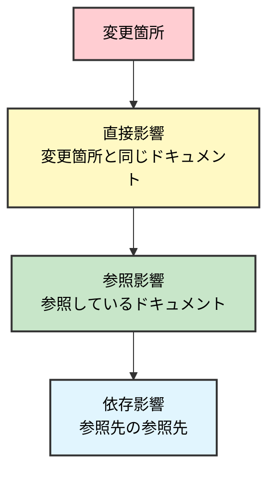

# 標準ガイドライン

**Version**: 4.0
**最終更新日**: 2025-10-28
**目的**: AI主導による段階的なシステム開発プロセスの標準化

---

## 1. 基本原則

### 1.1 AI開発の3原則

1. **フェーズ厳守**: 指定フェーズの成果物のみ作成。後続フェーズの作業は禁止
2. **ファイル編集制限**: 現在フェーズのディレクトリのみ編集可能
3. **人間承認**: 各フェーズゲートで人間が承認

### 1.2 ディレクトリ構成

```
project_MCPphone/
├── 1_guideline/         # 標準ガイドライン（全フェーズ参照、編集不可）
│   ├── 1_general/      # 汎用ガイドライン
│   └── 2_specific/     # プロジェクト固有ガイドライン
├── 2_docs/             # ドキュメント
│   ├── 01_planning/    # システム化計画
│   ├── 02_requirement/ # 要件定義
│   ├── 03_basic_design/# 基本設計
│   ├── 04_detail_design/# 詳細設計
│   ├── 05_implementation/# 実装ログ
│   ├── 06_test/       # テスト
│   ├── 07_deploy/     # デプロイ
│   └── 08_operation/  # 運用
└── 3_system/          # 実装コード（実装フェーズ以降）
```

### 1.3 フェーズ別編集権限

| フェーズ | 編集可能 | 参照のみ |
|---------|---------|---------|
| 01. システム化計画 | `2_docs/01_planning/` | `1_guideline/` |
| 02. 要件定義 | `2_docs/02_requirement/` | 上記 + `2_docs/01_planning/` |
| 03. 基本設計 | `2_docs/03_basic_design/` | 上記 + `2_docs/02_requirement/` |
| 04. 詳細設計 | `2_docs/04_detail_design/` | 上記 + `2_docs/03_basic_design/` |
| 05. 実装 | `3_system/`, `2_docs/05_implementation/` | 上記 + `2_docs/04_detail_design/` |
| 06. テスト | `3_system/`, `2_docs/06_test/` | 上記 + `2_docs/05_implementation/` |
| 07. デプロイ | `3_system/`, `2_docs/07_deploy/` | 上記 + `2_docs/06_test/` |
| 08. 運用 | `3_system/`, `2_docs/08_operation/` | 全2_docs |

**禁止**: 前フェーズの2_docs編集、後続フェーズのファイル作成

---

## 2. 開発フロー


---

## 3. フェーズ別ガイド

詳細は各フェーズガイドを参照：
- [01_システム化計画](./phase_guides/01_システム化計画フェーズ.md)
- [02_要件定義](./phase_guides/02_要件定義フェーズ.md)
- [03_基本設計](./phase_guides/03_基本設計フェーズ.md)
- [04_詳細設計](./phase_guides/04_詳細設計フェーズ.md)
- [05_実装](./phase_guides/05_実装フェーズ.md)
- [06_テスト](./phase_guides/06_テストフェーズ.md)
- [07_デプロイ](./phase_guides/07_デプロイフェーズ.md)
- [08_運用](./phase_guides/08_運用フェーズ.md)

各ガイドには以下を記載：
- 編集可能ディレクトリ
- 必須作成物（MUST CREATE）
- 禁止事項（MUST NOT CREATE）
- AIへの指示例
- セキュリティチェックリスト
- フェーズゲートチェックリスト

---

## 4. セッション管理

### 4.1 セッション開始時チェック

- [ ] 前回作業ログを読んだ
- [ ] 現在フェーズを確認した
- [ ] 編集可能ディレクトリを確認した
- [ ] 禁止事項を確認した
- [ ] マスターファイルを確認した

### 4.2 セッション終了時チェック

- [ ] 作業ログに今回の作業内容を記録した
- [ ] 作成・更新したファイル一覧を記録した
- [ ] 完了/未完了タスクを明記した
- [ ] 発見した問題点を記録した
- [ ] 次回作業予定を記録した

### 4.3 作業ログ記録（各フェーズで作成）

```markdown
# 作業ログ - [フェーズ名]

## セッション: 2025-XX-XX HH:MM

### 作業内容
- [実施内容]

### 作成・更新ファイル
- `path/to/file.md` (新規/更新)

### 決定事項
- [重要な決定]

### 次回作業
- [継続タスク]
```

### 4.4 トークン効率化

**優先読み込み順位**:
1. 必須: 現在フェーズの作業ログ、標準ガイドライン、マスターファイル
2. 条件付き: 前フェーズ成果物（参照必要時）
3. 不要: 後続フェーズ、無関係フェーズ

**大きなファイルは部分読み込み**: 目次→必要セクションのみ

---

## 5. 品質管理

### 5.1 作業前チェック

- [ ] 現在フェーズを確認
- [ ] 編集対象ディレクトリを確認
- [ ] 該当フェーズガイドを読んだ
- [ ] 禁止事項を確認
- [ ] 前フェーズ成果物を確認

### 5.2 作業後チェック

- [ ] 必須作成物を全て作成した
- [ ] ファイルパスが正しい
- [ ] 後続フェーズのファイルを作成していない
- [ ] 前フェーズのファイルを編集していない
- [ ] 用語定義マスターに従っている
- [ ] データ項目マスターに従っている
- [ ] 前フェーズと矛盾していない

### 5.3 ドキュメントサイズ管理

- **上限**: 1ファイル1000行
- **超過時**: ファイル分割 + 索引ファイル作成
- **確認**: `wc -l filename.md`

---

## 6. 変更管理

### 6.1 変更影響分析（3層）



### 6.2 マスターファイル管理

**階層**: 用語定義 → データ項目 → 技術仕様

| マスター | 作成 | 更新可能 | 配置 |
|---------|------|---------|------|
| 用語定義 | 要件定義 | 要件定義のみ | `docs/02_requirement/_master/` |
| データ項目 | 要件定義 | 基本設計まで | `docs/03_basic_design/_master/` |
| 技術仕様 | 基本設計 | 実装まで | `docs/03_basic_design/_master/` |

**重要**: マスターファイル変更時は全ドキュメントの整合性を確認

### 6.3 ADR（技術的決定記録）

```markdown
# ADR-XXX: [決定事項]

## ステータス
承認済み / 検討中 / 却下

## コンテキスト
[背景]

## 決定内容
[採用する選択肢]

## 検討した選択肢
### A: [選択肢1]
**メリット**: ...
**デメリット**: ...

### B: [選択肢2]
...

## 決定理由
[なぜこの選択肢を選んだか]

## 影響
[この決定の影響範囲]
```

---

## 7. コミュニケーション

### 7.1 確認が必須な7ケース

1. 複数選択肢がある時（技術選定、設計方針等）
2. 要件が曖昧な時
3. 前フェーズとの矛盾を発見した時
4. 新機能の追加提案
5. 禁止事項に該当するか不明な時
6. スケジュールに影響する問題発見時
7. セキュリティリスクを発見した時

### 7.2 確認依頼フォーマット

```markdown
【確認依頼】

## 緊急度・重要度
- 緊急度: 高/中/低
- 重要度: 高/中/低

## 選択肢
### A. [選択肢1]
**メリット**: ...
**デメリット**: ...
**実装コスト**: 低/中/高
**リスク**: 低/中/高

### B. [選択肢2]
...

## AIの推奨案
[推奨する選択肢とその理由]
```

### 7.3 承認が必須なケース

- フェーズゲート通過
- マスターファイル変更
- 前フェーズへの差戻提案
- 大きな技術的決定（ADR作成対象）

---

## 8. セキュリティ

### 8.1 個人情報保護3原則

1. **最小収集**: 必要最小限の個人情報のみ収集
2. **暗号化必須**: 保存時・通信時とも暗号化
3. **ログ禁止**: 個人情報・パスワードをログに記録しない

### 8.2 OWASP Top 10 対策（要確認）

各フェーズで以下を確認：

1. **A01: アクセス制御** - 全APIで認証・認可チェック
2. **A02: 暗号化の失敗** - 個人情報の暗号化
3. **A03: インジェクション** - SQLインジェクション対策（プリペアドステートメント）
4. **A04: 安全でない設計** - セキュリティ設計レビュー
5. **A05: セキュリティ設定ミス** - デフォルト認証情報の変更
6. **A06: 脆弱なコンポーネント** - 依存ライブラリの脆弱性スキャン
7. **A07: 認証の失敗** - パスワードポリシー、多要素認証
8. **A08: データ整合性の失敗** - 署名検証、改ざん防止
9. **A09: ログ・監視の失敗** - 認証失敗のログ記録
10. **A10: SSRF** - 外部リクエストの検証

---

## 9. AIへの指示テンプレート

### 9.1 新規ドキュメント作成

```
「[ドキュメント名]を作成してください。

【フェーズ】: [現在のフェーズ]
【ファイルパス】: docs/0X_[phase]/[filename].md
【含めるべき内容】:
- [項目1]
- [項目2]

【注意事項】:
- docs/0X_[phase]/ 配下のファイルのみ編集してください
- [後続フェーズ]の内容は含めないでください
- [前フェーズ]のファイルは参照のみ可能です
- [禁止事項]は作成しないでください

【参照ドキュメント】:
- [関連ドキュメント]
」
```

### 9.2 整合性チェック

```
「以下のドキュメント間の整合性をチェックしてください：
1. [ドキュメント1] vX.X
2. [ドキュメント2] vX.X

【確認項目】:
- 用語が統一されているか
- データ項目が一致しているか
- 機能要件がカバーされているか

【不整合発見時の報告形式】:
- ドキュメント名:行番号
- 不整合内容
- 重要度（高/中/低）
- 修正提案
」
```

---

## 10. プロジェクト個別化

### 10.1 個別ガイドライン作成

標準ガイドライン（本書）は汎用プロセス定義。プロジェクト固有情報は `docs/00_project/2_specific/プロジェクトの進め方_個別事項.md` に記載。

**個別ガイドラインに記載する内容（フェーズ別作成）**:

#### システム化計画フェーズ
- プロジェクト名、背景、目的
- 対象ユーザー
- 技術選定方針（候補のみ、詳細バージョンは要件定義で決定）

#### 要件定義フェーズで追記
- **技術スタック**: 採用技術の詳細バージョン（例: React 18.2.0, Node.js 20.x）
- **用語定義**: プロジェクト固有の用語（詳細は用語定義マスター参照）
- **セキュリティ・個人情報保護方針**: 扱う個人情報、暗号化方針、保管期間

#### 基本設計フェーズで追記
- **実装ディレクトリ構成**: system/配下のフォルダ構成
- **コーディング規約**: 命名規則、型使用ルール、コンポーネント設計
- **コミット規約**: コミットメッセージ形式、type一覧

#### 詳細設計フェーズで追記
- **マスターファイル管理方針**: 各マスターの更新可能フェーズ
- **編集制限の詳細**: プロジェクト固有の制約
- **プロジェクト固有の成果物**: 標準に追加する成果物

### 10.2 AIへの指示例

```
「個別ガイドラインを作成してください。

【プロジェクト情報】:
- プロジェクト名: [名前]
- 背景: [課題]
- 目的: [実現したいこと]
- 技術スタック: [フロント/バック/DB/インフラ]

【注意事項】:
- 標準ガイドラインを参照してください
- 汎用プロセスは含めず、プロジェクト固有情報のみ記載
- ファイル: docs/00_project/2_specific/プロジェクトの進め方_個別事項.md
」
```

---

## 11. バージョン管理

### 11.1 ドキュメントヘッダー

```markdown
# [ドキュメント名]

**Version**: 1.0
**最終更新日**: 2025-XX-XX

### 改訂履歴

| Version | 日付 | 変更内容 | 変更者 |
|---------|------|----------|--------|
| 1.0 | 2025-XX-XX | 初版作成 | AI Agent |
```

### 11.2 参照時のバージョン明記

```markdown
詳細は [要件定義書 v2.1](../02_requirement/要件定義書.md) を参照。
```

---

## 改訂履歴

| Version | 日付 | 変更内容 | 変更者 |
|---------|------|----------|--------|
| 1.0 | 2025-10-28 | 初版作成 | AI Agent |
| 1.1 | 2025-10-28 | マーメイド図の視認性改善、ファイル編集制限追加 | AI Agent |
| 1.2 | 2025-10-28 | 補足ガイド追加 | AI Agent |
| 1.3 | 2025-10-28 | フェーズ別ガイド切り出し | AI Agent |
| 2.0 | 2025-10-28 | 大幅簡潔化、補足ガイド重要項目統合（529行→397行） | AI Agent |
| 3.0 | 2025-10-28 | 補足ガイド内容を完全統合、補足ガイドファイル削除 | AI Agent |
| 3.1 | 2025-10-28 | フォルダ名変更（1_phase_guides → phase_guides） | AI Agent |
| 3.2 | 2025-10-28 | フォルダ名変更（01_business → 01_background） | AI Agent |
| 4.0 | 2025-10-28 | ディレクトリ構造全面変更（1_guideline/2_docs/3_system）、01_background → 01_planning | AI Agent |

---

**本ガイドラインにより、AI主導開発の品質・効率・セキュリティを確保します。**
