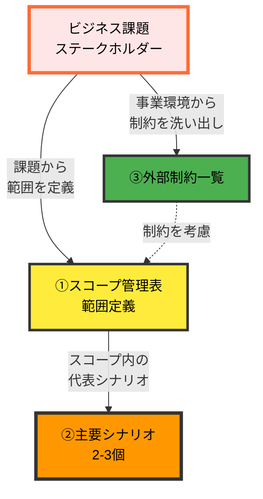

# 01. システム化計画フェーズ

**Version**: 1.0
**最終更新日**: 2025-01-30

---

## 目的

ビジネス課題を特定し、システム化の方向性とスコープを定義する。

---

## 編集可能なディレクトリ

- 編集可能: `2_docs/01_planning/`
- 参照のみ: `2_docs/00_master/`
- 編集禁止: その他全て

---

## 前提条件

システム化計画フェーズを開始する前に、以下が明確であることを確認：
- ビジネス上の課題や目標
- ステークホルダーの特定

---

## 必須作成物（MUST CREATE）と推奨作成順序

システム化計画フェーズでは、以下の順序でドキュメントを作成することを推奨します。

### 1. スコープ管理表（概要レベル）
- **格納場所**: `2_docs/00_master/01_スコープ管理表.md`
- ビジネス課題とシステム化の目的を明確化
- **必要性**: プロジェクトの範囲を早期に定義し、スコープクリープ（範囲の際限ない拡大）を防ぐ。何をシステム化し、何をシステム化しないかを明確にすることで、後工程での無駄な作業や手戻りを削減する。ステークホルダー間で合意形成の基盤となり、プロジェクトの成功基準を共有できる

### 2. 主要ユーザーシナリオ（2-3シナリオ）
- **格納場所**: `2_docs/01_planning/01_主要ユーザーシナリオ.md`
- 代表的な利用シーンを具体的に記述
- **必要性**: 抽象的な要求ではなく、具体的な利用シーンを描くことで、システムが解決すべき課題を明確にする。「注文管理システム」という抽象的な表現ではなく、「顧客が電話で注文→担当者が画面入力→在庫確認→配送手配」という具体的なシナリオを示すことで、関係者全員が同じゴールイメージを共有できる

### 3. 外部制約一覧
- **格納場所**: `2_docs/01_planning/02_外部制約一覧.md`
- **内容**:
  - 関連法令・規制（個人情報保護法、業界固有の法規制など）
  - 業界標準・ガイドライン
  - 社内規程・ポリシー
  - 取引先との契約・SLA
  - 既存システムとの連携制約
  - 提出が必要な書類・報告義務
  - その他の慣例・慣習
- **必要性**: システム設計前に法令・規制・契約上の制約を明確化することで、後工程での大幅な設計変更や手戻りを防止する。特に個人情報保護法、電子帳簿保存法、業界特有の規制などは、システムアーキテクチャに大きく影響するため、早期の洗い出しが必須。また、取引先との契約やSLAは非機能要件に直接影響し、既存システムとの連携制約は技術選定の前提条件となる

---

## 要件定義フェーズとの境界

手戻りを防ぐため、システム化計画フェーズと要件定義フェーズの成果物を明確に区別してください。

### 判断基準

| 視点 | システム化計画（WHY） | 要件定義（WHAT） |
|-----|---------|---------|
| 焦点 | なぜシステム化するか | 何を実現するか |
| 粒度 | 概要レベル | 詳細レベル |
| シナリオ | 主要2-3シナリオ | 全シナリオ網羅 |
| スコープ | 概要範囲 | 機能一覧（ID付与） |
| 成果物 | 計画書 | 要件定義書 |

---

## ドキュメント依存関係と整合性チェックポイント

### システム化計画フェーズ内のドキュメント依存関係

**凡例**:
- 実線（→）: 強い依存関係
- 点線（-.->）: 参照関係

---

## 次フェーズへの移行条件（フェーズゲート1）

要件定義フェーズに進むためには、以下の全ての条件を満たす必要があります。

### 移行条件の概要
- 全ての必須作成物が完成している
- 禁止事項に該当する成果物が含まれていない
- 以下の詳細チェックリストが全て合格
- 人間による承認が完了している

### 詳細チェックリスト

#### 前提条件確認
- [ ] ビジネス課題が明確になっているか
- [ ] 主要なステークホルダーが特定されているか

#### 必須作成物確認（3個）
- [ ] スコープ管理表（概要レベル）
- [ ] 主要ユーザーシナリオ（2-3シナリオ）
- [ ] 外部制約一覧

#### 基本項目
- [ ] ビジネス目標が明確に記述されているか
- [ ] システム化対象範囲が明確に定義されているか
- [ ] 主要ユーザーシナリオが2-3個作成されているか
- [ ] シナリオがスコープ管理表と整合しているか
- [ ] 外部制約（法令・規制・契約・既存システム制約など）が洗い出されているか
- [ ] 外部制約がスコープ定義に反映されているか

#### 禁止事項確認（境界の明確化）
- [ ] 詳細な機能要件除外
- [ ] 詳細な画面設計除外
- [ ] 詳細なデータ項目定義除外
- [ ] 詳細な業務フロー除外
- [ ] 技術実装の詳細除外
- [ ] 詳細な見積もり除外

---

次フェーズ: [02_要件定義フェーズ](./02_要件定義フェーズ.md)
