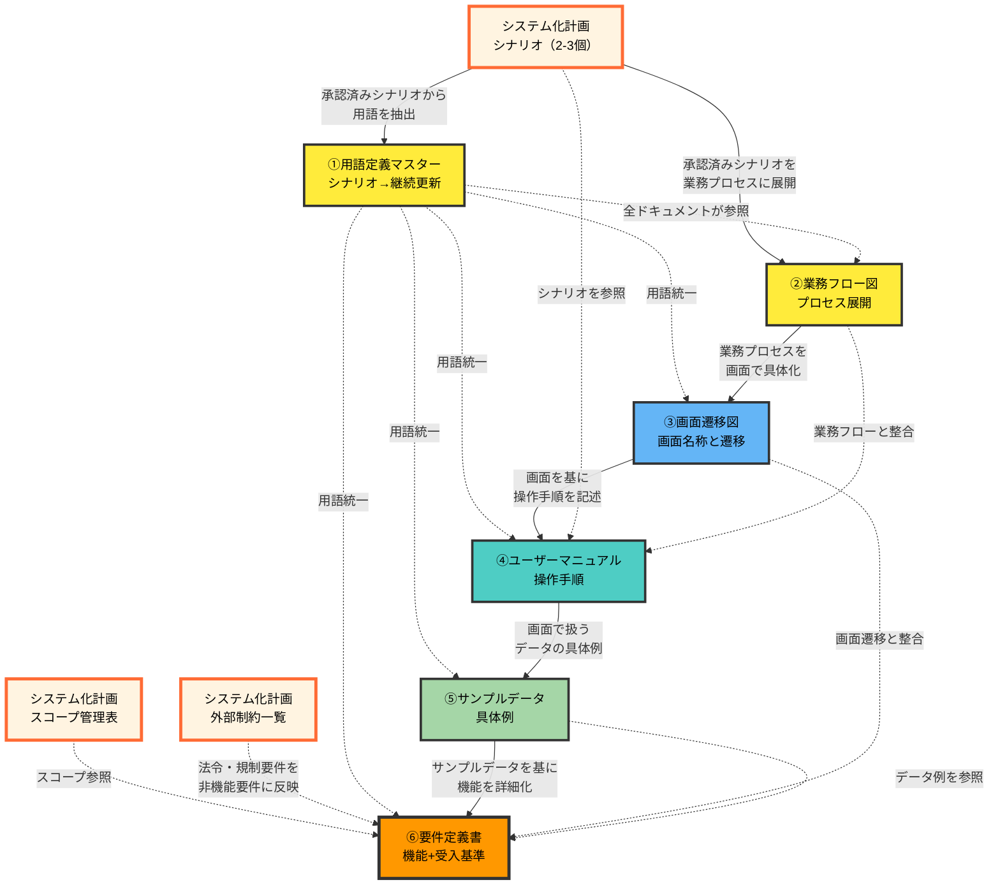

# 02. 要件定義フェーズ

**Version**: 1.1
**最終更新日**: 2025-10-28

---

## 目的

システムが満たすべき機能要件・非機能要件を明確に定義する。

---

## 編集可能なディレクトリ

- 編集可能: `2_docs/02_requirement/`
- 参照のみ: `2_docs/00_master/`, `2_docs/01_planning/`
- 編集禁止: その他全て

---

## 前提条件

システム化計画フェーズで以下が作成済みであることを確認：
- 主要ユーザーシナリオ（2-3シナリオ）
- スコープ管理表（概要レベル）
- 外部制約一覧

---

## 必須作成物（MUST CREATE）と推奨作成順序

要件定義フェーズでは、以下の順序でドキュメントを作成することを推奨します。

### 1. 用語定義マスター
- **格納場所**: `2_docs/00_master/02_用語定義マスター.md`
- シナリオから抽出し全フェーズで継続更新（Single Source of Truth）
- **必要性**: プロジェクト全体で用語の意味を統一することで、ステークホルダー間の認識齟齬を防ぐ。要件定義から運用まで全フェーズで参照され、コミュニケーションの基盤となる。特に「顧客」「ユーザー」「依頼者」など似た概念の使い分けを明確にすることで、後工程での手戻りを防止する

### 2. 業務フロー図
- **格納場所**: `2_docs/02_requirement/1_definition/01_業務フロー図.md`
- シナリオから業務プロセスを展開し、システム化ポイントを明示
- **必要性**: システムがビジネスプロセスのどの部分を支援するかを可視化する。現状（AS-IS）と理想（TO-BE）の比較により、システム化すべき範囲と人手で行う範囲を明確にし、開発優先度の判断材料とする。また業務の流れを俯瞰することで、抜け漏れや非効率な箇所を早期発見できる

### 3. 画面遷移図（概念）
- **格納場所**: `2_docs/02_requirement/1_definition/02_画面遷移図.md`
- 含む: 画面名称、遷移関係、主要ボタン
- 除外: 詳細レイアウト・UIコンポーネント（基本設計で作成）
- **必要性**: ユーザーがシステムをどのように操作するかを概念レベルで可視化し、ユーザー体験の全体像を早期に把握する。業務フローの各ステップに対応する画面を明確にすることで、画面の過不足を確認できる。ステークホルダーとの認識合わせに有効で、詳細設計前に大きな方向性の修正が可能になる

### 4. ユーザーマニュアル
- **格納場所**: `2_docs/02_requirement/1_definition/03_ユーザーマニュアル（概要版）.md`
- 画面遷移図を基に操作手順を記述
- **必要性**: エンドユーザー視点で実際の操作フローを文章化することで、システムの使いやすさを検証する。画面遷移図だけでは見えにくい操作の複雑さや非効率な手順を発見できる。また、ユーザー教育やヘルプデスクの準備を早期に開始でき、運用開始後のサポートコストを削減できる

### 5. サンプルデータ作成ガイド
- **格納場所**: `2_docs/02_requirement/1_definition/04_サンプルデータ作成ガイド.md`
- 画面で扱うデータの具体例
- **必要性**: 抽象的な要件ではなく具体的なデータ例を示すことで、ステークホルダーとの議論が具体化し、必要なデータ項目や制約条件が明確になる。「注文データ」という抽象概念ではなく、実際の注文番号や顧客名の例を示すことで、データ形式や桁数などの詳細要件を早期に確定できる

### 6. 要件定義書
- **格納場所**: `2_docs/02_requirement/1_definition/05_要件定義書.md`
- スコープ（システム化計画のスコープ管理表を参照）
- 機能一覧（機能ID付与）
- 機能要件詳細
- 非機能要件（性能、セキュリティ、可用性等）
  - セキュリティ: 脅威・リスク、保護対象資産、認証・認可機能、保護データ、監査・ログ、インシデント対応方針
  - 外部制約一覧で特定した法令・規制要件を反映
- 外部システム連携要件
- データ項目概要
- 受入基準（機能要件ごと）
- システム制約条件
- 運用要件
- **必要性**: 前工程（業務フロー図～サンプルデータ）で明確化した内容を統合し、システムが満たすべき要件を網羅的に記述する最終成果物。機能要件、非機能要件、受入基準を明確にすることで、基本設計以降の実装方針の判断基準となる。外部制約一覧で洗い出した法令・規制要件を非機能要件に反映することで、コンプライアンス違反を防止する。

---

## 要件定義と基本設計の境界

手戻りを防ぐため、要件定義フェーズと基本設計フェーズの成果物を明確に区別してください。

### 判断基準

| 視点 | 要件定義（WHAT） | 基本設計（HOW） |
|-----|---------|---------|
| 焦点 | 何を実現するか | どう実現するか |
| 業務フロー | ビジネスプロセス | システム処理順序 |
| データ | 項目一覧 | テーブル設計 |
| 画面 | 遷移図 | レイアウト |
| 通信 | 連携先 | API仕様 |

---

## ドキュメント依存関係と整合性チェックポイント

### 要件定義フェーズ内のドキュメント依存関係

**凡例**:
- 実線（→）: 強い依存関係
- 点線（-.->）: 参照関係

---

## 次フェーズへの移行条件（フェーズゲート2）

基本設計フェーズに進むためには、以下の全ての条件を満たす必要があります。

### 移行条件の概要
- 全ての必須作成物が完成している
- 禁止事項に該当する成果物が含まれていない
- 前フェーズ（システム化計画）との整合性が確認されている
- 以下の詳細チェックリストが全て合格
- 人間による承認が完了している

### 詳細チェックリスト

#### 前提条件確認
- [ ] システム化計画フェーズの主要ユーザーシナリオ（2-3シナリオ）が作成済みか
- [ ] システム化計画フェーズのスコープ管理表（概要レベル）が作成済みか
- [ ] システム化計画フェーズの外部制約一覧が作成済みか

#### 必須作成物確認（6個）
- [ ] 用語定義マスター
- [ ] 業務フロー図
- [ ] 画面遷移図（概念）
- [ ] ユーザーマニュアル
- [ ] サンプルデータ作成ガイド
- [ ] 要件定義書

#### 基本項目
- [ ] 機能要件が網羅的に記述されているか
- [ ] 各機能要件に受入基準が記載されているか
- [ ] 非機能要件が具体的な数値で記述されているか
- [ ] 業務フロー図がTO-BEプロセスを反映しているか
- [ ] 用語定義マスターの用語が全ドキュメントで一貫して使用されているか
- [ ] 要件定義書のスコープがシステム化計画のスコープ管理表を参照しているか
- [ ] 要件定義書に機能一覧（機能ID付与）が含まれているか
- [ ] 外部システム連携要件が要件定義書に統合されているか（別ドキュメントにしていないか）
- [ ] 外部制約一覧で特定した法令・規制要件が非機能要件に反映されているか

#### 禁止事項確認（境界の明確化）
- [ ] データ項目定義マスター（詳細）除外
- [ ] データベース物理設計除外
- [ ] API詳細仕様除外
- [ ] 処理シーケンス図/タイミング図除外
- [ ] ER図（実装レベル）除外
- [ ] システム処理の詳細な順序除外
- [ ] テスト計画書除外
- [ ] 詳細なテストケース除外
- [ ] ソースコード除外
- [ ] 画面の詳細レイアウト除外

#### セキュリティ確認
- [ ] セキュリティ要件（脅威・リスク、保護対象資産、認証・認可、監査・ログ、インシデント対応方針）が定義されているか

---