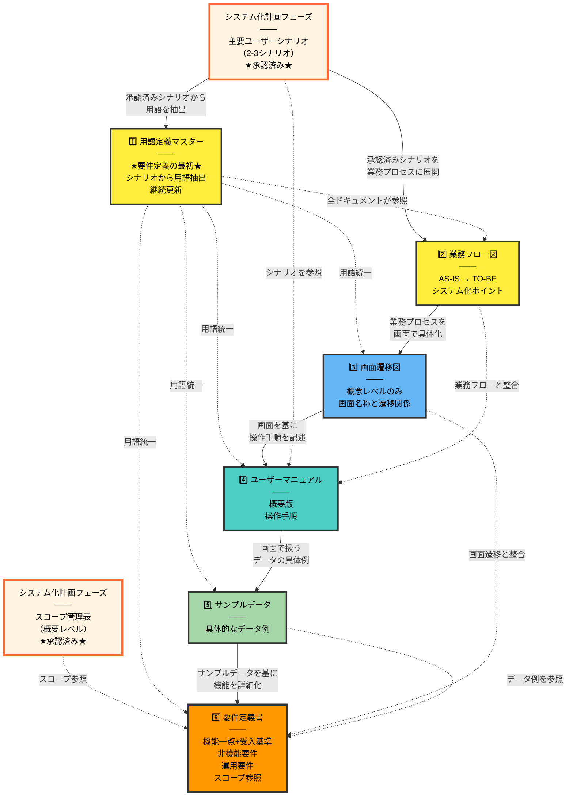

# 02. 要件定義フェーズ

**Version**: 1.1
**最終更新日**: 2025-10-28

---

## 目的

システムが満たすべき機能要件・非機能要件を明確に定義する。

---

## 編集可能なディレクトリ

- ✅ **編集可能**: `docs/02_requirement/`
- 📖 **参照のみ**: `docs/00_project/`, `docs/01_business/`
- ❌ **編集禁止**: その他全て

---

## 前提条件

要件定義フェーズを開始する前に、システム化計画フェーズで以下が承認済みであることを確認してください：

- ✅ **主要ユーザーシナリオ（2-3シナリオ）**が承認済み
- ✅ **スコープ管理表（概要レベル）**が承認済み

---

## 必須作成物（MUST CREATE）と推奨作成順序

要件定義フェーズでは、以下の順序でドキュメントを作成することを推奨します。

### 1. 用語定義マスター ← ★要件定義の最初★
- **格納場所**: `2_docs/00_master/02_用語定義マスター.md`
- **内容**: 承認済みシナリオから用語を抽出・定義
- **継続更新**: 要件定義、基本設計、詳細設計、実装、運用まで継続更新
- **重要性**: Single Source of Truth。全ドキュメントで用語を統一するための基盤

### 2. 業務フロー図
- **内容**: 承認済みシナリオを業務プロセスに展開
- AS-IS（現状）業務フロー
- TO-BE（理想）業務フロー
- システム化ポイントの明示

### 3. 画面遷移図（概念レベル）
- **粒度**: 概念レベルのみ
  - ✅ 画面名称とその役割
  - ✅ 画面間の遷移関係（矢印）
  - ✅ 主要なボタン・リンク名
  - ❌ 詳細なレイアウト（配置、サイズ、色）← 基本設計で作成
  - ❌ 詳細なUIコンポーネント（ドロップダウン、モーダル等）← 基本設計で作成
- **作成理由**: 業務プロセスを画面で具体化

### 4. ユーザーマニュアル（概要版）
- **内容**: 画面遷移図を基に操作手順を記述
- 画面の全体像を踏まえた操作手順
- 各画面での操作内容を具体的に記述
- 利用者向けの操作概要

### 5. サンプルデータ作成ガイド
- **内容**: 画面で扱うデータの具体例
- **作成理由**:
  - サンプルデータがあることで、要件定義書を書く際に「このデータ項目が必要」と具体的に記述できる
  - 抽象的な要件より、具体的なデータ例がある方がステークホルダーと議論しやすい

### 6. 要件定義書
- **内容**: サンプルデータを基に機能を詳細化
- スコープ（システム化計画で承認済みのスコープ管理表を参照）
- **機能一覧（機能ID付与）** ← スコープ管理表の詳細版
- 機能要件詳細
- 非機能要件（性能、セキュリティ、可用性等）
- 外部システム連携要件（別ドキュメント不要、要件定義書の一章として記載）
- 必要なデータ項目の概要
- 受入基準（各機能要件ごとに記載）
- システム制約条件
- 運用要件

---

## 作成順序の理由

### 画面遷移図を先に作成する理由
- スコープ管理表で「今回実装する機能」を確定した後、画面遷移図で「どの画面でそれを実現するか」を具体化
- 画面遷移図（概念レベル）を見ながら要件定義書を書くことで、機能要件が具体的になる
- 「この画面にはこの機能が必要」という形で要件を記述できる
- 画面の流れを考えることで、エラーハンドリングや画面遷移の要件も明確になる

### サンプルデータを画面遷移図の後に作成する理由
- 画面遷移図で「どの画面があるか」を明確化した後、その画面で「どんなデータを扱うか」を具体例で示す
- サンプルデータ作成時に「このデータ項目が足りない」と気づくことができる

---

## 削除・移動したドキュメント

### 基本設計フェーズに移動したドキュメント

#### データ項目定義マスター
- **移動理由**: データ項目の詳細（型、桁数、制約条件）は「HOW（どのように実装するか）」なので基本設計で決定
- **要件定義での対応**: 要件定義書には「必要なデータの種類」を概要レベルで記載
- **格納場所**: `2_docs/00_master/03_データ項目定義マスター.md`（基本設計フェーズで作成開始）
- **作成タイミング**: テーブル設計・ER図と一体で作成する方が効率的

#### テスト計画書
- **移動理由**: 詳細なテストケースは、システム構成（画面、API、DB）が確定してから作成すべき
- **要件定義での対応**: 要件定義書の各機能要件に「受入基準」を記載することで、テストの方針は担保
- **基本設計での対応**: 具体的なテスト項目・テストケース・テスト手順を定義

### システム化計画フェーズに移動したドキュメント

#### ユーザーシナリオ
- **移動理由**:
  - プロジェクトの方向性を早期に確定できる
  - 要件定義フェーズでの手戻りを削減できる
  - 業務フロー図とユーザーマニュアルで内容が重複するため、要件定義での詳細化は不要

### 削除したドキュメント

#### ユースケース図
- **削除理由**: ユーザーシナリオと業務フロー図でカバー済み
  - ユーザーシナリオで「誰が何をするか」を具体的に記述
  - 業務フロー図で「業務の流れ」を可視化
  - ユースケース図を追加しても、新しい情報がほとんどない（冗長）

---

## 外部システム連携要件の記載方法

外部システムとの連携がある場合は、**要件定義書に以下のような章を追加**します（別ドキュメント不要）：

```markdown
## 7. 外部システム連携要件

### 7.1 LINE Messaging API

#### 連携目的
- 依頼者からのファイル受信
- 依頼者へのステータス通知

#### 連携方式
- REST API（Webhook）
- メッセージ送信API

#### データ項目
- ユーザーID、メッセージ内容、添付ファイル

#### エラーハンドリング
- API障害時は管理画面で通知
```

このように、要件定義書の中に統合することで、**ドキュメント数を削減**し、**一元管理**できます。

---

## サービス仕様比較表（該当する場合のみ）

複数のサービスタイプやプランを提供するシステムの場合のみ作成：
- サービスタイプごとの機能比較
- 料金体系の比較
- 確認項目・入力項目の差分整理
- サービス追加時の考慮事項

**注意**: これは**ビジネス要件レベル**での比較です。システム実装の詳細（API仕様、データベース設計）は含めません。

---

## 禁止事項（MUST NOT CREATE）

### 基本設計フェーズで作成すべきもの
- ❌ 詳細なデータベース物理設計
- ❌ 詳細なAPI仕様
- ❌ 詳細な画面レイアウト
- ❌ **処理シーケンス図/タイミング図**（システムの処理順序）
- ❌ **ER図（実装レベル）**（エンティティ関連、外部キー等）

### 詳細設計フェーズで作成すべきもの
- ❌ クラス図
- ❌ 詳細なシーケンス図

### その他のフェーズで作成すべきもの
- ❌ ソースコード（実装フェーズで作成）
- ❌ 詳細なテストケース（テストフェーズで作成）
- ❌ インフラ構築手順（デプロイフェーズで作成）

---

## 要件定義と基本設計の境界

手戻りを防ぐため、要件定義フェーズと基本設計フェーズの成果物を明確に区別してください。

### 判断基準

| 視点 | 要件定義 | 基本設計 |
|-----|---------|---------|
| **焦点** | WHAT（何を実現するか） | HOW（どのように実現するか） |
| **業務フロー図** | ✅ ビジネスプロセス | ❌ システム処理順序 |
| **データ定義** | ✅ データ項目一覧 | ❌ テーブル設計・ER図 |
| **画面定義** | ✅ 画面遷移図（概念） | ❌ 画面レイアウト（詳細） |
| **通信仕様** | ✅ 外部連携先の特定 | ❌ API詳細仕様 |

### 境界が曖昧になりやすい図表

以下の図表は、**基本設計フェーズで作成**してください：

1. **処理シーケンス図/タイミング図**
   - ❌ 要件定義: システムの処理順序の詳細は含めない
   - ✅ 基本設計: タスクキュー、タイムアウト管理、リトライロジック等を設計

2. **データモデル（ER図）**
   - ❌ 要件定義: テーブル構造の詳細は含めない
   - ✅ 基本設計: エンティティ関連、外部キー、カーディナリティ等を設計

3. **サービス仕様比較表**
   - ✅ 要件定義: ビジネス要件レベルでの比較（料金体系、サービス内容）
   - ❌ 基本設計: システム実装の詳細（API設計、データベース設計）

### ディレクトリ構造例

要件定義フェーズと基本設計フェーズのドキュメント配置例：

```
docs/
├── 02_requirement/
│   └── 1_definition/
│       ├── 01_要件定義書.md
│       ├── 02_業務フロー図.md
│       ├── 03_サービスタイプ比較表.md ※ビジネス要件の比較
│       └── 2_sample_data/
│           └── 01_サンプルデータ定義
│
└── 03_basic_design/
    ├── 01_処理シーケンス図.md ※システム処理の詳細
    └── 02_データモデル.md      ※ER図、エンティティ設計
```

**ポイント**:
- 要件定義では「何を実現するか」に焦点
- 基本設計では「どのように実現するか」に焦点

---

## AIへの指示例

```
「以下の要件定義書を作成してください：
- 機能要件一覧
- 非機能要件
- 業務フロー図
- ユースケース
- 用語定義
- 画面遷移図（概念レベル）
- データ項目定義

ファイルパス: docs/02_requirement/要件定義書.md

注意事項：
- docs/02_requirement/ 配下のファイルのみ編集してください
- データベースの物理設計やAPI仕様の詳細、ソースコードは含めないでください
- docs/03_basic_design/ 以降のフェーズのファイルは作成しないでください
- 前フェーズ（docs/01_business/）のファイルは参照のみ可能です」
```

---

## ドキュメント依存関係と整合性チェックポイント

### 要件定義フェーズ内のドキュメント依存関係



**凡例**:
- **実線（→）**: 強い依存関係（前提条件）
- **点線（-.->）**: 参照関係（整合性確認が必要）
- **オレンジ枠**: システム化計画フェーズからの入力（承認済み）
- **黄色**: 最優先で作成すべき基盤ドキュメント
- **オレンジ**: 中核となるドキュメント

---

## セキュリティチェックリスト

このフェーズで確認すべきセキュリティ項目：

### 認証・認可要件
- [ ] 認証方式を定義したか（パスワード、OAuth、多要素認証等）
- [ ] 認可方式を定義したか（ロールベース、属性ベース等）
- [ ] セッション管理要件を定義したか

### データ保護要件
- [ ] データ暗号化要件を定義したか（保存時、通信時）
- [ ] 個人情報の匿名化・仮名化要件を定義したか
- [ ] バックアップとリストアの要件を定義したか

### アクセス制御要件
- [ ] ユーザー権限の定義があるか
- [ ] データへのアクセス制御要件があるか
- [ ] APIのアクセス制御要件があるか

### 監査・ログ要件
- [ ] ログ記録要件を定義したか
- [ ] 監査証跡要件を定義したか
- [ ] ログの保管期間を定義したか

### セキュリティ事故対応要件
- [ ] インシデント対応要件を定義したか
- [ ] データ漏洩時の対応手順を定義したか

---

## フェーズゲート2チェックリスト

### 前提条件確認
- [ ] システム化計画フェーズの主要ユーザーシナリオ（2-3シナリオ）が承認済みか
- [ ] システム化計画フェーズのスコープ管理表（概要レベル）が承認済みか

### 必須作成物確認（6個）
- [ ] 1. 用語定義マスターが作成されているか（`2_docs/00_master/02_用語定義マスター.md`）
- [ ] 2. 業務フロー図が作成されているか
- [ ] 3. 画面遷移図（概念レベル）が作成されているか
- [ ] 4. ユーザーマニュアル（概要版）が作成されているか
- [ ] 5. サンプルデータ作成ガイドが作成されているか
- [ ] 6. 要件定義書が作成されているか

### 基本項目
- [ ] 機能要件が網羅的に記述されているか
- [ ] 各機能要件に受入基準が記載されているか
- [ ] 非機能要件が具体的な数値で記述されているか
- [ ] 業務フロー図がTO-BEプロセスを反映しているか
- [ ] 用語定義マスターの用語が全ドキュメントで一貫して使用されているか
- [ ] 要件定義書のスコープがシステム化計画のスコープ管理表を参照しているか
- [ ] 要件定義書に機能一覧（機能ID付与）が含まれているか
- [ ] 外部システム連携要件が要件定義書に統合されているか（別ドキュメントにしていないか）

### 禁止事項確認（境界の明確化）
- [ ] データ項目定義マスター（詳細）が含まれていないか（基本設計で作成）
- [ ] データベース物理設計が含まれていないか（基本設計で作成）
- [ ] API詳細仕様が含まれていないか（基本設計で作成）
- [ ] 処理シーケンス図/タイミング図が含まれていないか（基本設計で作成）
- [ ] ER図（実装レベル）が含まれていないか（基本設計で作成）
- [ ] システム処理の詳細な順序が記述されていないか（基本設計で作成）
- [ ] テスト計画書が含まれていないか（基本設計で作成）
- [ ] 詳細なテストケースが含まれていないか（基本設計で作成）
- [ ] ソースコードが含まれていないか（実装フェーズで作成）
- [ ] 画面の詳細レイアウト（配置、サイズ、色）が含まれていないか（基本設計で作成）

### セキュリティ確認
- [ ] 認証・認可要件が定義されているか
- [ ] データ保護要件が定義されているか
- [ ] 監査・ログ要件が定義されているか

---

## 次フェーズへの移行条件

- 全ての必須作成物が完成している
- 禁止事項に該当する成果物が含まれていない
- 前フェーズ（システム化計画）との整合性が確認されている
- フェーズゲート2チェックリストが全て合格
- 人間による承認が完了している

前フェーズ: [01_システム化計画フェーズ](./01_システム化計画フェーズ.md)
次フェーズ: [03_基本設計フェーズ](./03_基本設計フェーズ.md)
