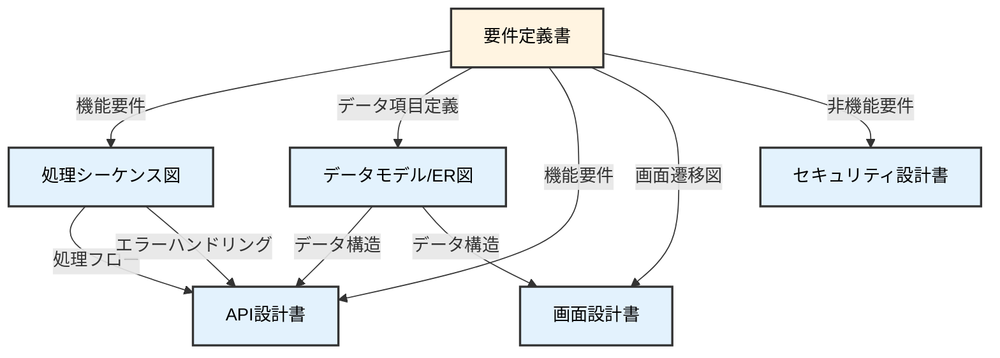

# 03. 基本設計フェーズ

**Version**: 1.1
**最終更新日**: 2025-10-28

---

## 目的

要件を実現するためのシステム構造・インターフェース・データ構造を定義する。

---

## 編集可能なディレクトリ

- ✅ **編集可能**: `docs/03_basic_design/`
- 📖 **参照のみ**: `docs/00_project/`, `docs/01_business/`, `docs/02_requirement/`
- ❌ **編集禁止**: その他全て

---

## 必須作成物（MUST CREATE）

### 1. 処理シーケンス図/タイミング図
- システムの処理順序
- タイムアウト管理
- リトライロジック
- エラーハンドリングフロー
- 非同期処理・タスクキュー設計

**注意**: 要件定義では業務フローのみを定義します。基本設計でシステムの処理順序を設計してください。

### 2. データモデル（ER図）
- エンティティ関連図
- 外部キー定義
- カーディナリティ（1:1, 1:N, N:M）
- データ整合性制約

**注意**: 要件定義ではデータ項目定義のみを作成します。基本設計でER図とテーブル設計を行ってください。

### 3. システム構成図
- フロントエンド、バックエンド、データベース、外部システムの配置
- 技術スタックの明示

### 4. データベース設計書（論理設計）
- テーブル定義（論理モデル）
- リレーションシップ定義
- インデックス設計方針

### 5. API設計書
- エンドポイント一覧
- リクエスト/レスポンス仕様
- 認証・認可方式

### 6. 画面設計書
- 画面レイアウト
- UIコンポーネント定義
- 画面項目とデータ項目のマッピング

### 7. 外部インターフェース設計書
- 外部システムとの連携仕様
- データフォーマット定義

### 8. セキュリティ設計書
- 認証・認可方式
- データ暗号化方式
- 通信プロトコル

### 9. エラーハンドリング設計
- エラーコード体系
- エラーメッセージ定義

### 10. 技術仕様マスター
- 採用ライブラリ一覧
- バージョン情報
- ライセンス情報

---

## 禁止事項（MUST NOT CREATE）

### 詳細設計フェーズで作成すべきもの
- ❌ 詳細なクラス設計
- ❌ 関数レベルの処理フロー

### その他のフェーズで作成すべきもの
- ❌ ソースコード（実装フェーズで作成）
- ❌ 単体テストケース（テストフェーズで作成）
- ❌ インフラ構築スクリプト（デプロイフェーズで作成）
- ❌ 運用手順書（運用フェーズで作成）

---

## 基本設計と要件定義の境界

基本設計フェーズでは、要件定義で定義した「WHAT（何を）」を「HOW（どのように）」に変換します。

### 要件定義から引き継ぐもの

| 要件定義の成果物 | 基本設計での展開 |
|----------------|----------------|
| ✅ 機能要件（WHAT） | → システムの処理順序（HOW）に変換 |
| ✅ データ項目一覧 | → テーブル設計・ER図に展開 |
| ✅ 業務フロー図 | → 処理シーケンス図に展開 |
| ✅ 外部連携先 | → API詳細仕様に展開 |
| ✅ 画面遷移図（概念） | → 画面レイアウト（詳細）に展開 |

### 基本設計で新たに作成するもの

1. **処理シーケンス図/タイミング図**
   - システムの処理順序を具体的に設計
   - タイムアウト、リトライ、エラーハンドリングを定義
   - タスクキュー、非同期処理の設計

2. **データモデル（ER図）**
   - エンティティ関連を定義
   - 外部キー、カーディナリティを設計
   - データ整合性制約を定義

3. **API詳細仕様**
   - エンドポイントURL、HTTPメソッド
   - リクエスト/レスポンスの具体的な構造
   - 認証方式、エラーレスポンス

4. **画面レイアウト**
   - UIコンポーネントの配置
   - 画面項目とデータ項目のマッピング

### 要件定義との整合性確認

基本設計を作成する際は、常に以下を確認してください：

- [ ] 要件定義書の全機能要件をカバーしているか
- [ ] 要件定義のデータ項目定義と整合しているか
- [ ] 要件定義の非機能要件を満たしているか
- [ ] 要件定義で定義されていない機能を追加していないか

---

## AIへの指示例

```
「基本設計書を作成してください：
- システム構成図
- データベース論理設計（ER図、テーブル定義）
- API設計書（エンドポイント、リクエスト/レスポンス）
- 画面設計書（レイアウト、コンポーネント）
- セキュリティ設計書

ファイルパス: docs/03_basic_design/基本設計書.md

注意事項：
- docs/03_basic_design/ 配下のファイルのみ編集してください
- 詳細なクラス設計やソースコードは含めないでください
- docs/04_detail_design/ 以降のフェーズのファイルは作成しないでください
- 前フェーズ（docs/02_requirement/）のファイルは参照のみ可能です」
```

---

## 整合性チェックポイント



---

## セキュリティチェックリスト

このフェーズで確認すべきセキュリティ項目：

### 通信のセキュリティ
- [ ] HTTPS通信を必須としたか
- [ ] TLS 1.2以上を使用しているか
- [ ] 証明書の管理方法を定義したか

### データ暗号化
- [ ] 保存データの暗号化方式を定義したか
- [ ] 暗号化キーの管理方法を定義したか
- [ ] 個人情報は暗号化して保存するか

### 認証・認可の設計
- [ ] 認証フローを設計したか
- [ ] パスワードポリシーを定義したか（長さ、複雑性等）
- [ ] セッション管理方式を設計したか（トークン有効期限等）
- [ ] CSRF対策を設計したか

### API セキュリティ
- [ ] API認証方式を設計したか（JWT、APIキー等）
- [ ] レートリミットを設計したか
- [ ] 入力値検証を設計したか

### データベースセキュリティ
- [ ] データベースアクセス制御を設計したか
- [ ] SQLインジェクション対策を設計したか
- [ ] データベース暗号化を設計したか

---

## フェーズゲート3チェックリスト

### 基本項目
- [ ] システム構成図が技術スタックを明示しているか
- [ ] ER図がデータ項目定義マスターと整合しているか
- [ ] API仕様が全機能要件をカバーしているか
- [ ] 画面設計が画面遷移図と整合しているか
- [ ] セキュリティ要件が設計に反映されているか
- [ ] 要件定義書の用語定義が使用されているか

### 禁止事項確認
- [ ] クラス詳細設計が含まれていないか（禁止事項）
- [ ] ソースコードが含まれていないか（禁止事項）
- [ ] テストケースが含まれていないか（禁止事項）

### セキュリティ確認
- [ ] HTTPS通信を必須としたか
- [ ] データ暗号化方式を定義したか
- [ ] 認証・認可フローを設計したか
- [ ] API セキュリティを設計したか

---

## 次フェーズへの移行条件

- 全ての必須作成物が完成している
- 禁止事項に該当する成果物が含まれていない
- 前フェーズ（要件定義）との整合性が確認されている
- フェーズゲート3チェックリストが全て合格
- 人間による承認が完了している

前フェーズ: [02_要件定義フェーズ](./02_要件定義フェーズ.md)
次フェーズ: [04_詳細設計フェーズ](./04_詳細設計フェーズ.md)
