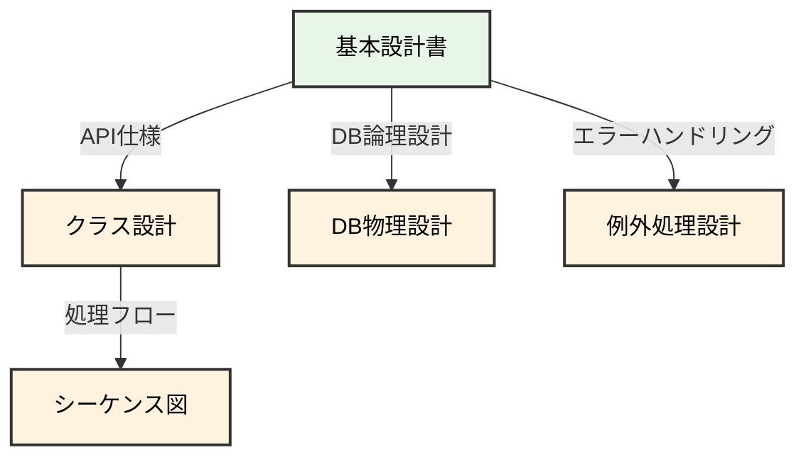

# 04. 詳細設計フェーズ

**Version**: 1.1
**最終更新日**: 2025-10-28

---

## 目的

基本設計を実装可能なレベルまで詳細化する。

---

## 編集可能なディレクトリ

- ✅ **編集可能**: `docs/04_detail_design/`
- 📖 **参照のみ**: `docs/00_project/` ~ `docs/03_basic_design/`
- ❌ **編集禁止**: その他全て

---

## 必須作成物（MUST CREATE）

### 1. クラス設計書
- クラス図
- クラス責務定義
- 属性・メソッド定義

### 2. シーケンス図
- 主要処理のオブジェクト間相互作用
- API呼び出しフロー

### 3. 処理フロー図
- 主要アルゴリズムの詳細フロー
- 分岐条件の明示

### 4. データベース物理設計書
- 物理テーブル名
- インデックス定義
- パーティション設計

### 5. コーディング規約
- 命名規則
- フォーマット規則
- コメント記述規則

### 6. 例外処理設計書
- 例外クラス定義
- エラーハンドリングフロー

### 7. ロギング設計書
- ログレベル定義
- ログ出力項目
- ログローテーション方針

---

## 禁止事項（MUST NOT CREATE）

- ❌ 実装コード（実装フェーズで作成）
- ❌ 単体テストコード（テストフェーズで作成）
- ❌ ビルドスクリプト（実装フェーズで作成）
- ❌ デプロイ手順書（デプロイフェーズで作成）
- ❌ 運用監視設定（運用フェーズで作成）

---

## AIへの指示例

```
「詳細設計書を作成してください：
- クラス設計書（クラス図、属性・メソッド定義）
- シーケンス図（主要処理フロー）
- データベース物理設計
- コーディング規約

ファイルパス: docs/04_detail_design/詳細設計書.md

注意事項：
- docs/04_detail_design/ 配下のファイルのみ編集してください
- 実装コードやテストコードは含めないでください。設計レベルに留めてください
- system/ 配下（実装ファイル）は一切作成しないでください
- 前フェーズ（docs/03_basic_design/）のファイルは参照のみ可能です」
```

---

## 整合性チェックポイント



---

## セキュリティチェックリスト

このフェーズで確認すべきセキュリティ項目：

### 入力値検証
- [ ] 全ての入力値に対する検証ロジックを設計したか
- [ ] ホワイトリスト方式の検証を採用したか
- [ ] エラーメッセージで内部情報を漏らさないか

### エラーハンドリング
- [ ] エラーメッセージで機密情報を漏らさないか
- [ ] スタックトレースを本番環境で表示しないか
- [ ] エラーログに機密情報を記録しないか

### ロギング
- [ ] 認証・認可の失敗をログに記録するか
- [ ] ログに個人情報・パスワードを記録しないか
- [ ] ログの改ざん防止策があるか

### セキュアコーディング
- [ ] パスワードのハッシュ化アルゴリズムを定義したか（bcrypt等）
- [ ] 乱数生成に暗号学的に安全な方法を使用するか
- [ ] ハードコードされた秘密情報がないか確認したか

---

## フェーズゲート4チェックリスト

### 基本項目
- [ ] クラス設計がAPI設計と整合しているか
- [ ] シーケンス図が全API処理をカバーしているか
- [ ] データベース物理設計が論理設計と整合しているか
- [ ] コーディング規約が定義されているか
- [ ] 例外処理設計がエラーハンドリング設計と整合しているか

### 禁止事項確認
- [ ] 実装コードが含まれていないか（禁止事項）
- [ ] テストコードが含まれていないか（禁止事項）
- [ ] デプロイスクリプトが含まれていないか（禁止事項）

### セキュリティ確認
- [ ] 入力値検証ロジックを設計したか
- [ ] エラーメッセージで機密情報を漏らさないか
- [ ] ロギング設計でセキュリティを考慮したか
- [ ] セキュアコーディング規約を定義したか

---

## 次フェーズへの移行条件

- 全ての必須作成物が完成している
- 禁止事項に該当する成果物が含まれていない
- 前フェーズ（基本設計）との整合性が確認されている
- フェーズゲート4チェックリストが全て合格
- 人間による承認が完了している

前フェーズ: [03_基本設計フェーズ](./03_基本設計フェーズ.md)
次フェーズ: [05_実装フェーズ](./05_実装フェーズ.md)
