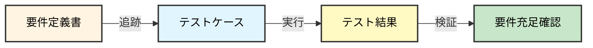

# 06. テストフェーズ

**Version**: 1.1
**最終更新日**: 2025-10-28

---

## 目的

実装されたシステムが要件を満たしていることを検証する。

---

## 編集可能なディレクトリ

- ✅ **編集可能**: `system/`, `docs/06_test/`
- 📖 **参照のみ**: `docs/00_project/` ~ `docs/05_implementation/`
- ❌ **編集禁止**: 前フェーズのdocs

---

## 必須作成物（MUST CREATE）

### 1. 単体テストコード
- 全関数・メソッドの単体テスト
- カバレッジレポート

### 2. 統合テストコード
- API統合テスト
- データベース統合テスト

### 3. E2Eテストコード
- ユーザーシナリオベースのE2Eテスト

### 4. テストケース仕様書
- テストケースID、テスト項目、期待結果
- トレーサビリティマトリクス（要件⇔テストケース）

### 5. テスト結果報告書
- 合格/不合格の記録
- 不具合報告

### 6. パフォーマンステスト結果
- 負荷テスト結果
- 非機能要件との比較

### 7. セキュリティテスト結果
- 脆弱性スキャン結果
- ペネトレーションテスト結果

---

## 禁止事項（MUST NOT CREATE）

- ❌ 新機能の実装（実装フェーズに戻る）
- ❌ 設計の変更（詳細設計フェーズに戻る）
- ❌ デプロイスクリプト（デプロイフェーズで作成）
- ❌ 運用手順書（運用フェーズで作成）

---

## AIへの指示例

```
「以下のテストを作成・実行してください：
- [機能名] の単体テスト
- [機能名] の統合テスト
- 要件定義書のユースケースに基づくE2Eテスト
- テスト結果報告書

テストコード配置: system/tests/
ドキュメント配置: docs/06_test/

注意事項：
- テスト中に新機能を追加しないでください
- 不具合のみ修正してください
- docs/07_deploy/ 以降のフェーズのファイルは作成しないでください」
```

---

## テストトレーサビリティ



---

## セキュリティチェックリスト

このフェーズで確認すべきセキュリティ項目：

### セキュリティテスト
- [ ] 入力値検証のテストを実施したか
- [ ] 認証・認可のテストを実施したか
- [ ] XSS脆弱性のテストを実施したか
- [ ] SQLインジェクション脆弱性のテストを実施したか
- [ ] CSRF脆弱性のテストを実施したか

### 脆弱性スキャン
- [ ] 依存ライブラリの脆弱性スキャンを実施したか
- [ ] Webアプリケーションの脆弱性スキャンを実施したか

### ペネトレーションテスト
- [ ] 認証バイパスのテストを実施したか
- [ ] 権限昇格のテストを実施したか
- [ ] データアクセス制御のテストを実施したか

---

## フェーズゲート6チェックリスト

### 基本項目
- [ ] 全要件に対応するテストケースが存在するか
- [ ] 単体テストカバレッジが基準を満たしているか
- [ ] 統合テストが全API仕様をカバーしているか
- [ ] E2Eテストが全ユースケースをカバーしているか
- [ ] 非機能要件（性能、セキュリティ）が満たされているか
- [ ] 不具合が全て解決されているか

### 禁止事項確認
- [ ] 新機能が追加されていないか（禁止事項）
- [ ] 設計書が無断で変更されていないか（禁止事項）

### セキュリティ確認
- [ ] セキュリティテストを実施したか
- [ ] 脆弱性スキャンを実施したか
- [ ] ペネトレーションテストを実施したか
- [ ] 全脆弱性が修正されたか

---

## 次フェーズへの移行条件

- 全ての必須作成物が完成している
- 禁止事項に該当する成果物が含まれていない
- 全テストケースが合格している
- フェーズゲート6チェックリストが全て合格
- 人間による承認が完了している

前フェーズ: [05_実装フェーズ](./05_実装フェーズ.md)
次フェーズ: [07_デプロイフェーズ](./07_デプロイフェーズ.md)
