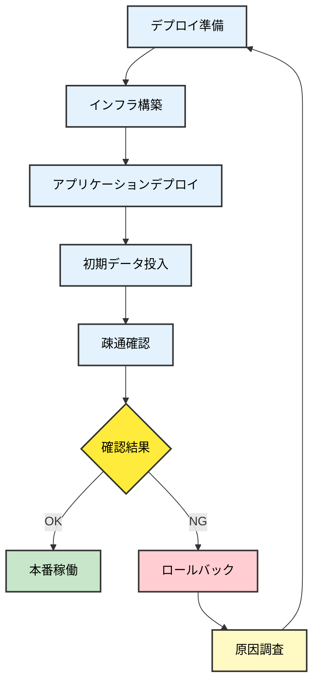

# 07. デプロイフェーズ

**Version**: 1.1
**最終更新日**: 2025-10-28

---

## 目的

システムを本番環境に展開し、稼働開始する。

---

## 編集可能なディレクトリ

- ✅ **編集可能**: `system/`, `docs/07_deploy/`
- 📖 **参照のみ**: `docs/00_project/` ~ `docs/06_test/`
- ❌ **編集禁止**: 前フェーズのdocs

---

## 必須作成物（MUST CREATE）

### 1. インフラ構築スクリプト
- IaC（Terraform, CloudFormation等）
- コンテナイメージ（Docker）

### 2. CI/CDパイプライン設定
- ビルド・テスト・デプロイの自動化設定

### 3. デプロイ手順書
- 本番環境へのデプロイ手順
- ロールバック手順

### 4. 環境構築ドキュメント
- インフラ構成図（本番環境）
- ネットワーク設定
- セキュリティグループ設定

### 5. 初期データ投入スクリプト
- マスターデータ投入SQL
- 初期設定データ

### 6. デプロイチェックリスト
- デプロイ前チェック項目
- デプロイ後確認項目

### 7. リリースノート
- リリースバージョン
- 新機能・修正内容

---

## 禁止事項（MUST NOT CREATE）

- ❌ 新機能の追加（実装フェーズに戻る）
- ❌ 運用監視ダッシュボード（運用フェーズで作成）
- ❌ 障害対応手順書（運用フェーズで作成）
- ❌ バックアップ運用手順（運用フェーズで作成）

---

## AIへの指示例

```
「本番環境へのデプロイ準備を行ってください：
- インフラ構築スクリプト（Terraform）
- CI/CDパイプライン設定
- デプロイ手順書
- 初期データ投入スクリプト

スクリプト配置: system/infrastructure/
ドキュメント配置: docs/07_deploy/

注意事項：
- 新機能の追加や運用手順書は含めないでください
- docs/08_operation/ のファイルは作成しないでください」
```

---

## デプロイフロー



---

## フェーズゲート7チェックリスト

- [ ] インフラ構築スクリプトが動作するか
- [ ] CI/CDパイプラインが正常に動作するか
- [ ] デプロイ手順書が明確で再現可能か
- [ ] 本番環境でアプリケーションが起動するか
- [ ] 初期データが正しく投入されているか
- [ ] セキュリティ設定が要件通りか
- [ ] ロールバック手順が確認されているか
- [ ] 新機能が追加されていないか（禁止事項）
- [ ] 運用手順書が含まれていないか（禁止事項）

---

## 次フェーズへの移行条件

- 全ての必須作成物が完成している
- 禁止事項に該当する成果物が含まれていない
- 本番環境への展開が成功している
- フェーズゲート7チェックリストが全て合格
- 人間による承認が完了している

前フェーズ: [06_テストフェーズ](./06_テストフェーズ.md)
次フェーズ: [08_運用フェーズ](./08_運用フェーズ.md)
