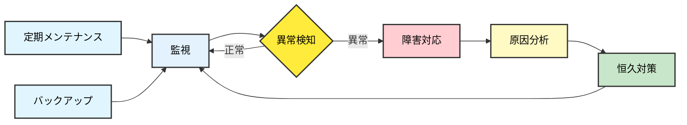

# 08. 運用フェーズ

**Version**: 1.1
**最終更新日**: 2025-10-28

---

## 目的

システムを安定稼働させ、継続的に改善する。

---

## 編集可能なディレクトリ

- ✅ **編集可能**: `system/`, `docs/08_operation/`
- 📖 **参照のみ**: 全てのdocs
- ❌ **編集禁止**: なし（運用中の改善は可能）

---

## 必須作成物（MUST CREATE）

### 1. 運用手順書
- 日次運用手順
- 月次運用手順
- 定期メンテナンス手順

### 2. 監視設定
- アプリケーション監視設定
- インフラ監視設定
- アラート通知設定

### 3. 障害対応手順書
- 障害レベル定義
- エスカレーションフロー
- 障害切り分け手順

### 4. バックアップ・リストア手順書
- バックアップスケジュール
- リストア手順
- データ保管ポリシー

### 5. FAQ・トラブルシューティングガイド
- よくある問い合わせと回答
- トラブル事例と対処法

### 6. 変更管理手順書
- 設定変更申請フロー
- 変更作業手順

### 7. 運用報告書テンプレート
- 日次報告
- 月次報告

---

## 禁止事項（MUST NOT CREATE）

- ❌ 新機能の追加（新規開発プロジェクトとして開始）
- ❌ 大規模なリファクタリング（別プロジェクトとして計画）

---

## AIへの指示例

```
「運用フェーズの文書を作成してください：
- 運用手順書（日次・月次）
- 監視設定（アラート定義）
- 障害対応手順書
- バックアップ・リストア手順書

ドキュメント配置: docs/08_operation/

注意事項：
- 新機能の追加提案は含めないでください
- 運用に必要な設定ファイルはsystem/配下に配置してください」
```

---

## 運用サイクル



---

## フェーズゲート8チェックリスト

- [ ] 運用手順書が整備されているか
- [ ] 監視・アラートが正常に動作しているか
- [ ] 障害対応手順が明確か
- [ ] バックアップが正常に取得されているか
- [ ] リストア手順が検証されているか
- [ ] FAQ・トラブルシューティングガイドが整備されているか
- [ ] 運用メンバーへの引継ぎが完了しているか

---

## 運用フェーズの完了条件

- 全ての必須作成物が完成している
- 禁止事項に該当する成果物が含まれていない
- 安定運用が確立されている
- フェーズゲート8チェックリストが全て合格
- 人間による承認が完了している

前フェーズ: [07_デプロイフェーズ](./07_デプロイフェーズ.md)

---

## 新機能開発について

運用フェーズ中に新機能の追加が必要になった場合は、**新規プロジェクトとして01_システム化計画フェーズから開始**してください。

既存システムの改善・バグ修正は運用フェーズ内で対応可能ですが、新機能追加は別プロジェクトとして計画・実行することで、品質とトレーサビリティを維持します。
