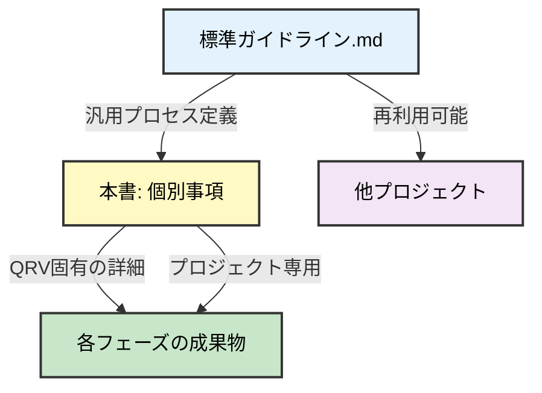
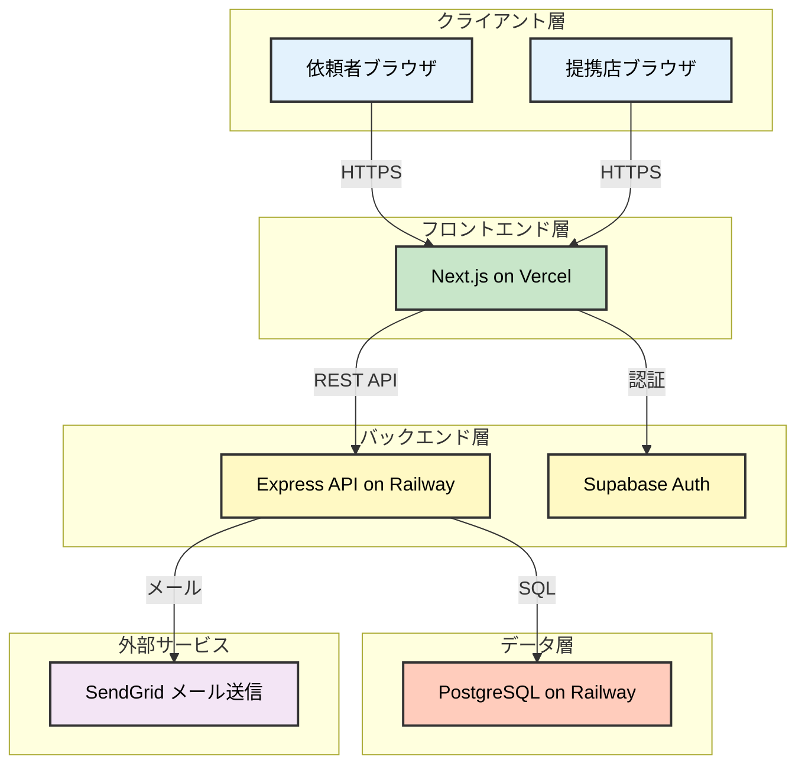
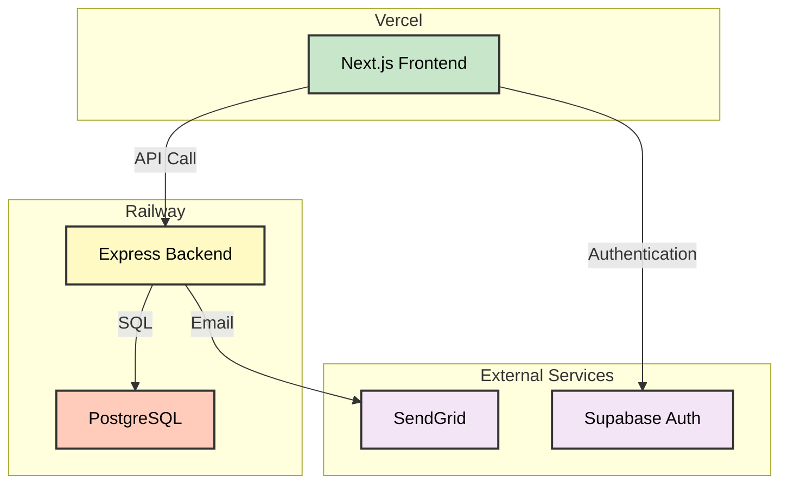
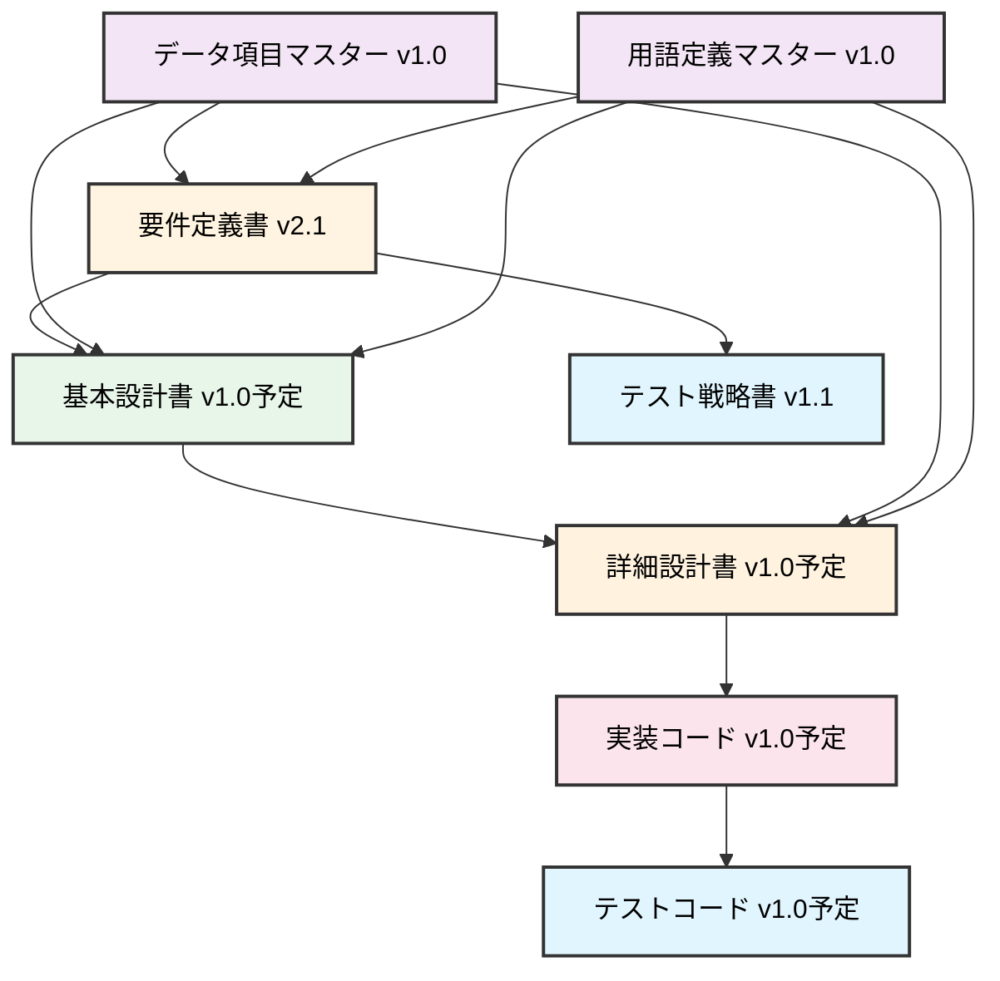

# 個別ガイドライン_QRV

**Version**: 2.0
**最終更新日**: 2025-10-28
**プロジェクト名**: QRV（QR予約システム）
**目的**: QRVプロジェクト固有の開発プロセス詳細と成果物を定義

---

## 1. 本書の位置づけ

本書は「標準ガイドライン.md」の個別プロジェクト版として、QRVプロジェクト固有の情報を記載する。

### 1.1 標準ガイドラインとの関係



### 1.2 参照ドキュメント

- **標準ガイドライン**: [標準ガイドライン.md](../1_general/標準ガイドライン.md) v4.0

---

## 2. QRVプロジェクト概要

### 2.1 プロジェクト背景

現在の電話予約システムには以下の課題がある：
- 電話対応による人的コスト
- 営業時間外の予約機会損失
- 予約情報の管理煩雑さ
- 依頼者と提携店の連絡コスト

### 2.2 システム化の目的

QRコードを活用した予約システムにより、以下を実現する：
- 非同期予約による24時間対応
- 予約情報のデジタル管理
- 依頼者・提携店双方の業務効率化

### 2.3 主要ステークホルダー

| ステークホルダー | 役割 | 期待値 |
|-----------------|------|--------|
| 依頼者 | サービス利用者 | 簡単に予約できる |
| 提携店 | サービス提供者 | 予約管理の効率化 |
| システム管理者 | 運用者 | 安定稼働・トラブル対応 |

### 2.4 システム化範囲

#### システム化する範囲
- QRコード生成・配布
- 予約申請受付
- 予約確認・承認
- 予約確定・通知
- 予約一覧管理

#### システム化しない範囲
- 決済処理（将来フェーズで検討）
- 複雑な在庫管理（将来フェーズで検討）
- CRM機能（将来フェーズで検討）

### 2.5 技術スタック

| レイヤー | 技術 | 選定理由 |
|---------|------|----------|
| フロントエンド | Next.js, React, TypeScript | モダンな開発体験、SSR対応 |
| バックエンド | Node.js, Express, TypeScript | フロントエンドと言語統一 |
| データベース | PostgreSQL | リレーショナルデータの管理に適合 |
| 認証 | Supabase Auth | 開発スピード重視 |
| ホスティング | Vercel (Frontend), Railway (Backend) | デプロイの簡便性 |

### 2.6 QRV固有のファイル編集制限

標準ガイドライン「1.3 フェーズ境界とファイル編集制限」を遵守し、以下のQRV固有ルールを追加する。

#### QRVプロジェクトのディレクトリ構成

```
project_MCPphone/
├── 1_guideline/             # プロジェクト進め方（全フェーズ参照、編集不可）
│   ├── 1_general/          # 汎用ガイドライン
│   └── 2_specific/         # QRV固有ガイドライン（本書）
├── 2_docs/                 # ドキュメント
│   ├── 01_planning/        # システム化計画（作成済み）
│   ├── 02_requirement/     # 要件定義（作成済み、v2.1）
│   ├── 03_basic_design/    # 基本設計（準備中）
│   ├── 04_detail_design/   # 詳細設計（未着手）
│   ├── 05_implementation/  # 実装ドキュメント（未着手）
│   ├── 06_test/           # テストドキュメント（未着手）
│   ├── 07_deploy/         # デプロイドキュメント（未着手）
│   └── 08_operation/      # 運用ドキュメント（未着手）
└── 3_system/              # 実装成果物（実装フェーズ以降）
    ├── frontend/          # Next.js (未作成)
    ├── backend/           # Express API (未作成)
    └── infrastructure/    # IaC (未作成)
```

#### QRV固有の編集制限例

**基本設計フェーズでの作業例**:
```
✅ 許可:
- 2_docs/03_basic_design/DB設計書.md の作成
- 2_docs/03_basic_design/API設計書.md の作成
- 2_docs/02_requirement/要件定義書.md の参照

❌ 禁止:
- 2_docs/02_requirement/要件定義書.md の修正
- 2_docs/04_detail_design/クラス設計書.md の作成
- 3_system/backend/src/ 配下のコード作成
```

**実装フェーズでの作業例**:
```
✅ 許可:
- 3_system/backend/src/controllers/ 配下のコード作成
- 3_system/frontend/src/components/ 配下のコード作成
- 2_docs/05_implementation/実装メモ.md の作成
- 2_docs/03_basic_design/API設計書.md の参照

❌ 禁止:
- 2_docs/03_basic_design/API設計書.md の修正
- 2_docs/06_test/テストケース.md の作成
```

#### 前フェーズ修正が必要な場合の手順

例: 基本設計中に要件定義の不備を発見した場合

1. **作業を一旦停止**
2. **人間に報告**: 「要件定義書に〇〇の不備を発見しました。要件定義フェーズに差戻して修正が必要です」
3. **承認を待つ**: 人間が要件定義フェーズへの差戻を判断
4. **差戻後**: 要件定義フェーズとして `docs/02_requirement/` を修正
5. **再レビュー**: フェーズゲート2を再通過
6. **基本設計再開**: 修正された要件定義書を基に基本設計を継続

---

## 3. QRV固有のフェーズ別成果物

### 3.1 システム化計画フェーズ

#### QRV固有の成果物
- **プロジェクト概要書**: `2_docs/01_planning/プロジェクト概要書.md`
- **ステークホルダー分析**: `2_docs/01_planning/ステークホルダー分析.md`
- **技術選定方針**: `2_docs/01_planning/技術選定方針.md`

#### 作成済み状況
- [x] プロジェクト概要書（作成済み）
- [x] ステークホルダー分析（作成済み）
- [x] 技術選定方針（作成済み）

#### AIへの指示例（QRV版）
```
「QRVプロジェクトのシステム化計画書を作成してください。
- プロジェクト名: QRV（QR予約システム）
- 背景: 電話予約の課題（人的コスト、営業時間外対応不可）
- 目的: QRコードを活用した非同期予約システムの構築
- ステークホルダー: 依頼者、提携店、システム管理者
- 技術スタック: Next.js, Node.js, PostgreSQL, Supabase

注意：業務フローやDB設計などの詳細は含めないでください。」
```

---

### 3.2 要件定義フェーズ

#### QRV固有の成果物

| No | ドキュメント名 | ファイルパス | 状態 |
|----|---------------|-------------|------|
| 1 | 要件定義書 | `2_docs/02_requirement/要件定義書.md` | v2.1 作成済み |
| 2 | 要件定義_図表 | `2_docs/02_requirement/要件定義_図表.md` | v1.2 作成済み |
| 3 | 業務フロー図 | `2_docs/02_requirement/業務フロー図.md` | 作成済み |
| 4 | ユーザーマニュアル_依頼者向け | `2_docs/02_requirement/ユーザーマニュアル_依頼者向け.md` | v1.1 作成済み |
| 5 | ユーザーマニュアル_提携店向け | `2_docs/02_requirement/ユーザーマニュアル_提携店向け.md` | v1.1 作成済み |
| 6 | テスト戦略書 | `2_docs/02_requirement/テスト戦略書.md` | v1.1 作成済み |

#### QRV固有の主要機能要件
1. **QRコード生成・管理**
   - QRコード自動生成
   - QRコード一覧表示
   - QRコード無効化

2. **予約申請機能**
   - QRスキャンによる予約フォーム表示
   - 予約情報入力（日時、人数、要望）
   - 確認リンクのメール送信

3. **予約承認機能**
   - 提携店による予約確認
   - 承認/辞退の選択
   - 依頼者への通知

4. **予約管理機能**
   - 予約一覧表示
   - 予約ステータス管理
   - 予約履歴閲覧

#### QRV固有の非機能要件
- **性能**: 1秒以内のQRスキャン応答
- **可用性**: 99.9%以上の稼働率
- **セキュリティ**: HTTPS通信、個人情報の暗号化
- **ユーザビリティ**: スマートフォン最適化

#### QRV固有のデータ項目
主要データ項目は `2_docs/03_basic_design/_master/データ項目マスター.md` で定義：
- QRコード（QR_CODE）
- 予約情報（RESERVATION）
- 確認リンク（CONFIRMATION_LINK）
- 提携店情報（PARTNER_SHOP）

#### AIへの指示例（QRV版）
```
「QRVプロジェクトの要件定義書を作成してください。
機能要件:
- QRコード生成・管理
- 予約申請（QRスキャン→フォーム入力→確認メール）
- 予約承認（提携店による確認・承認/辞退）
- 予約管理（一覧、ステータス管理）

非機能要件:
- 性能: 1秒以内のQRスキャン応答
- 可用性: 99.9%
- セキュリティ: HTTPS、個人情報暗号化

参照: データ項目マスター（QR_CODE, RESERVATION, CONFIRMATION_LINK）

注意：データベースの物理設計やソースコードは含めないでください。」
```

#### 整合性チェックポイント（QRV版）
- [ ] データ項目マスターで定義された項目が要件定義書で使用されているか
- [ ] 用語定義マスター（QRコード、予約、提携店等）が統一されているか
- [ ] 業務フロー図が要件定義書の機能要件と整合しているか
- [ ] ユーザーマニュアルが要件定義書の機能要件と整合しているか
- [ ] テスト戦略書が要件定義書のバージョン（v2.1）を参照しているか

---

### 3.3 基本設計フェーズ

#### QRV固有の成果物

| No | ドキュメント名 | ファイルパス | 状態 |
|----|---------------|-------------|------|
| 1 | システム構成図 | `2_docs/03_basic_design/システム構成図.md` | 作成予定 |
| 2 | データベース設計書 | `2_docs/03_basic_design/DB設計書.md` | 作成予定 |
| 3 | API設計書 | `2_docs/03_basic_design/API設計書.md` | 作成予定 |
| 4 | 画面設計書 | `2_docs/03_basic_design/画面設計書.md` | 作成予定 |
| 5 | セキュリティ設計書 | `2_docs/03_basic_design/セキュリティ設計書.md` | 作成予定 |
| 6 | 技術仕様マスター | `2_docs/03_basic_design/_master/技術仕様マスター.md` | 作成済み |

#### QRV固有のシステム構成



#### QRV固有のDB設計要件
主要テーブル（論理設計レベル）:
1. **qr_codes**: QRコード情報
2. **reservations**: 予約情報
3. **confirmation_links**: 確認リンク情報
4. **partner_shops**: 提携店情報
5. **users**: ユーザー情報（Supabase Auth連携）

#### QRV固有のAPI設計要件
主要エンドポイント:
- `POST /api/qr-codes`: QRコード生成
- `GET /api/qr-codes/:id`: QRコード情報取得
- `POST /api/reservations`: 予約申請
- `GET /api/reservations`: 予約一覧取得
- `PATCH /api/reservations/:id/approve`: 予約承認
- `PATCH /api/reservations/:id/decline`: 予約辞退

#### QRV固有の画面設計要件
主要画面:
1. **依頼者側**:
   - QRスキャン→予約フォーム画面
   - 予約完了画面
   - 予約確認画面

2. **提携店側**:
   - ログイン画面
   - QRコード管理画面
   - 予約一覧画面
   - 予約詳細・承認画面

#### AIへの指示例（QRV版）
```
「QRVプロジェクトの基本設計書を作成してください。

システム構成:
- フロントエンド: Next.js on Vercel
- バックエンド: Express on Railway
- DB: PostgreSQL on Railway
- 認証: Supabase Auth
- メール: SendGrid

データベース論理設計:
- テーブル: qr_codes, reservations, confirmation_links, partner_shops, users
- ER図を作成してください
- データ項目マスター（docs/03_basic_design/_master/データ項目マスター.md）を参照

API設計:
- エンドポイント: QRコード生成、予約申請、予約承認/辞退、予約一覧
- リクエスト/レスポンス仕様を定義
- 認証方式: JWT (Supabase Auth)

画面設計:
- 依頼者側: QRスキャン→予約フォーム、予約完了、予約確認
- 提携店側: ログイン、QRコード管理、予約一覧、予約承認

注意：クラス設計やソースコードは含めないでください。」
```

#### 整合性チェックポイント（QRV版）
- [ ] データ項目マスターで定義された項目がDB設計に反映されているか
- [ ] 要件定義書の機能要件が全てAPI設計でカバーされているか
- [ ] 画面遷移図（要件定義）と画面設計が整合しているか
- [ ] 非機能要件（性能、セキュリティ）が設計に反映されているか
- [ ] 技術仕様マスターで定義された技術スタックが使用されているか

---

### 3.4 詳細設計フェーズ

#### QRV固有の成果物

| No | ドキュメント名 | ファイルパス | 状態 |
|----|---------------|-------------|------|
| 1 | クラス設計書 | `2_docs/04_detail_design/クラス設計書.md` | 作成予定 |
| 2 | シーケンス図 | `2_docs/04_detail_design/シーケンス図.md` | 作成予定 |
| 3 | DB物理設計書 | `2_docs/04_detail_design/DB物理設計書.md` | 作成予定 |
| 4 | コーディング規約 | `2_docs/04_detail_design/コーディング規約.md` | 作成予定 |
| 5 | 例外処理設計書 | `2_docs/04_detail_design/例外処理設計書.md` | 作成予定 |

#### QRV固有のクラス設計要件
主要クラス/モジュール:

**フロントエンド (Next.js)**:
- `pages/`: ページコンポーネント
- `components/`: 再利用可能なUIコンポーネント
- `hooks/`: カスタムフック
- `services/`: APIクライアント
- `utils/`: ユーティリティ関数

**バックエンド (Express)**:
- `routes/`: ルーティング
- `controllers/`: ビジネスロジック
- `models/`: データモデル
- `middleware/`: 認証・エラーハンドリング
- `services/`: 外部サービス連携（SendGrid等）

#### QRV固有の主要処理フロー
1. **予約申請フロー**:
   - QRスキャン → QRコード検証 → 予約フォーム表示 → 予約情報保存 → 確認リンク生成 → メール送信

2. **予約承認フロー**:
   - 予約一覧取得 → 予約詳細表示 → 承認/辞退選択 → ステータス更新 → 依頼者へ通知メール送信

#### QRV固有のDB物理設計要件
- **命名規則**: スネークケース（例: `qr_codes`, `created_at`）
- **主要インデックス**:
  - `qr_codes.code_id` (PRIMARY KEY)
  - `reservations.reservation_id` (PRIMARY KEY)
  - `reservations.qr_code_id` (FOREIGN KEY, INDEX)
  - `confirmation_links.token` (UNIQUE INDEX)
- **制約条件**:
  - `confirmation_links.expires_at`: 10分後の自動失効
  - `reservations.status`: ENUM ('PENDING_CONFIRMATION', 'PENDING_APPROVAL', 'APPROVED', 'DECLINED')

#### AIへの指示例（QRV版）
```
「QRVプロジェクトの詳細設計書を作成してください。

クラス設計:
- フロントエンド: pages, components, hooks, services, utils
- バックエンド: routes, controllers, models, middleware, services
- クラス図とメソッド定義を作成

シーケンス図:
- 予約申請フロー（QRスキャン→予約→メール送信）
- 予約承認フロー（承認→ステータス更新→通知）

DB物理設計:
- テーブル物理名: qr_codes, reservations, confirmation_links, partner_shops
- インデックス定義
- 制約条件（CONFIRMATION_LINK有効期限: 10分）

コーディング規約:
- TypeScript strict mode
- ESLint + Prettier
- 命名規則: camelCase (JS/TS), snake_case (DB)

参照: API設計書、DB論理設計書

注意：実装コードは含めないでください。設計図とメソッドシグネチャのみ。」
```

#### 整合性チェックポイント（QRV版）
- [ ] クラス設計がAPI設計書のエンドポイントと整合しているか
- [ ] シーケンス図が業務フロー図と整合しているか
- [ ] DB物理設計がDB論理設計と整合しているか
- [ ] CONFIRMATION_LINKの有効期限が10分で統一されているか
- [ ] エラーコード体系がAPI設計書と整合しているか

---

### 3.5 実装フェーズ

#### QRV固有の成果物

| No | カテゴリ | ファイルパス | 状態 |
|----|---------|-------------|------|
| 1 | フロントエンド | `3_system/frontend/` | 作成予定 |
| 2 | バックエンド | `3_system/backend/` | 作成予定 |
| 3 | DBマイグレーション | `3_system/backend/migrations/` | 作成予定 |
| 4 | 環境設定 | `3_system/.env.example` | 作成予定 |
| 5 | README | `3_system/README.md` | 作成予定 |

#### QRV固有の実装優先順位
1. **Phase 1: 基盤構築**
   - プロジェクトセットアップ
   - DB接続・認証基盤
   - 共通コンポーネント

2. **Phase 2: QRコード機能**
   - QRコード生成API
   - QRコード管理画面（提携店）

3. **Phase 3: 予約申請機能**
   - QRスキャン→予約フォーム
   - 予約情報保存API
   - 確認リンク生成・メール送信

4. **Phase 4: 予約承認機能**
   - 予約一覧画面（提携店）
   - 予約承認/辞退API
   - 依頼者への通知メール

5. **Phase 5: 予約管理機能**
   - 予約履歴表示
   - ステータス管理

#### AIへの指示例（QRV版）
```
「QRVプロジェクトのPhase 3（予約申請機能）を実装してください。

実装内容:
- フロントエンド: 予約フォームコンポーネント（Next.js/React）
- バックエンド: POST /api/reservations エンドポイント
- 処理フロー:
  1. QRコードIDの検証
  2. 予約情報のバリデーション
  3. reservationsテーブルへの保存
  4. 確認リンクの生成（有効期限10分）
  5. SendGrid経由でメール送信

参照:
- 詳細設計書のクラス設計
- API設計書のリクエスト/レスポンス仕様
- DB物理設計書のテーブル定義

注意：
- 設計書に定義されていない機能を追加しないでください
- コーディング規約に従ってください
- エラーハンドリングを適切に実装してください
」
```

#### 実装時のAIガードレール（QRV版）
- ❌ 確認リンクの有効期限を10分以外に変更しない
- ❌ 予約ステータスの値を設計書以外に追加しない
- ❌ 決済機能など、要件にない機能を実装しない
- ❌ データベーススキーマを設計書と異なる形で実装しない

---

### 3.6 テストフェーズ

#### QRV固有の成果物

| No | カテゴリ | ファイルパス | 状態 |
|----|---------|-------------|------|
| 1 | 単体テスト | `3_system/backend/tests/unit/` | 作成予定 |
| 2 | 統合テスト | `3_system/backend/tests/integration/` | 作成予定 |
| 3 | E2Eテスト | `3_system/e2e/tests/` | 作成予定 |
| 4 | テスト結果報告書 | `2_docs/05_test/テスト結果報告書.md` | 作成予定 |

#### QRV固有のテストケース優先順位
1. **Critical（クリティカル）**:
   - 予約申請の正常フロー
   - 予約承認/辞退の正常フロー
   - 確認リンクの有効期限（10分）検証
   - 個人情報の暗号化確認

2. **High（高）**:
   - QRコード生成・検証
   - メール送信機能
   - 認証・認可機能
   - エラーハンドリング

3. **Medium（中）**:
   - 予約一覧表示
   - 予約履歴表示
   - バリデーション機能

#### QRV固有の非機能テスト
- **性能テスト**: QRスキャン応答時間が1秒以内であることを確認
- **負荷テスト**: 同時アクセス100ユーザーでの動作確認
- **セキュリティテスト**: OWASP Top 10の脆弱性チェック

#### AIへの指示例（QRV版）
```
「QRVプロジェクトの予約申請機能のテストを作成・実行してください。

テスト範囲:
1. 単体テスト: POST /api/reservations のコントローラー
2. 統合テスト: 予約申請フロー全体（API + DB）
3. E2Eテスト: QRスキャン→フォーム入力→メール送信→確認

テストケース:
- 正常系: 予約申請が成功し、メールが送信されること
- 異常系: 無効なQRコードIDでエラーが返ること
- 異常系: 必須項目が未入力でバリデーションエラーが返ること
- 非機能: 確認リンクが10分後に無効になること

参照:
- 要件定義書 v2.1
- テスト戦略書 v1.1
- API設計書

注意：
- テスト中に新機能を追加しないでください
- 不具合を発見した場合は報告し、修正してください
」
```

#### トレーサビリティマトリクス（QRV版）

| 要件ID | 要件内容 | テストケースID | テスト結果 |
|--------|---------|----------------|-----------|
| REQ-001 | QRコード生成 | TC-001, TC-002 | 作成予定 |
| REQ-002 | 予約申請 | TC-003, TC-004, TC-005 | 作成予定 |
| REQ-003 | 確認リンク生成 | TC-006, TC-007 | 作成予定 |
| REQ-004 | 予約承認 | TC-008, TC-009 | 作成予定 |
| REQ-005 | 予約辞退 | TC-010, TC-011 | 作成予定 |

---

### 3.7 デプロイフェーズ

#### QRV固有の成果物

| No | カテゴリ | ファイルパス | 状態 |
|----|---------|-------------|------|
| 1 | インフラ構築 | `3_system/infrastructure/` | 作成予定 |
| 2 | CI/CD設定 | `.github/workflows/` | 作成予定 |
| 3 | デプロイ手順書 | `2_docs/06_deploy/デプロイ手順書.md` | 作成予定 |
| 4 | 環境構築ドキュメント | `2_docs/06_deploy/環境構築.md` | 作成予定 |

#### QRV固有のインフラ構成



#### QRV固有の環境設定

| 環境変数 | 説明 | 設定先 |
|---------|------|--------|
| `DATABASE_URL` | PostgreSQL接続文字列 | Railway Backend |
| `SUPABASE_URL` | Supabase URL | Vercel + Railway |
| `SUPABASE_ANON_KEY` | Supabase匿名キー | Vercel + Railway |
| `SENDGRID_API_KEY` | SendGrid APIキー | Railway Backend |
| `FRONTEND_URL` | フロントエンドURL | Railway Backend |
| `NEXT_PUBLIC_API_URL` | バックエンドURL | Vercel Frontend |

#### QRV固有のデプロイフロー

1. **ステージング環境デプロイ**
   - GitHubのdevelopブランチへプッシュ
   - CI/CDで自動テスト実行
   - Vercel/Railwayへ自動デプロイ
   - 動作確認

2. **本番環境デプロイ**
   - mainブランチへマージ
   - CI/CDで自動テスト実行
   - 手動承認ステップ
   - Vercel/Railwayへ本番デプロイ
   - 疎通確認

#### AIへの指示例（QRV版）
```
「QRVプロジェクトの本番環境デプロイ準備を行ってください。

インフラ構成:
- フロントエンド: Vercel
- バックエンド: Railway
- データベース: Railway PostgreSQL
- 認証: Supabase
- メール: SendGrid

CI/CD設定:
- GitHub Actions
- developブランチ: ステージング環境へ自動デプロイ
- mainブランチ: 本番環境へ手動承認後デプロイ
- テスト自動実行（単体・統合・E2E）

デプロイ手順書:
- 環境変数設定手順
- データベースマイグレーション手順
- 初期データ投入手順
- 疎通確認手順
- ロールバック手順

注意：
- 新機能の追加や運用手順書は含めないでください
」
```

---

### 3.8 運用フェーズ

#### QRV固有の成果物

| No | カテゴリ | ファイルパス | 状態 |
|----|---------|-------------|------|
| 1 | 運用手順書 | `2_docs/07_operation/運用手順書.md` | 作成予定 |
| 2 | 監視設定 | `2_docs/07_operation/監視設定.md` | 作成予定 |
| 3 | 障害対応手順書 | `2_docs/07_operation/障害対応手順書.md` | 作成予定 |
| 4 | バックアップ手順書 | `2_docs/07_operation/バックアップ手順書.md` | 作成予定 |

#### QRV固有の監視項目

| 監視項目 | 監視ツール | アラート閾値 |
|---------|-----------|-------------|
| フロントエンド稼働状態 | Vercel Analytics | 5xx エラー率 > 1% |
| バックエンド稼働状態 | Railway Metrics | 5xx エラー率 > 1% |
| API応答時間 | Railway Metrics | > 3秒 |
| データベース接続 | Railway Metrics | 接続エラー発生時 |
| メール送信成功率 | SendGrid Dashboard | 成功率 < 95% |
| ディスク使用率 | Railway Metrics | > 80% |

#### QRV固有の障害レベル定義

| レベル | 定義 | 対応時間 | 例 |
|--------|------|---------|-----|
| Critical | サービス全停止 | 即時対応 | データベース停止、バックエンド停止 |
| High | 主要機能停止 | 1時間以内 | 予約申請不可、メール送信失敗 |
| Medium | 一部機能不具合 | 4時間以内 | 予約一覧表示遅延 |
| Low | 軽微な不具合 | 次回メンテナンス時 | UI表示の乱れ |

#### QRV固有のバックアップ方針

| 対象 | バックアップ頻度 | 保管期間 | 方式 |
|------|----------------|---------|------|
| PostgreSQL | 日次（深夜3時） | 30日間 | Railway自動バックアップ |
| 画像ファイル（将来） | 日次 | 90日間 | S3互換ストレージ |
| ログファイル | リアルタイム | 90日間 | Railway Logs |

#### QRV固有のFAQ

**Q1: 確認リンクのメールが届かない**
- A1: 迷惑メールフォルダを確認してください。SendGridの送信ログで配信状況を確認してください。

**Q2: QRコードをスキャンしてもページが表示されない**
- A2: QRコードの有効性を確認してください。バックエンドのログでエラー内容を確認してください。

**Q3: 予約承認のメールが依頼者に届かない**
- A3: SendGridの送信ログを確認してください。依頼者のメールアドレスが正しいか確認してください。

#### AIへの指示例（QRV版）
```
「QRVプロジェクトの運用手順書を作成してください。

運用手順:
- 日次: ログ確認、エラー監視、バックアップ確認
- 週次: パフォーマンスレポート確認
- 月次: セキュリティアップデート適用

監視設定:
- Vercel Analytics: フロントエンド稼働状態
- Railway Metrics: バックエンド稼働状態、API応答時間
- SendGrid Dashboard: メール送信成功率

障害対応:
- Critical: サービス全停止（即時対応）
- High: 主要機能停止（1時間以内）
- Medium: 一部機能不具合（4時間以内）
- Low: 軽微な不具合（次回メンテナンス時）

バックアップ:
- PostgreSQL: 日次自動バックアップ（30日保管）
- ログ: Railway Logs（90日保管）

FAQ:
- 確認リンクのメール不達
- QRスキャン時のエラー
- 予約承認メール不達

注意：
- 新機能の追加提案は含めないでください
」
```

---

## 4. QRV固有のAIガードレール

### 4.1 要件定義時の禁止事項
- ❌ データベースの物理テーブル名を記載しない（例: `qr_codes_tbl`は基本設計で決定）
- ❌ 具体的なAPI実装コードを記載しない
- ❌ 画面の詳細なピクセル指定を行わない（基本設計で決定）

### 4.2 基本設計時の禁止事項
- ❌ クラス内部のメソッド実装を記載しない（詳細設計で決定）
- ❌ SQLクエリの詳細を記載しない（詳細設計で決定）
- ❌ React HooksやState管理の詳細を記載しない（詳細設計で決定）

### 4.3 詳細設計時の禁止事項
- ❌ 実装コードを書かない（実装フェーズで作成）
- ❌ 単体テストコードを書かない（テストフェーズで作成）

### 4.4 実装時の禁止事項
- ❌ 確認リンク有効期限を10分以外に変更しない
- ❌ 予約ステータスを `PENDING_CONFIRMATION`, `PENDING_APPROVAL`, `APPROVED`, `DECLINED` 以外に追加しない
- ❌ 決済機能を実装しない（システム化範囲外）
- ❌ 複雑な在庫管理機能を実装しない（システム化範囲外）

### 4.5 テスト時の禁止事項
- ❌ テスト中に新機能を追加しない
- ❌ 設計書を無断で変更しない
- ❌ 要件にない機能のテストを作成しない

---

## 5. QRV固有の整合性チェックリスト

### 5.1 要件定義⇔基本設計の整合性

- [ ] 要件定義書の機能要件が全てAPI設計書に反映されているか
- [ ] データ項目マスターの項目が全てDB論理設計に反映されているか
- [ ] 画面遷移図の画面が全て画面設計書に反映されているか
- [ ] 非機能要件（性能1秒以内、可用性99.9%）がシステム構成図に反映されているか

### 5.2 基本設計⇔詳細設計の整合性

- [ ] API設計書のエンドポイントが全てクラス設計に反映されているか
- [ ] DB論理設計のテーブルが全てDB物理設計に反映されているか
- [ ] エラーハンドリング設計が例外処理設計に反映されているか

### 5.3 詳細設計⇔実装の整合性

- [ ] クラス設計書のクラス名が実装コードと一致しているか
- [ ] シーケンス図の処理フローが実装コードと一致しているか
- [ ] DB物理設計のテーブル定義がマイグレーションスクリプトと一致しているか
- [ ] API設計書のリクエスト/レスポンス仕様が実装と一致しているか

### 5.4 要件定義⇔テストの整合性

- [ ] 要件定義書の全機能要件に対応するテストケースが存在するか
- [ ] 非機能要件（性能、セキュリティ）のテストが実施されているか
- [ ] ユーザーマニュアルの操作手順がE2Eテストでカバーされているか

---

## 6. QRV固有のバージョン管理

### 6.1 現在のドキュメントバージョン

| フェーズ | ドキュメント | バージョン | 更新日 |
|---------|-------------|-----------|--------|
| 01_planning | プロジェクト概要書 | 1.0 | 2025-XX-XX |
| 02_requirement | 要件定義書 | 2.1 | 2025-XX-XX |
| 02_requirement | 要件定義_図表 | 1.2 | 2025-XX-XX |
| 02_requirement | 業務フロー図 | 1.0 | 2025-XX-XX |
| 02_requirement | ユーザーマニュアル_依頼者向け | 1.1 | 2025-XX-XX |
| 02_requirement | ユーザーマニュアル_提携店向け | 1.1 | 2025-XX-XX |
| 02_requirement | テスト戦略書 | 1.1 | 2025-XX-XX |
| 03_basic_design | データ項目マスター | 1.0 | 2025-XX-XX |
| 03_basic_design | 技術仕様マスター | 1.0 | 2025-XX-XX |
| 03_basic_design | 用語定義マスター | 1.0 | 2025-XX-XX |

### 6.2 バージョン間の依存関係



---

## 7. 次ステップ

### 7.1 現在の状況
- ✅ システム化計画フェーズ: 完了
- ✅ 要件定義フェーズ: 完了（v2.1）
- 🔄 基本設計フェーズ: 準備中（マスターファイルのみ作成済み）

### 7.2 次のアクション
1. **基本設計フェーズの開始**
   - システム構成図の作成
   - データベース論理設計（ER図、テーブル定義）
   - API設計書の作成
   - 画面設計書の作成
   - セキュリティ設計書の作成

2. **整合性チェックの実施**
   - 要件定義書 v2.1 と各設計書の整合性確認
   - データ項目マスターとDB設計の整合性確認
   - 用語定義マスターの統一使用確認

3. **フェーズゲート3の通過**
   - 基本設計書のレビュー
   - 人間による承認
   - 詳細設計フェーズへの移行

---

## 8. 付録

### 8.1 QRV固有の用語集

| 用語 | 定義 |
|------|------|
| 依頼者 | QRコードをスキャンして予約を申請するユーザー |
| 提携店 | 予約を受け付け、承認/辞退するサービス提供者 |
| QRコード | 予約申請用のユニークなQRコード |
| 確認リンク | 予約申請後に送信される確認用のURL（有効期限10分） |
| 仮予約 | 予約申請後、提携店の承認待ちの状態 |
| 予約確定 | 提携店が承認し、予約が確定した状態 |

### 8.2 参照ドキュメント
- [標準ガイドライン.md](../1_general/標準ガイドライン.md) v4.0
- [要件定義書](../../2_docs/02_requirement/要件定義書.md) v2.1
- [データ項目マスター](../../2_docs/03_basic_design/_master/データ項目マスター.md) v1.0
- [技術仕様マスター](../../2_docs/03_basic_design/_master/技術仕様マスター.md) v1.0
- [用語定義マスター](../../2_docs/03_basic_design/_master/用語定義マスター.md) v1.0

### 8.3 改訂履歴

| Version | 日付 | 変更内容 | 変更者 |
|---------|------|----------|--------|
| 1.0 | 2025-10-28 | 初版作成 | AI Agent |
| 1.1 | 2025-10-28 | マーメイド図の視認性改善、QRV固有のファイル編集制限ルール追加 | AI Agent |
| 1.2 | 2025-10-28 | ファイル名変更、01_business → 01_background、標準ガイドライン参照v3.2 | AI Agent |
| 2.0 | 2025-10-28 | ディレクトリ構造全面変更（1_guideline/2_docs/3_system）、01_background → 01_planning、標準ガイドライン参照v4.0 | AI Agent |

---

**本書は QRVプロジェクト固有の情報を記載しています。**
**汎用的なプロセスについては「標準ガイドライン.md」を参照してください。**
