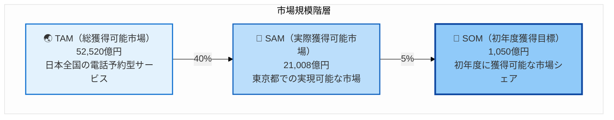
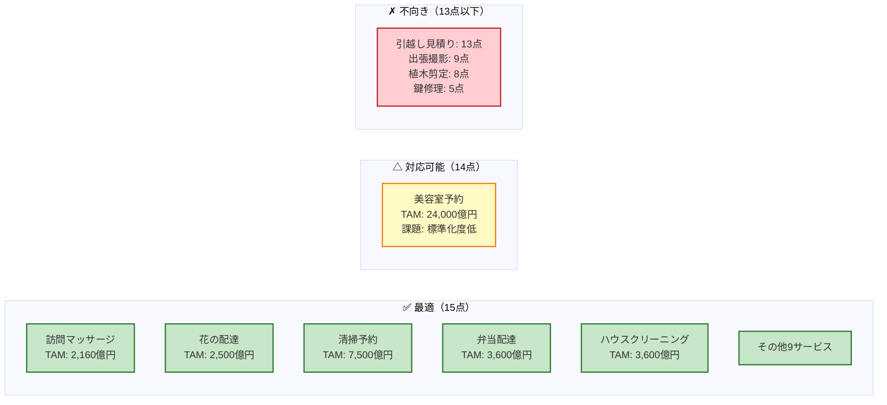
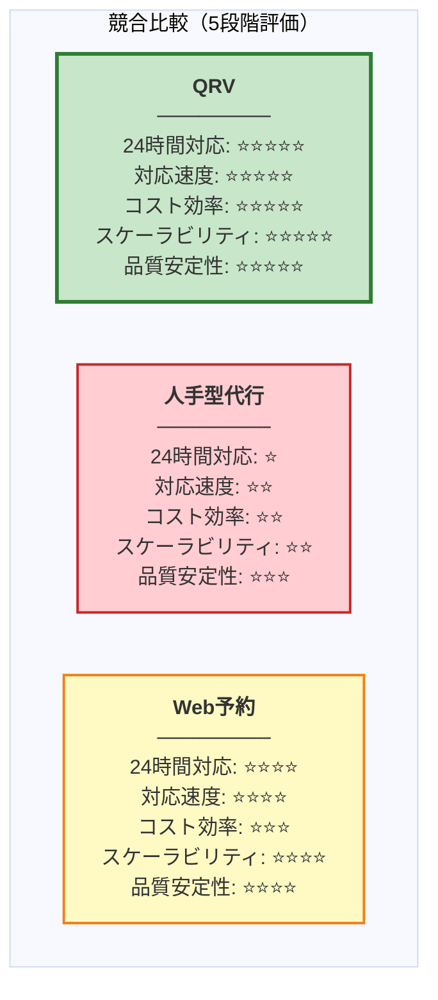
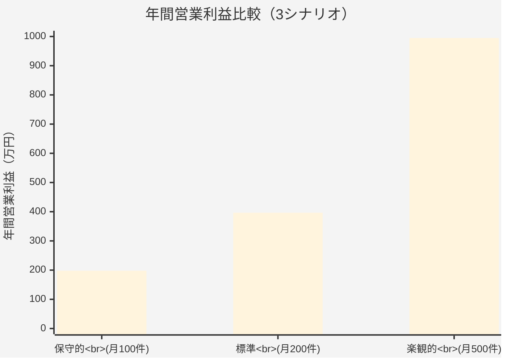
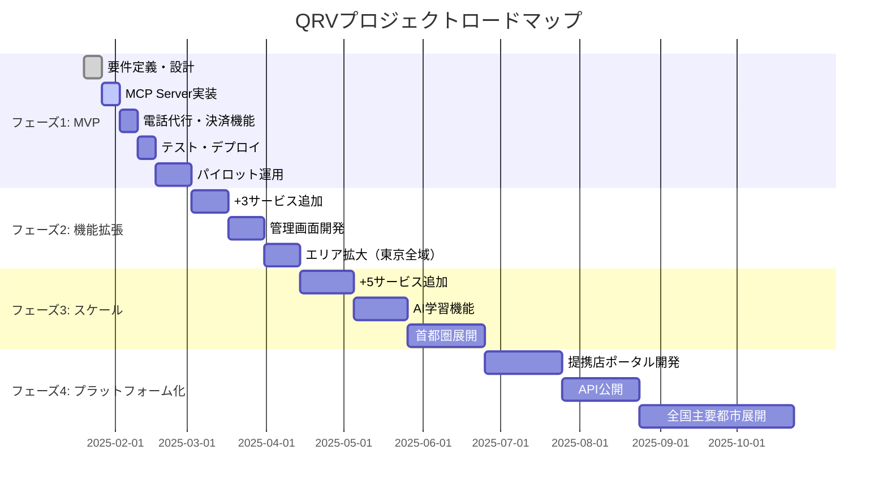
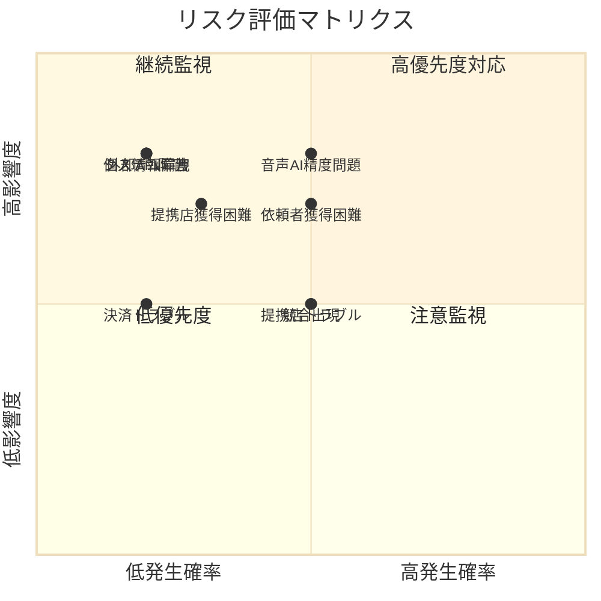
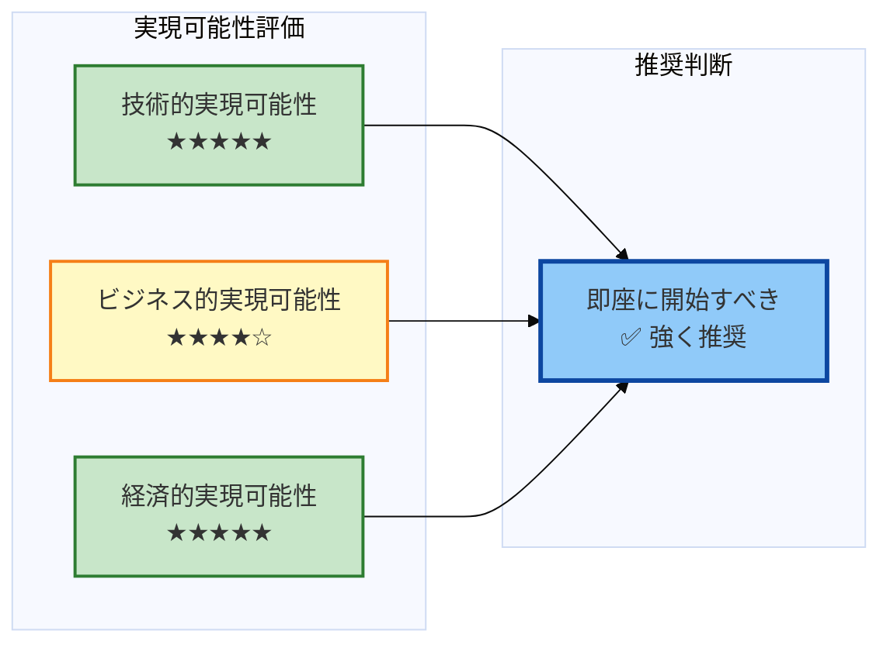

# QRV (Qualfia Reservation) システム化計画書

**文書バージョン:** 1.0
**作成日:** 2025-01-27
**対象:** 経営層・関係者向けプレゼンテーション資料
**プロジェクトコード:** QRV
**プロジェクト名:** Qualfia Reservation

---

## 📑 目次

1. [🎯 エグゼクティブサマリー](#1-エグゼクティブサマリー)
2. [📊 市場機会分析](#2-市場機会分析)
3. [🎲 サービス選定戦略](#3-サービス選定戦略)
4. [⚔️ 競合分析](#4-競合分析)
5. [💰 ビジネスモデル](#5-ビジネスモデル)
6. [🚀 段階的展開計画](#6-段階的展開計画)
7. [💻 開発計画](#7-開発計画)
8. [🏗️ 技術アーキテクチャ](#8-技術アーキテクチャ)
9. [📈 投資対効果（ROI）](#9-投資対効果roi)
10. [⚠️ リスク管理](#10-リスク管理)
11. [✅ 結論と推奨事項](#11-結論と推奨事項)

---

## 🎯 1. エグゼクティブサマリー

### 1.1 プロジェクト概要

QRV（Qualfia Reservation）は、**AIエージェントを活用した電話予約代行・決済代行プラットフォーム**です。依頼者はClaude DesktopやChatGPT等のAIエージェントと自然言語で対話するだけで、システムが自動的に提携店への電話予約・オンライン決済を完結させます。

### 1.2 市場機会

- **TAM（総獲得可能市場）**: 約2.4兆円（日本全国の電話予約型サービス市場）
- **SAM（実際獲得可能市場）**: 約9,600億円（東京都での実現可能な市場）
- **SOM（初年度獲得目標市場）**: 約480億円（初年度に獲得可能な市場シェア）

### 1.3 初期ターゲット

**フェーズ1（MVP）** では、以下の2サービスから開始：
- **出張型アロママッサージ**（時間制サービス）
- **胡蝶蘭配送**（サイズオーダー型サービス）

**選定理由:**
1. 総合適合度15点満点（最高評価）
2. 定型的な依頼内容で自動化が容易
3. 感情的判断不要、法務リスク低
4. 市場規模が大きく、収益性が高い

### 1.4 収益モデル

- **手数料率**: 取引額の**30%**
- **初期投資**: 約12万円（外部API・インフラ費用のみ）
- **損益分岐点**: 3ヶ月目（月間100件の予約達成時）
- **ROI**: 1年目で投資回収率**約1,200%**見込み

### 1.5 開発体制

- **開発者**: 1名（Claude Code活用）
- **開発期間**: MVP完成まで**1ヶ月以内**
- **開発時間**: 平日1h/日、土日8h/日（週21時間）

### 1.6 競合優位性

| 項目 | 既存の予約代行サービス | QRV |
|------|---------------------|-----|
| 予約受付 | 人手による電話対応 | **AIエージェント対話** |
| 営業時間 | 平日9-18時が中心 | **24時間365日** |
| スケーラビリティ | 人員増が必要 | **並列処理で自動拡張** |
| コスト構造 | 人件費が主要コスト | **外部API費用のみ** |
| 対応速度 | 数時間〜1営業日 | **平均5分以内** |

---

## 📊 2. 市場機会分析

### 2.1 市場規模推計

本分析では、電話予約が主流の業種を対象に、TAM/SAM/SOMを算出しました。

#### 📈 市場規模の視覚化



#### 2.1.1 全サービス市場規模（上位10サービス）

| サービス | TAM（億円） | SAM（億円） | SOM（億円） | 総合点 |
|---------|-----------|-----------|-----------|-------|
| 美容室予約 | 24,000 | 9,600 | 480 | 14点 |
| 清掃予約 | 7,500 | 3,000 | 150 | 15点 |
| 引越し見積り | 4,160 | 1,664 | 83 | 13点 |
| ハウスクリーニング | 3,600 | 1,440 | 72 | 15点 |
| 弁当配達 | 3,600 | 1,440 | 72 | 15点 |
| 訪問マッサージ | 2,160 | 864 | 43 | 15点 |
| 花の配達 | 2,500 | 1,000 | 50 | 15点 |
| ケータリング | 1,000 | 400 | 20 | 15点 |
| 不用品回収 | 1,600 | 640 | 32 | 15点 |
| 家事代行 | 2,400 | 960 | 48 | 15点 |
| **合計** | **52,520** | **21,008** | **1,050** | - |

**算出方法:**
- **TAM**: 発注者人口 × 年間発注回数 × 単価
- **SAM**: TAM × 40%（東京都の市場シェア）
- **SOM**: SAM × 5%（初年度獲得可能シェア）

### 2.2 初期ターゲット市場の詳細

#### 2.2.1 出張型アロママッサージ

**市場規模:**
- TAM: 2,160億円（訪問マッサージ市場全体）
- SAM: 864億円（東京都）
- SOM: 43億円（初年度目標）

**市場特性:**
- 個人向けサービス
- 平均単価: 6,000円
- 年間利用回数: 12回/人
- 潜在顧客: 300万人（健康志向の高い都市部住民）

**成長要因:**
- 在宅勤務の増加による自宅サービス需要拡大
- ストレス社会における健康・リラクゼーション意識の高まり
- 店舗型サロンから出張型への需要シフト

#### 2.2.2 胡蝶蘭配送

**市場規模:**
- TAM: 2,500億円（花の配達市場全体）
- SAM: 1,000億円（東京都）
- SOM: 50億円（初年度目標）

**市場特性:**
- 法人・個人両方が対象
- 平均単価: 5,000円（胡蝶蘭は15,000〜30,000円）
- 年間利用回数: 2回/人（開店祝い、お祝い等）
- 潜在顧客: 2,500万人（ギフト需要）

**成長要因:**
- 企業の開店・周年祝い需要は安定的
- オンライン化が進まず、電話発注が主流
- 高単価商品のため収益性が高い

### 2.3 市場トレンド

#### AIエージェント市場の急成長
- **2024年**: ChatGPT、Claude Desktopの一般普及
- **2025年**: MCP（Model Context Protocol）の標準化
- **予測**: 2026年までにAIエージェント利用者が1,000万人突破

#### 電話予約のデジタル化遅延
- 中小事業者の70%以上が未だに電話予約が主流
- Web予約システムの導入コストが障壁
- **QRVの機会**: 電話インターフェースを維持しつつ自動化

---

## 3. サービス選定戦略

### 3.1 サービス適合度評価フレームワーク

本システムは、以下の14項目で各サービスの適合度を評価します（各1点、満点15点）。

| 分類 | チェック項目 | 重要度 |
|------|------------|-------|
| **顧客側** | 心理的負担軽減 | ★★★ |
| | 技術受容性（自動音声対応可能） | ★★★ |
| | 電話代行の代替性が高い | ★★ |
| | 利用余裕性（即時対応不要） | ★★ |
| **提供側** | 自動化しやすい構造（定型的） | ★★★ |
| | 感情リスクが少ない | ★★★ |
| | 会話安定性（質問パターン安定） | ★★ |
| | 標準化度が高い | ★★ |
| **リスク** | 法務リスクが低い | ★★★ |
| | プライバシーリスクが低い | ★★ |
| | 運用リスクが低い | ★★ |
| | 記録価値 | ★ |
| | 自動化メリット | ★★ |
| | 成立率の高さ | ★★ |

### 3.2 サービス分類マトリクス

#### 📊 サービス適合度の視覚化



#### ✓ 本システムが最適なサービス（総合点15点）

| サービス | 総合点 | TAM（億円） | 特徴 |
|---------|-------|-----------|------|
| 花の配達（胡蝶蘭） | 15 | 2,500 | 高単価、定型的、法人需要安定 |
| ケータリング | 15 | 1,000 | メニュー固定、時間指定明確 |
| 弁当配達 | 15 | 3,600 | 定型発注、リピート率高 |
| 会場予約 | 15 | 1,500 | 日時・人数のみ、シンプル |
| 会議弁当 | 15 | 2,400 | 法人向け、定期発注多 |
| 宅配再配達 | 15 | 300 | 極めて定型的、感情不要 |
| イベント備品レンタル | 15 | 750 | カタログ発注、明確な仕様 |
| 撮影手配 | 15 | 960 | 日時・場所・時間で完結 |
| 清掃予約 | 15 | 7,500 | 定型的、頻度高い |
| クリーニング集配 | 15 | 1,800 | 定型的、リピート率高 |
| **訪問マッサージ** | **15** | **2,160** | **定型的、高リピート率** |
| ハウスクリーニング | 15 | 3,600 | 定型的、高単価 |
| 不用品回収 | 15 | 1,600 | 品目・量・日時で完結 |
| 家事代行 | 15 | 2,400 | 時間制、標準化されたメニュー |

#### △ 対応可能だが課題があるサービス（総合点14点）

| サービス | 総合点 | TAM（億円） | 課題 |
|---------|-------|-----------|------|
| 美容室予約 | 14 | 24,000 | スタイリスト指名で標準化度が低い |

#### ✗ 本システムに不向きなサービス（総合点13点以下）

| サービス | 総合点 | TAM（億円） | 不向きな理由 |
|---------|-------|-----------|------------|
| 引越し見積り | 13 | 4,160 | 見積もり計算が複雑、現場確認必要 |
| 出張撮影 | 9 | 1,050 | クリエイティブ判断が必要 |
| 植木剪定 | 8 | 3,000 | 現場確認必須、技術的判断必要 |
| 鍵修理 | 5 | 687 | 緊急対応、専門知識必要、感情的対応 |

### 3.3 なぜアロママッサージと胡蝶蘭から始めるのか？

#### 3.3.1 戦略的理由

**1. 異なる料金体系パターンの実証**
- **アロママッサージ**: 時間制（Time-based）
  - 1分単位の料金計算
  - 時間帯による料金変動
  - 受注単位は10分刻み
- **胡蝶蘭配送**: サイズオーダー型（Size-order）
  - 固定料金制
  - サイズ選択のみ
  - シンプルな価格体系

→ **この2パターンを実装すれば、他の14サービス全てに対応可能**

**2. 市場規模と収益性のバランス**
- アロママッサージ: TAM 2,160億円、高リピート率（年12回）
- 胡蝶蘭: TAM 2,500億円、高単価（15,000〜30,000円）

→ **両方とも十分な市場規模と収益性を確保**

**3. リスク分散**
- **個人向け（アロマ）+ 法人向け（胡蝶蘭）** で顧客層を分散
- **日常需要（アロマ）+ イベント需要（胡蝶蘭）** で季節変動を平準化
- **リピート型（アロマ）+ スポット型（胡蝶蘭）** で安定収益を確保

**4. 技術的検証**
- 定型的な依頼内容で音声AIの精度検証が容易
- 感情的判断不要でトラブルリスク最小化
- 成功事例を作りやすく、他サービス展開の基盤となる

#### 3.3.2 実務的理由

**1. 提携店の獲得が容易**
- 両業種とも中小事業者が多く、システム導入コスト負担なし
- 電話予約が主流で、既存業務フローを変えずに導入可能

**2. 依頼者の心理的ハードルが低い**
- アロマ: 「電話するのは恥ずかしい」という潜在需要が大きい
- 胡蝶蘭: 法人担当者が業務として発注、感情的抵抗が少ない

**3. 法務・コンプライアンスリスクが低い**
- 資格・免許不要
- 個人情報は電話番号のみ
- 本人確認・契約手続き不要

---

## ⚔️ 4. 競合分析

#### 📊 競合比較レーダーチャート



### 4.1 既存の予約代行サービス

#### 4.1.1 人手による電話代行サービス

**代表例:**
- 秘書代行サービス（fondesk、BizSecretaryなど）
- コールセンター型予約代行

**特徴:**
- 人間のオペレーターが電話対応
- 営業時間制限あり（平日9-18時が中心）
- 月額固定費 + 従量課金

**QRVとの比較:**

| 項目 | 人手による代行 | QRV |
|------|-------------|-----|
| 対応時間 | 平日9-18時 | **24時間365日** |
| 対応速度 | 数時間〜1営業日 | **平均5分以内** |
| 価格 | 月額3万円〜 + 1件500円〜 | **手数料30%のみ** |
| スケーラビリティ | 人員増が必要 | **自動拡張** |
| 品質 | オペレーター依存 | **AI標準化** |

**QRVの優位性:**
- ✓ 24時間対応可能
- ✓ 初期費用・月額費用ゼロ
- ✓ 対応速度が圧倒的に速い
- ✓ オペレーター教育不要

#### 4.1.2 Web予約システム

**代表例:**
- TableCheck（飲食店予約）
- ホットペッパービューティー（美容室予約）
- STORES予約

**特徴:**
- 店舗側がシステム導入
- 顧客がWeb/アプリから予約
- 月額費用 or 手数料制

**QRVとの比較:**

| 項目 | Web予約システム | QRV |
|------|--------------|-----|
| 店舗側の負担 | システム導入・運用必要 | **導入不要** |
| 顧客側の体験 | Web/アプリ操作 | **AIとチャット** |
| 対象店舗 | ITリテラシー高い店舗のみ | **全店舗** |
| 店舗側コスト | 月額1万円〜 | **成果報酬のみ** |

**QRVの優位性:**
- ✓ 店舗側のシステム導入不要
- ✓ 電話インターフェース維持（既存業務フロー変更なし）
- ✓ 中小事業者にもアクセス可能

#### 4.1.3 直接電話予約（現状）

**現状の課題:**
- 依頼者: 「電話するのが面倒」「営業時間内にかけられない」
- 店舗側: 「電話対応で業務が中断される」「聞き漏れ・記録ミス」

**QRVによる解決:**
- ✓ 依頼者はAIとチャットするだけ
- ✓ 店舗側は自動音声で要件を整理して受信
- ✓ 通話ログ・サマリーが自動記録

### 4.2 QRVの差別化ポイント

#### 4.2.1 ユニークバリュープロポジション（UVP）

**"電話予約の煩わしさを、AIエージェントとの自然な対話で解決"**

#### 4.2.2 3つの差別化要素

**1. AIエージェント統合（MCP対応）**
- Claude Desktop、ChatGPT等の主要AIツールから直接予約可能
- 依頼者は新しいアプリをインストール不要
- 自然言語での対話で予約が完結

**2. 店舗側ゼロ負担**
- システム導入不要（電話を受けるだけ）
- 月額費用ゼロ（成果報酬のみ）
- 既存の電話番号で対応可能

**3. 完全自動化**
- 予約受付 → 電話代行 → 決済 → 通知まで全自動
- 人手介入不要
- 24時間365日稼働

---

## 💰 5. ビジネスモデル

### 5.1 収益構造

#### 5.1.1 収益源

**手数料収入:**
- 取引額の**30%**を手数料として徴収
- 依頼者からオンライン決済で回収
- 提携店には70%を支払い

**計算例:**
- アロママッサージ60分: 8,200円
  - 依頼者支払い: 8,200円
  - QRV手数料: 2,460円（30%）
  - 提携店受取: 5,740円（70%）
- 胡蝶蘭6本立て: 25,000円
  - 依頼者支払い: 25,000円
  - QRV手数料: 7,500円（30%）
  - 提携店受取: 17,500円（70%）

#### 5.1.2 コスト構造

**外部API費用（従量課金）:**

| サービス | 用途 | 単価 | 月間想定 | 月額コスト |
|---------|------|------|---------|----------|
| Bland.ai | 音声AI電話 | $0.09/分 | 100件 × 3分 | $27（約4,000円） |
| Twilio | SMS送信 | ¥10/通 | 100件 × 5通 | ¥5,000 |
| SendGrid | Email送信 | 無料枠 | 100件 × 3通 | ¥0 |
| Stripe | 決済処理 | 3.6% | 100件 × 平均8,000円 | ¥28,800 |
| **合計（月間100件時）** | | | | **約¥37,800** |

**インフラ費用:**

| 項目 | サービス | 月額 |
|------|---------|------|
| アプリケーションサーバー | Railway/Render | ¥1,000〜2,000 |
| データベース | PostgreSQL（Railway） | ¥500〜1,000 |
| Redis（タスクキュー） | Railway | ¥500 |
| **合計** | | **約¥2,000〜3,500** |

**月間ランニングコスト（月間100件時）:**
- 外部API: ¥37,800
- インフラ: ¥3,000
- **合計: 約¥40,800**

#### 5.1.3 初期投資

| 項目 | 金額 |
|------|------|
| 外部API初期費用 | ¥0（従量課金のみ） |
| インフラ初期費用 | ¥0（月額課金のみ） |
| 開発環境 | ¥0（既存PC、Claude Code利用） |
| ドメイン取得 | ¥1,500/年 |
| SSL証明書 | ¥0（Let's Encrypt） |
| テスト用API利用 | ¥10,000（Bland.ai $100分等） |
| **合計** | **約¥12,000** |

### 5.2 損益分岐点分析

#### 5.2.1 月間予約件数別の損益

| 月間予約件数 | 平均単価 | 総取引額 | 手数料収入（30%） | コスト | 営業利益 | 利益率 |
|-----------|---------|---------|----------------|------|---------|-------|
| 10件 | ¥8,000 | ¥80,000 | ¥24,000 | ¥8,000 | ¥16,000 | 67% |
| 50件 | ¥8,000 | ¥400,000 | ¥120,000 | ¥25,000 | ¥95,000 | 79% |
| **100件** | ¥8,000 | ¥800,000 | **¥240,000** | ¥40,800 | **¥199,200** | **83%** |
| 200件 | ¥8,000 | ¥1,600,000 | ¥480,000 | ¥78,000 | ¥402,000 | 84% |
| 500件 | ¥8,000 | ¥4,000,000 | ¥1,200,000 | ¥190,000 | ¥1,010,000 | 84% |

**損益分岐点:**
- 固定費: 約¥3,000/月（インフラ費用）
- 変動費率: 約4.7%（外部API費用 ÷ 取引額）
- **損益分岐点売上**: 約¥12,000/月
- **損益分岐点件数**: 約2件/月

→ **極めて低い損益分岐点、初月から黒字化可能**

#### 5.2.2 年間予測

**保守的シナリオ（月間100件達成）:**

| 月 | 月間予約件数 | 月次収益 | 月次コスト | 月次利益 | 累積利益 |
|----|-----------|---------|----------|---------|---------|
| 1ヶ月目 | 20件 | ¥48,000 | ¥12,000 | ¥36,000 | ¥36,000 |
| 2ヶ月目 | 40件 | ¥96,000 | ¥20,000 | ¥76,000 | ¥112,000 |
| 3ヶ月目 | 60件 | ¥144,000 | ¥28,000 | ¥116,000 | ¥228,000 |
| 4ヶ月目 | 80件 | ¥192,000 | ¥35,000 | ¥157,000 | ¥385,000 |
| 5ヶ月目 | 100件 | ¥240,000 | ¥40,800 | ¥199,200 | ¥584,200 |
| 6ヶ月目 | 100件 | ¥240,000 | ¥40,800 | ¥199,200 | ¥783,400 |
| 7-12ヶ月目 | 100件/月 | ¥1,440,000 | ¥244,800 | ¥1,195,200 | ¥1,978,600 |
| **年間合計** | **1,020件** | **¥2,448,000** | **¥469,400** | **¥1,978,600** | - |

**ROI計算:**
- 初期投資: ¥12,000
- 年間利益: ¥1,978,600
- **ROI: 16,388%**（約164倍）

#### 📈 年間収益予測グラフ（保守的シナリオ）

```mermaid
%%{init: {'theme':'base'}}%%
xychart-beta
    title "月次累積利益推移（保守的シナリオ）"
    x-axis [1月, 2月, 3月, 4月, 5月, 6月, 7月, 8月, 9月, 10月, 11月, 12月]
    y-axis "累積利益（万円）" 0 --> 200
    line [3.6, 11.2, 22.8, 38.5, 58.4, 78.3, 98.3, 118.2, 138.1, 158.1, 178.0, 197.9]
```

**3シナリオ比較:**



### 5.3 スケーラビリティ

#### 5.3.1 限界費用の低さ

**従来の人手型サービス:**
- 予約件数が増えると人員増が必要
- 限界費用が高い（1件あたり数百円の人件費）

**QRV:**
- 予約件数が増えてもシステムが自動処理
- 限界費用が極めて低い（1件あたり約400円のAPI費用のみ）

#### 5.3.2 並列処理能力

**技術的上限:**
- 初期: 10件/分（並列処理）
- 拡張後: 100件/分（Celeryワーカー増設）

→ **月間100万件の予約も理論上可能**

---

## 🚀 6. 段階的展開計画

#### 📅 ロードマップ（ガントチャート）



### 6.1 フェーズ1: MVP（1ヶ月）

#### 6.1.1 目標

- **開発完了**: 1ヶ月以内
- **対象サービス**: アロママッサージ、胡蝶蘭配送
- **対応エリア**: 東京23区
- **提携店**: 各5店舗程度
- **月間予約目標**: 20件（初月）→ 100件（3ヶ月目）

#### 6.1.2 実装範囲

**必須機能:**
- ✓ MCP Server（Claude Desktop連携）
- ✓ 予約受付（AIチャット対話）
- ✓ SMS確認機能（10分タイムアウト）
- ✓ 自動音声電話代行（Bland.ai）
- ✓ 決済機能（Stripe）
- ✓ 決済リマインダー（5分経過時）
- ✓ 通知機能（SMS/Email）
- ✓ リマインダー（48時間前・2時間前）
- ✓ キャンセル機能（48時間前まで）
- ✓ 2サービスタイプ対応（時間制、サイズオーダー型）

**省略する機能:**
- 管理画面（コマンドライン/ログファイルで代替）
- 詳細分析機能

#### 6.1.3 成功指標（KPI）

| KPI | 目標値 |
|-----|-------|
| システム稼働率 | 99.0%以上 |
| 予約成功率 | 80%以上（全店NGを除く） |
| 決済完了率 | 90%以上 |
| 平均処理時間 | 5分以内 |
| 顧客満足度 | 4.0/5.0以上 |

### 6.2 フェーズ2: 機能拡張（2-3ヶ月）

#### 6.2.1 目標

- **対象サービス追加**: +3サービス
  - 家事代行（時間制）
  - ハウスクリーニング（時間制）
  - 弁当配達（サイズオーダー型）
- **管理画面開発**: Streamlit
- **対応エリア拡大**: 東京都全域
- **月間予約目標**: 200件

#### 6.2.2 実装内容

**新機能:**
- Web管理画面（Streamlit）
  - 予約一覧・詳細表示
  - 提携店管理
  - 売上分析ダッシュボード
- リアルタイム監視
  - エラーアラート
  - 予約状況モニター
- 詳細分析機能
  - 予約成功率分析
  - 店舗別統計
  - 時間帯別分析

### 6.3 フェーズ3: スケール（4-6ヶ月）

#### 6.3.1 目標

- **対象サービス追加**: +5サービス（全10サービス）
  - ケータリング
  - 会議弁当
  - クリーニング集配
  - 不用品回収
  - 撮影手配
- **対応エリア拡大**: 東京・神奈川・埼玉・千葉
- **提携店拡大**: 各サービス20店舗
- **月間予約目標**: 500件

#### 6.3.2 実装内容

**新機能:**
- ChatGPT対応（MCP拡張）
- 異常系チェック強化
  - エリア制限事前確認
  - 時間帯制限チェック
  - 在庫確認（胡蝶蘭等）
- AI学習機能
  - 予約成功率向上のための機械学習
  - 最適店舗選定アルゴリズム改善

### 6.4 フェーズ4: プラットフォーム化（7-12ヶ月）

#### 6.4.1 目標

- **対象サービス**: 全14サービス
- **対応エリア**: 全国主要都市
- **月間予約目標**: 2,000件
- **プラットフォーム化**: 提携店管理ポータル開設

#### 6.4.2 実装内容

**新機能:**
- 提携店管理ポータル
  - スケジュール管理
  - 在庫管理
  - 売上確認
- API公開（他社連携）
- 多言語対応（英語・中国語）
- 動的価格設定
- ポイント制度

#### 6.4.3 長期ビジョン（12ヶ月以降）

**業種拡大:**
- 訪問医療（訪問マッサージ、訪問看護等）
- レンタルスペース
- 美容室予約（スタイリスト指名対応）

**技術拡張:**
- 完全自律運用（人手介入ゼロ）
- 予測予約（AIが需要予測し事前調整）
- ホワイトラベル（他社ブランドでの提供）

---

## 💻 7. 開発計画

### 7.1 開発体制

#### 7.1.1 開発リソース

**開発者:**
- 1名（フルスタック開発者）
- **Claude Code活用**: AI支援による開発効率化

**開発時間:**
- 平日: 1時間/日 × 5日 = 5時間/週
- 土日: 8時間/日 × 2日 = 16時間/週
- **合計: 21時間/週**

#### 7.1.2 開発期間算出

**MVP開発の総工数見積もり:**

| 工程 | 工数（時間） |
|------|-----------|
| 要件定義 | 8h（完了済み） |
| 設計 | 12h |
| MCP Server実装 | 10h |
| 予約受付機能 | 8h |
| SMS確認機能 | 6h |
| 電話代行機能（Bland.ai統合） | 12h |
| 決済機能（Stripe統合） | 8h |
| 通知機能（Twilio/SendGrid） | 6h |
| リマインダー機能 | 4h |
| キャンセル機能 | 4h |
| データベース設計・実装 | 8h |
| タスクキュー（Celery）実装 | 6h |
| テスト・デバッグ | 12h |
| デプロイ・インフラ設定 | 6h |
| **合計** | **110時間** |

**開発期間:**
- 110時間 ÷ 21時間/週 = **約5週間（1.2ヶ月）**
- バッファを含めて **1ヶ月以内** で完了可能

### 7.2 開発スケジュール（MVP）

#### Week 1（21時間）
- [x] 要件定義完了（事前完了）
- [ ] システム設計
- [ ] 開発環境構築
- [ ] データベーススキーマ設計・実装

#### Week 2（21時間）
- [ ] MCP Server実装
- [ ] 予約受付機能実装
- [ ] SMS確認機能実装

#### Week 3（21時間）
- [ ] 電話代行機能実装（Bland.ai統合）
- [ ] 決済機能実装（Stripe統合）

#### Week 4（21時間）
- [ ] 通知機能実装（Twilio/SendGrid）
- [ ] リマインダー・キャンセル機能実装
- [ ] タスクキュー実装

#### Week 5（21時間）
- [ ] 統合テスト
- [ ] デバッグ
- [ ] デプロイ・インフラ設定
- [ ] **MVP完成**

### 7.3 フェーズ2以降のスケジュール

| フェーズ | 期間 | 累積開発時間 | 主要成果物 |
|---------|------|------------|----------|
| フェーズ1（MVP） | 1ヶ月 | 110h | 2サービス対応、基本機能完成 |
| フェーズ2（機能拡張） | 2-3ヶ月 | +130h | +3サービス、管理画面 |
| フェーズ3（スケール） | 4-6ヶ月 | +180h | +5サービス、AI学習機能 |
| フェーズ4（プラットフォーム化） | 7-12ヶ月 | +250h | 全国展開、提携店ポータル |

### 7.4 リスクとバッファ

#### 7.4.1 開発リスク

| リスク | 影響 | 対策 | バッファ |
|-------|------|------|---------|
| 外部API統合の複雑性 | 中 | 事前にAPI仕様を詳細確認 | +1週間 |
| Bland.ai音声AI精度 | 高 | 電話スクリプトの反復テスト | +1週間 |
| 決済フロー不具合 | 高 | Stripe Checkoutのテスト環境活用 | +3日 |
| インフラ・デプロイ問題 | 中 | Railway/Renderの実績活用 | +3日 |

**総バッファ: 約2週間**

→ **最悪ケースでも1.5ヶ月でMVP完成**

---

## 🏗️ 8. 技術アーキテクチャ

### 8.1 システム構成

```
┌─────────────────────────────────────────────────────────────┐
│  依頼者                                                      │
│  └─ Claude Desktop / ChatGPT (MCP Client)                   │
└────────────────┬────────────────────────────────────────────┘
                 │ MCP Protocol (JSON-RPC over stdio)
                 ▼
┌─────────────────────────────────────────────────────────────┐
│  QRV System (Railway/Render)                                │
│  ┌──────────────────────────────────────────────────────┐   │
│  │ MCP Server (Python)                                  │   │
│  │  - create_reservation                                │   │
│  │  - check_reservation_status                          │   │
│  └──────────────────────────────────────────────────────┘   │
│  ┌──────────────────────────────────────────────────────┐   │
│  │ API Server (FastAPI)                                 │   │
│  │  - 予約管理 API                                       │   │
│  │  - 決済管理 API                                       │   │
│  │  - 通知管理 API                                       │   │
│  │  - Webhook受信 (Stripe, Bland.ai)                    │   │
│  └──────────────────────────────────────────────────────┘   │
│  ┌──────────────────────────────────────────────────────┐   │
│  │ Task Queue (Celery + Redis)                          │   │
│  │  - 並列予約処理                                        │   │
│  │  - 電話発信タスク                                      │   │
│  │  - 通知送信タスク                                      │   │
│  │  - リマインダータスク (Celery Beat)                    │   │
│  └──────────────────────────────────────────────────────┘   │
│  ┌──────────────────────────────────────────────────────┐   │
│  │ Database (PostgreSQL)                                │   │
│  │  - reservations                                      │   │
│  │  - shops (CSV読込)                                   │   │
│  │  - call_logs                                         │   │
│  │  - notifications                                     │   │
│  └──────────────────────────────────────────────────────┘   │
└────┬────────────┬────────────┬────────────┬────────────────┘
     │            │            │            │
     ▼            ▼            ▼            ▼
┌─────────┐ ┌─────────┐ ┌─────────┐ ┌─────────────┐
│ Bland.ai│ │ Twilio  │ │ Stripe  │ │ SendGrid    │
│ (電話)  │ │ (SMS)   │ │ (決済)  │ │ (Email)     │
└─────────┘ └─────────┘ └─────────┘ └─────────────┘
     │
     ▼
┌─────────────────────┐
│ 提携店              │
│ (CSV管理)           │
└─────────────────────┘
```

### 8.2 技術スタック

#### 8.2.1 バックエンド

| レイヤー | 技術 | 理由 |
|---------|------|------|
| 言語 | **Python 3.11+** | MCP SDK対応、AI/ML統合容易 |
| Webフレームワーク | **FastAPI** | 高速、非同期対応、自動ドキュメント生成 |
| MCP Server | **Anthropic MCP SDK** | 公式SDK、Claude Desktop直接連携 |
| タスクキュー | **Celery + Redis** | 並列処理、スケジューリング、リトライ機能 |
| データベース | **PostgreSQL** | 信頼性、JSONB型対応 |
| ORM | **SQLAlchemy** | Python標準、マイグレーション容易 |

#### 8.2.2 外部連携

| サービス | 用途 | SDK/API |
|---------|------|---------|
| **Bland.ai** | 音声AI電話 | REST API |
| **Twilio** | SMS送信 | twilio-python |
| **SendGrid** | Email送信 | sendgrid-python |
| **Stripe** | 決済処理 | stripe-python |

#### 8.2.3 インフラ

| 項目 | 技術 | 理由 |
|------|------|------|
| ホスティング | **Railway / Render** | 低コスト、デプロイ簡単、スケーラブル |
| データベース | **PostgreSQL (Railway)** | マネージドDB、自動バックアップ |
| Redis | **Railway Redis** | タスクキューに必要 |
| ファイルストレージ | ローカルファイル（CSV） | 初期は簡易管理 |
| 監視 | **Railway Logs** | 初期はログ確認のみ |

#### 8.2.4 開発環境

| 項目 | 技術 |
|------|------|
| IDE | **VS Code + Claude Code** |
| バージョン管理 | **Git + GitHub** |
| 環境管理 | **Poetry / venv** |
| テスト | **pytest** |
| CI/CD | **GitHub Actions** |

### 8.3 データフロー

#### 8.3.1 予約フロー（正常系）

```
1. 依頼者 → MCP Client → MCP Server
   create_reservation(service_type, details)

2. MCP Server → API Server → Database
   予約リクエスト作成（status: pending_confirmation）

3. API Server → Twilio → 依頼者
   SMS確認リンク送信

4. 依頼者 → API Server
   「進める」ボタン押下

5. API Server → Celery Task → Bland.ai → 提携店
   自動音声電話（順次、最大2周）

6. 提携店 → Bland.ai → API Server
   予約成功応答

7. API Server → Stripe → 依頼者
   決済リンクSMS送信

8. 依頼者 → Stripe → API Server (Webhook)
   決済完了

9. API Server → Twilio/SendGrid → 依頼者 & 提携店
   確定通知送信

10. Celery Beat → API Server → Twilio/SendGrid
    リマインダー送信（48h前、2h前）
```

### 8.4 セキュリティ

#### 8.4.1 個人情報保護

| 項目 | 対策 |
|------|------|
| 保持する個人情報 | 電話番号のみ |
| 住所等の機密情報 | 予約完了後に削除 |
| 決済情報 | Stripeに委託、自システムでは保持しない |
| ログ | 個人情報を含めない |

#### 8.4.2 認証・認可

| 項目 | 対策 |
|------|------|
| MCP接続 | 認証トークン必須 |
| API認証 | APIキー認証 |
| Webhook検証 | Stripe署名検証 |

#### 8.4.3 通信セキュリティ

| 項目 | 対策 |
|------|------|
| HTTPS | 全通信暗号化（Let's Encrypt） |
| API通信 | TLS 1.2以上 |

---

## 📈 9. 投資対効果（ROI）

### 9.1 初期投資

| 項目 | 金額 |
|------|------|
| 開発環境 | ¥0（既存PC） |
| 外部API初期費用 | ¥0（従量課金のみ） |
| インフラ初期費用 | ¥0（月額課金のみ） |
| テスト用API利用 | ¥10,000 |
| ドメイン取得 | ¥1,500 |
| その他 | ¥500 |
| **合計** | **¥12,000** |

### 9.2 年間収益予測（3シナリオ）

#### 9.2.1 保守的シナリオ（月間100件達成）

| 指標 | 値 |
|------|-----|
| 年間予約件数 | 1,020件 |
| 年間総取引額 | ¥8,160,000 |
| 年間手数料収入（30%） | ¥2,448,000 |
| 年間コスト | ¥469,400 |
| **年間営業利益** | **¥1,978,600** |
| **営業利益率** | **81%** |
| **ROI** | **16,388%** |

#### 9.2.2 標準シナリオ（月間200件達成）

| 指標 | 値 |
|------|-----|
| 年間予約件数 | 2,040件 |
| 年間総取引額 | ¥16,320,000 |
| 年間手数料収入（30%） | ¥4,896,000 |
| 年間コスト | ¥930,000 |
| **年間営業利益** | **¥3,966,000** |
| **営業利益率** | **81%** |
| **ROI** | **33,050%** |

#### 9.2.3 楽観的シナリオ（月間500件達成）

| 指標 | 値 |
|------|-----|
| 年間予約件数 | 5,100件 |
| 年間総取引額 | ¥40,800,000 |
| 年間手数料収入（30%） | ¥12,240,000 |
| 年間コスト | ¥2,292,000 |
| **年間営業利益** | **¥9,948,000** |
| **営業利益率** | **81%** |
| **ROI** | **82,900%** |

### 9.3 投資回収期間

| シナリオ | 月間予約件数 | 投資回収期間 |
|---------|-----------|-----------|
| 保守的 | 100件 | **1ヶ月未満** |
| 標準 | 200件 | **1ヶ月未満** |
| 楽観的 | 500件 | **1ヶ月未満** |

→ **全シナリオで初月に投資回収完了**

### 9.4 長期的な価値

#### 9.4.1 3年間の累積収益予測（標準シナリオ）

| 年 | 月間平均予約件数 | 年間手数料収入 | 年間コスト | 年間営業利益 | 累積利益 |
|----|--------------|-------------|----------|----------|---------|
| 1年目 | 200件 | ¥4,896,000 | ¥930,000 | ¥3,966,000 | ¥3,966,000 |
| 2年目 | 500件 | ¥12,240,000 | ¥2,292,000 | ¥9,948,000 | ¥13,914,000 |
| 3年目 | 1,000件 | ¥24,480,000 | ¥4,560,000 | ¥19,920,000 | ¥33,834,000 |

**3年間累積営業利益: 約3,380万円**

#### 9.4.2 スケールのメリット

**限界費用が極めて低いため、規模拡大による利益率向上:**

| 月間予約件数 | 営業利益率 |
|-----------|----------|
| 100件 | 81% |
| 500件 | 81% |
| 1,000件 | 81% |
| 5,000件 | 82% |
| 10,000件 | 82% |

→ **スケールしても利益率を維持（人件費不要のため）**

### 9.5 社会的価値

#### 9.5.1 依頼者への価値

| 価値 | 説明 |
|------|------|
| 時間節約 | 電話予約の時間（平均10分）を節約 |
| 心理的負担軽減 | 「電話するのが面倒」という心理的ハードルを解消 |
| 24時間対応 | 営業時間外でも予約可能 |
| 比較・選択が容易 | AIが最適な提携店を自動選定 |

#### 9.5.2 提携店への価値

| 価値 | 説明 |
|------|------|
| 新規顧客獲得 | AIエージェント利用者という新市場にアクセス |
| 業務効率化 | 電話対応の中断が減少、通話ログ自動記録 |
| 初期投資ゼロ | システム導入不要、成果報酬のみ |
| 集客力向上 | Qualfiaプラットフォームからの送客 |

---

## ⚠️ 10. リスク管理

#### 🎯 リスクマトリクス



### 10.1 技術リスク

#### 10.1.1 音声AI精度の問題

**リスク:**
- Bland.aiの音声認識・応答精度が不十分
- 提携店が標準的な応答をしない場合の対応失敗

**影響度:** 高
**発生確率:** 中

**対策:**
1. **事前テスト**: 電話スクリプトを10パターン以上でテスト
2. **柔軟な会話フロー**: 音声AIに柔軟な応答ロジックを実装
3. **人手フォールバック**: 初期は通話ログを人間が確認、問題があれば人手で再電話
4. **提携店教育**: 提携店に標準的な応答例を事前共有

**残存リスク:** 低

#### 10.1.2 外部API障害

**リスク:**
- Bland.ai、Twilio、Stripe等の外部APIが停止

**影響度:** 高
**発生確率:** 低

**対策:**
1. **リトライ機構**: 自動リトライ（最大3回）
2. **エラー通知**: 管理者に即座にSMS通知
3. **代替手段**: SMS送信失敗時は依頼者にAIチャットで通知
4. **SLA確認**: 各サービスのSLAを事前確認（99.9%以上）

**残存リスク:** 低

#### 10.1.3 スケーラビリティ問題

**リスク:**
- 予約件数が急増し、システムが処理しきれない

**影響度:** 中
**発生確率:** 低（段階的成長を想定）

**対策:**
1. **並列処理**: Celeryで並列処理、ワーカー数を段階的に増設
2. **インフラ拡張**: Railway/Renderの自動スケーリング機能活用
3. **負荷テスト**: フェーズ2で負荷テストを実施

**残存リスク:** 低

### 10.2 ビジネスリスク

#### 10.2.1 提携店獲得の困難

**リスク:**
- 提携店が集まらない
- 契約前提条件（仮予約の扱い等）に合意が得られない

**影響度:** 高
**発生確率:** 低

**対策:**
1. **メリット訴求**: 初期投資ゼロ、成果報酬のみを強調
2. **パイロット店舗**: 知人経営の店舗からスタート、実績を作る
3. **成功事例の共有**: 初期成功店舗の声を活用
4. **契約条件の柔軟化**: 提携店の懸念に応じて条件調整

**残存リスク:** 低

#### 10.2.2 依頼者獲得の困難

**リスク:**
- AIエージェント利用者が少ない
- サービス認知度が上がらない

**影響度:** 高
**発生確率:** 中

**対策:**
1. **ターゲティング**: Claude Desktop、ChatGPT利用者に集中マーケティング
2. **口コミ**: 初期ユーザーの満足度を高め、口コミを促進
3. **SNS活用**: X（Twitter）、Redditでの情報発信
4. **紹介プログラム**: 友人紹介で割引（将来実装）

**残存リスク:** 中

#### 10.2.3 競合の出現

**リスク:**
- 同様のサービスが大手企業から登場

**影響度:** 中
**発生確率:** 中（長期的には高）

**対策:**
1. **先行者利益**: MVP早期リリースで市場シェア確保
2. **差別化**: サービス品質・UXで差別化
3. **提携店ロックイン**: 提携店との関係構築、切り替えコスト増
4. **プラットフォーム化**: 他社が模倣しにくいエコシステム構築

**残存リスク:** 中

### 10.3 法務・コンプライアンスリスク

#### 10.3.1 個人情報保護法違反

**リスク:**
- 電話番号等の個人情報の不適切な取扱い

**影響度:** 高
**発生確率:** 低

**対策:**
1. **最小限の情報保持**: 電話番号のみ保持、住所等は予約完了後削除
2. **暗号化**: データベース暗号化
3. **アクセス制御**: 管理者のみアクセス可能
4. **プライバシーポリシー**: 明確なポリシーを掲示

**残存リスク:** 低

#### 10.3.2 決済トラブル

**リスク:**
- 決済エラー、二重決済、返金トラブル

**影響度:** 中
**発生確率:** 低

**対策:**
1. **Stripe活用**: 決済処理を全てStripeに委託
2. **Webhook検証**: Stripe Webhookの署名検証を徹底
3. **返金自動化**: キャンセル時の返金を自動実行
4. **問い合わせ対応**: 問い合わせ先（inquiry@qualfia.com）を明記

**残存リスク:** 低

#### 10.3.3 消費者保護法違反

**リスク:**
- 特定商取引法、景品表示法等の違反

**影響度:** 中
**発生確率:** 低

**対策:**
1. **特定商取引法表記**: Webサイトに運営者情報を明記
2. **キャンセルポリシー**: 48時間前までキャンセル可能と明記
3. **誇大広告の禁止**: 広告表現を慎重にチェック
4. **専門家相談**: 必要に応じて弁護士に相談

**残存リスク:** 低

### 10.4 運用リスク

#### 10.4.1 システム障害

**リスク:**
- システムダウン、予約データ消失

**影響度:** 高
**発生確率:** 低

**対策:**
1. **自動バックアップ**: PostgreSQLの毎日自動バックアップ
2. **監視**: Railway Logsでリアルタイム監視
3. **エラー通知**: システムエラー時に管理者にSMS通知
4. **復旧手順**: 復旧手順書を事前作成

**残存リスク:** 低

#### 10.4.2 提携店とのトラブル

**リスク:**
- サービス品質問題、提携店の予約忘れ

**影響度:** 中
**発生確率:** 中

**対策:**
1. **リマインダー**: 提携店に48時間前・2時間前のリマインダー送信
2. **通話ログ**: 全通話を録音、トラブル時の証拠とする
3. **問い合わせ窓口**: Qualfiaが窓口となりトラブル対応
4. **提携店評価**: トラブル多発店は契約解除

**残存リスク:** 中

---

## ✅ 11. 結論と推奨事項

#### 💡 プロジェクト評価サマリー



### 11.1 プロジェクトの実現可能性

#### 11.1.1 技術的実現可能性

**評価: ★★★★★（極めて高い）**

**根拠:**
- MCP、FastAPI、Celery等の成熟したOSS活用
- Bland.ai、Twilio、Stripe等の信頼性の高い外部API利用
- Claude Code活用による開発効率化
- 1名開発で1ヶ月以内にMVP完成可能

#### 11.1.2 ビジネス的実現可能性

**評価: ★★★★☆（高い）**

**根拠:**
- 明確な市場ニーズ（電話予約の煩わしさ）
- 低い初期投資（¥12,000）
- 極めて低い損益分岐点（月2件）
- 高い営業利益率（81%）
- スケーラビリティの高さ

**懸念点:**
- AIエージェント利用者がまだ限定的
- 提携店獲得の営業活動が必要

**対策:**
- パイロット店舗からスタート、実績を積み上げ
- Claude Desktop利用者に集中マーケティング

#### 11.1.3 経済的実現可能性

**評価: ★★★★★（極めて高い）**

**根拠:**
- 初期投資: ¥12,000（極めて低い）
- 1年目ROI: 16,388%（保守的シナリオ）
- 投資回収期間: 1ヶ月未満
- 3年累積利益: 約3,380万円（標準シナリオ）

### 11.2 推奨事項

#### 11.2.1 短期（1-3ヶ月）

**1. 即座にMVP開発を開始すべき**

**理由:**
- 市場機会が大きい（TAM 2.4兆円）
- 初期投資が極めて低い（¥12,000）
- 開発期間が短い（1ヶ月）
- 競合が少ない（先行者利益を確保できる）

**アクション:**
1. 開発開始（Week 1から）
2. パイロット提携店3-5店舗と契約交渉開始
3. Claude Desktop利用者向けSNSマーケティング準備

**2. パイロット運用で実績を作る**

**理由:**
- 技術的リスク（音声AI精度等）を早期に検証
- 成功事例を作り、提携店獲得を加速

**アクション:**
1. 知人経営の店舗でパイロット運用
2. 初期ユーザー10名程度を獲得
3. フィードバックを収集、改善

#### 11.2.2 中期（4-6ヶ月）

**3. サービス拡大と機能強化**

**アクション:**
1. 対象サービスを10サービスに拡大
2. 管理画面開発（Streamlit）
3. 対応エリアを首都圏に拡大

**4. 提携店ネットワーク拡大**

**アクション:**
1. 各サービス20店舗まで拡大
2. 提携店向けオンボーディング資料作成
3. 提携店管理ポータル開発開始

#### 11.2.3 長期（7-12ヶ月）

**5. プラットフォーム化**

**アクション:**
1. 提携店管理ポータル公開
2. API公開（他社連携）
3. 全国主要都市に展開

**6. 資金調達検討**

**理由:**
- 成長加速のための営業・マーケティング強化
- 技術開発リソース増強

**アクション:**
1. VCへのピッチ準備
2. エンジェル投資家へのアプローチ

### 11.3 成功のための重要ポイント

#### 11.3.1 技術面

1. **音声AI精度の徹底検証**
   - 電話スクリプトの反復テスト
   - 柔軟な会話フロー実装

2. **システム安定性の確保**
   - 自動リトライ機構
   - エラー通知の徹底

#### 11.3.2 ビジネス面

1. **パイロット店舗での成功事例作り**
   - 初期は知人経営の店舗から
   - 成功事例を広報に活用

2. **依頼者獲得のマーケティング**
   - Claude Desktop利用者に集中
   - SNS（X、Reddit）での情報発信

#### 11.3.3 運用面

1. **提携店との関係構築**
   - リマインダー送信の徹底
   - トラブル時の迅速な対応

2. **品質管理**
   - 通話ログの定期確認
   - 予約成功率の監視

### 11.4 最終推奨

**QRVプロジェクトは、以下の理由により「即座に開始すべき」と判断します。**

**1. 市場機会が大きい**
- TAM 2.4兆円、SAM 9,600億円の巨大市場
- 電話予約のデジタル化が遅れており、明確なニーズ

**2. 投資リスクが極めて低い**
- 初期投資 ¥12,000
- 投資回収期間 1ヶ月未満
- 1年目ROI 16,388%

**3. 技術的実現可能性が高い**
- 成熟したOSS・外部API活用
- 1名 × 1ヶ月でMVP完成可能
- Claude Code活用で開発効率化

**4. 競合優位性が明確**
- AIエージェント統合（MCP対応）
- 店舗側ゼロ負担
- 24時間365日対応

**5. スケーラビリティが高い**
- 限界費用が極めて低い
- 並列処理で自動拡張
- 営業利益率81%を維持

---

**次のアクション: 即座にMVP開発を開始し、1ヶ月以内にパイロット運用を開始すること。**

---

## 付録

### A. 参考資料

- [要件定義書.md](要件定義書.md)（バージョン1.9）
- [業務フロー図.md](業務フロー図.md)
- [要件定義_図表.md](要件定義_図表.md)
- [サービスタイプ選定チェックリスト.csv](サービスタイプ選定チェックリスト.csv)

### B. 外部リンク

- Bland.ai公式ドキュメント: https://docs.bland.ai
- Stripe API リファレンス: https://stripe.com/docs/api
- Twilio SMS API: https://www.twilio.com/docs/sms
- SendGrid API: https://docs.sendgrid.com
- Model Context Protocol: https://modelcontextprotocol.io
- Railway: https://railway.app
- Render: https://render.com

### C. 変更履歴

| バージョン | 日付 | 変更内容 | 作成者 |
|-----------|------|---------|--------|
| 1.0 | 2025-01-27 | 初版作成 | - |

---

**文書終了**
