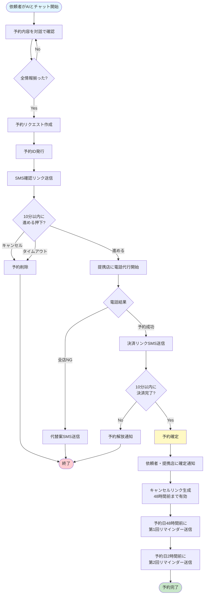
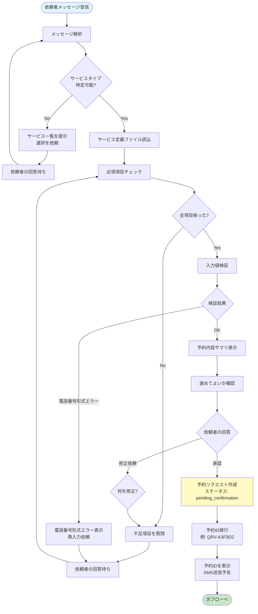
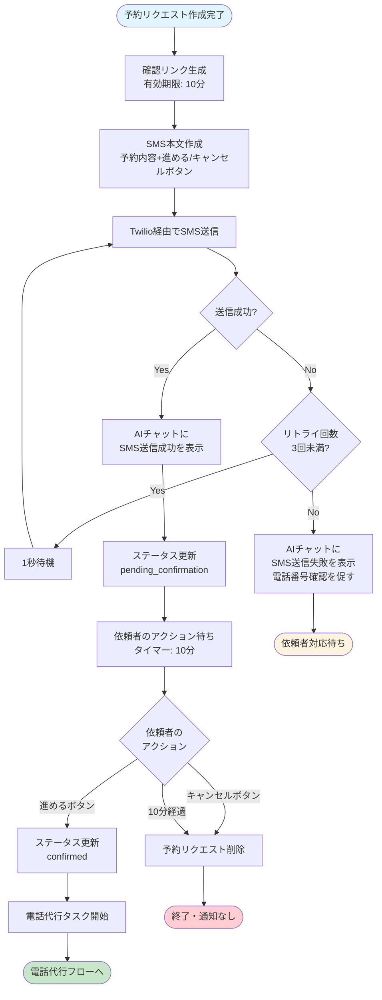
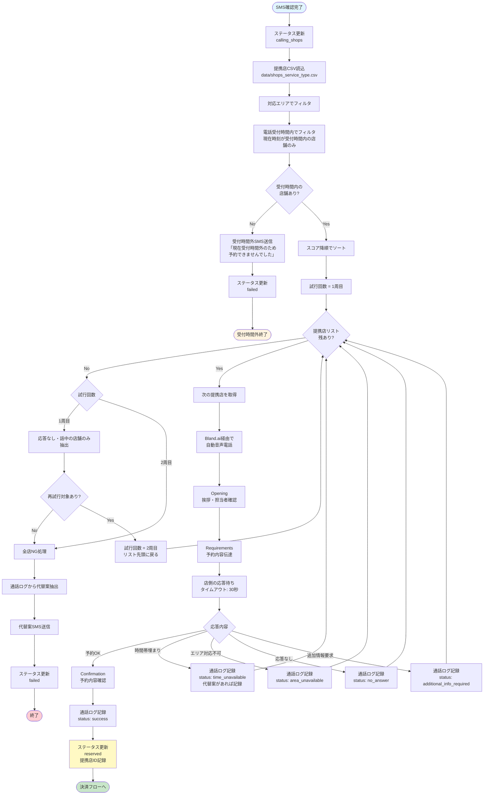
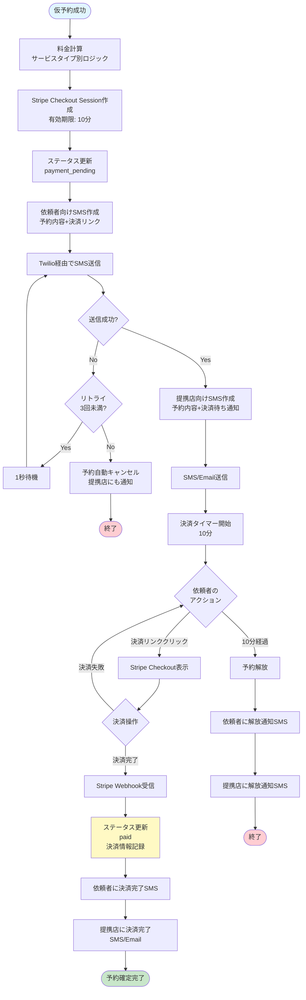
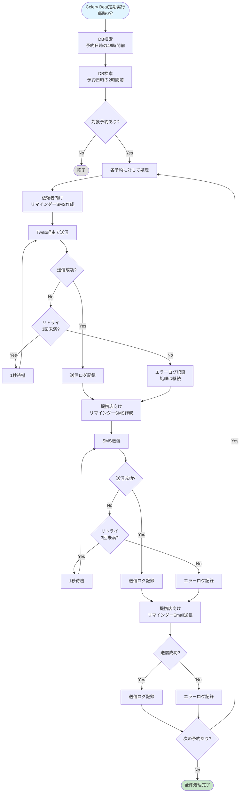
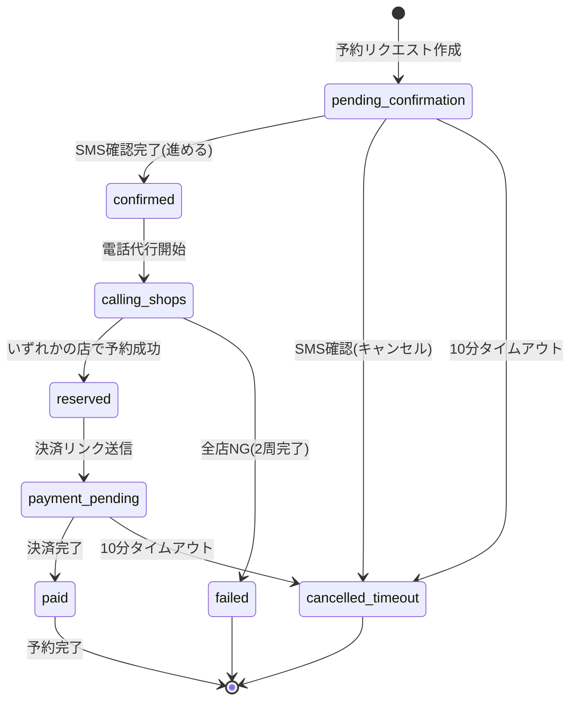
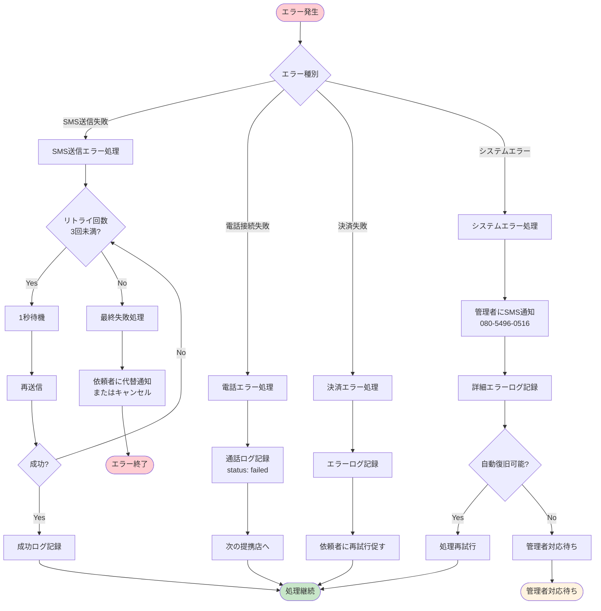
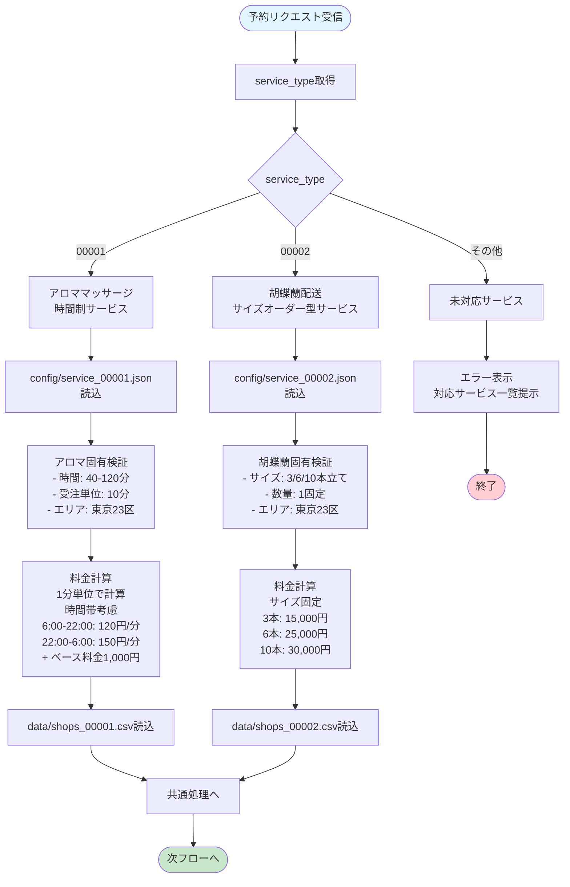

# QRV (Qualfia Reservation) 業務フロー図

**作成日:** 2025-01-26
**最終更新日:** 2025-01-29
**対象システム:** QRV (Qualfia Reservation)

**関連文書:**
- [要件定義書](01_要件定義書.md)
- [機能要件定義書](03_機能要件定義書.md)
- [非機能要件定義書](04_非機能要件定義書.md)
- [運用要件定義書](05_運用要件定義書.md)

---

## 目次

1. [全体フロー](#1-全体フロー)
2. [予約受付フロー（詳細）](#2-予約受付フロー詳細)
3. [SMS確認フロー](#3-sms確認フロー)
4. [電話代行フロー](#4-電話代行フロー)
5. [決済フロー](#5-決済フロー)
6. [通知フロー](#6-通知フロー)

---

## 1. 全体フロー

システム全体の業務フローを示します。

---

## 2. 予約受付フロー（詳細）

AIエージェントとの対話による予約受付の詳細フローです。

---

## 3. SMS確認フロー

依頼者に確認リンクを送信し、承認を得るフローです。

---

## 4. 電話代行フロー

提携店への自動音声電話による予約取得フローです。

---

## 5. 決済フロー

仮予約成功後の決済処理フローです。

---

## 6. 通知フロー

リマインダーおよび各種通知の送信フローです。

---

## 7. ステータス遷移図

予約のステータス遷移を示します。

---

## 8. エラー処理フロー

主要なエラーケースの処理フローです。

---

## 9. サービスタイプ別処理分岐

サービスタイプに応じた処理の分岐を示します。

---

**文書終了**
