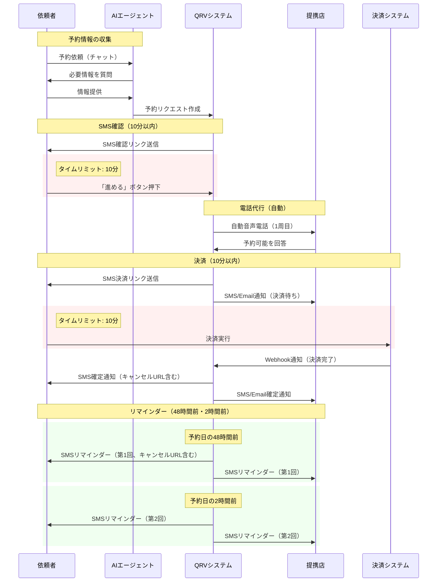
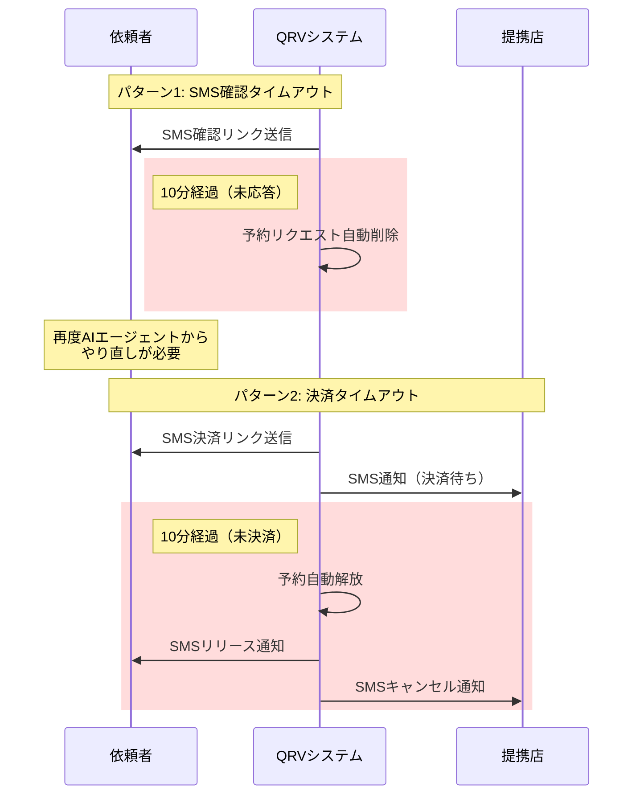
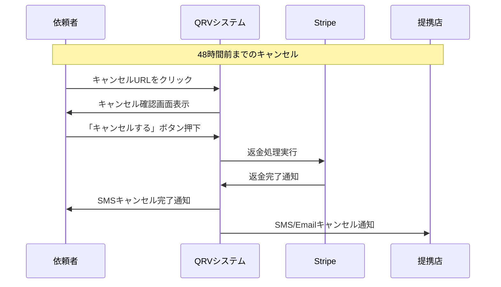
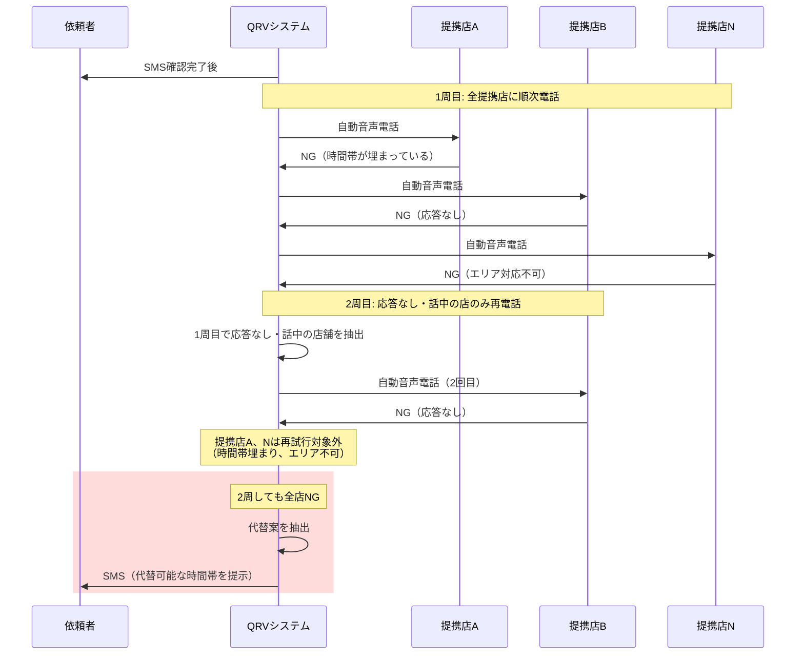

# QRV 基本設計 - 処理シーケンス図

**文書バージョン:** 1.0
**作成日:** 2025-01-29
**関連文書:** [要件定義書](../02_requirement/1_definition/01_要件定義書.md) v2.1

---

## 目次

1. [正常系フロー（時間制約の可視化）](#1-正常系フロー時間制約の可視化)
2. [タイムアウト時の処理](#2-タイムアウト時の処理)
3. [キャンセル処理](#3-キャンセル処理)
4. [全店NG時の処理](#4-全店ng時の処理)

---

## 1. 正常系フロー（時間制約の可視化）

---

## 2. タイムアウト時の処理

---

## 3. キャンセル処理

---

## 4. 全店NG時の処理

---

## 利用目的と設計指針

### タイミング図の利用シーン
- **タスクキュー（Celery）のタスク設計**
- **タイムアウト監視処理の設計**
- **依頼者・提携店への通知タイミングの確認**

### 実装時の注意点
1. **タイムアウト管理**
   - SMS確認: 10分以内に未応答 → 予約リクエスト削除
   - 決済: 10分以内に未決済 → 予約解放、提携店に通知

2. **リマインダー送信タイミング**
   - 第1回: 予約日の48時間前
   - 第2回: 予約日の2時間前

3. **全店NG時の再試行ロジック**
   - 1周目: 全提携店に順次電話
   - 2周目: 応答なし・話中の店舗のみ再試行
   - 明示的なNG（時間帯埋まり、エリア不可）は再試行対象外

---

## 変更履歴

| バージョン | 日付 | 変更内容 | 作成者 |
|-----------|------|---------|--------|
| 1.0 | 2025-01-29 | 要件定義の図表集から基本設計に移動 | - |

---

**文書終了**
