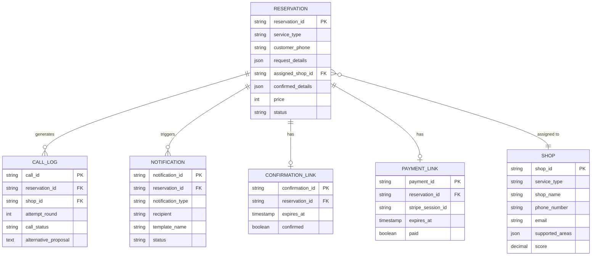

# QRV 基本設計 - データモデル

**文書バージョン:** 1.0
**作成日:** 2025-01-29
**関連文書:** [要件定義書](../02_requirement/1_definition/01_要件定義書.md) v2.1

---

## 目次

1. [エンティティ関連図（概念レベル）](#1-エンティティ関連図概念レベル)
2. [エンティティの説明](#2-エンティティの説明)
3. [主要な業務ルール](#3-主要な業務ルール)

---

## 1. エンティティ関連図（概念レベル）

---

## 2. エンティティの説明

### 2.1 RESERVATION（予約）

- **役割:** 依頼者の予約リクエストと確定内容を管理
- **主要関連:**
  - 1つの予約は1つの提携店に割り当てられる（assigned_shop_id）
  - 1つの予約は複数の通話ログを持つ（電話代行の履歴）
  - 1つの予約は複数の通知を持つ（SMS/Email）
  - 1つの予約は1つの確認リンクを持つ（SMS確認用）
  - 1つの予約は1つの決済リンクを持つ（Stripe決済用）

### 2.2 SHOP（提携店）

- **役割:** サービス提供事業者の情報を管理
- **主要関連:**
  - 1つの提携店は複数の予約に割り当てられる可能性がある
  - サービスタイプごとに別CSVで管理（shops_00001.csv等）

### 2.3 CALL_LOG（通話ログ）

- **役割:** 電話代行の履歴を記録
- **主要関連:**
  - 1つの予約に対して複数の通話ログ（複数店舗に電話）
  - 各通話ログは1つの提携店と関連

### 2.4 NOTIFICATION（通知履歴）

- **役割:** SMS/Email送信の履歴を記録
- **主要関連:**
  - 1つの予約に対して複数の通知（確認SMS、決済SMS、リマインダー等）

### 2.5 CONFIRMATION_LINK（確認リンク）

- **役割:** 依頼者がSMSで「進める」を押すための確認リンク管理
- **主要関連:**
  - 1つの予約に対して1つの確認リンク
  - 有効期限: 10分

### 2.6 PAYMENT_LINK（決済リンク）

- **役割:** 依頼者が決済を行うためのリンク管理
- **主要関連:**
  - 1つの予約に対して1つの決済リンク
  - 有効期限: 10分
  - Stripe Checkout Sessionと連携

---

## 3. 主要な業務ルール

### 3.1 予約のライフサイクル

予約は作成後、複数のステータスを遷移する。最終的に以下のいずれかになる：
- `paid`（確定）
- `cancelled`（キャンセル）
- `failed`（失敗）

### 3.2 提携店の選定

1. サービスタイプと対応エリアでフィルタリング
2. 電話受付時間内の店舗のみを抽出
3. スコア降順でソート

### 3.3 電話代行のリトライ

1. 1周目で全店NGの場合、2周目を実施
2. 2周目では以下のみを対象とする：
   - 応答なし
   - 話中
3. 2周目も全店NGの場合、代替案を依頼者に提示

**再試行対象外**:
- 時間帯が埋まっている
- エリア対応不可
- その他明示的なNG

### 3.4 タイムアウト管理

| イベント | タイムリミット | タイムアウト時の処理 |
|---------|--------------|-------------------|
| SMS確認 | 10分 | 予約リクエスト自動削除 |
| 決済 | 10分 | 予約解放、提携店に通知 |

### 3.5 通知の種類

#### 依頼者向け
- SMS: 確認、決済、確定、リマインダー、キャンセル

#### 提携店向け
- SMS + Email: 決済待ち、確定、リマインダー、キャンセル

---

## 利用目的と設計指針

### データモデルの利用シーン
- **データベーススキーマ設計**（詳細設計フェーズ）
- **API設計時のデータ構造確認**
- **業務フローとデータの対応関係の理解**

### 詳細設計フェーズでの展開事項
1. **物理テーブル設計**
   - カラムの詳細定義（型、長さ、制約）
   - インデックス設計
   - パーティション設計

2. **データ整合性制約**
   - 外部キー制約
   - チェック制約
   - ユニーク制約

3. **パフォーマンス最適化**
   - クエリパターンの分析
   - インデックス戦略
   - キャッシュ戦略

---

## 変更履歴

| バージョン | 日付 | 変更内容 | 作成者 |
|-----------|------|---------|--------|
| 1.0 | 2025-01-29 | 要件定義の図表集から基本設計に移動 | - |

---

**文書終了**
