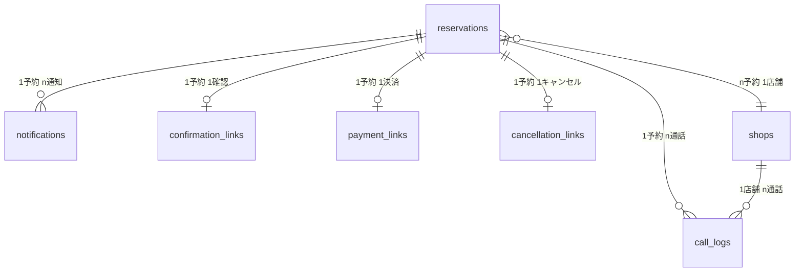

# データ項目マスター

**文書バージョン:** 1.1
**作成日:** 2025-01-27
**最終更新日:** 2025-01-28
**目的:** QRVシステムの全データベーステーブルとカラムの一覧
**関連文書:** 06_データベース設計/

---

## 目次

1. [概要](#1-概要)
2. [reservations（予約）](#2-reservations予約)
3. [shops（提携店）](#3-shops提携店)
4. [call_logs（通話ログ）](#4-call_logs通話ログ)
5. [notifications（通知履歴）](#5-notifications通知履歴)
6. [confirmation_links（確認リンク）](#6-confirmation_links確認リンク)
7. [payment_links（決済リンク）](#7-payment_links決済リンク)
8. [cancellation_links（キャンセルリンク）](#8-cancellation_linksキャンセルリンク)

---

## 1. 概要

### 1.1 データ型の凡例

| 表記 | SQLite | PostgreSQL | 説明 |
|------|--------|-----------|------|
| VARCHAR(n) | TEXT | VARCHAR(n) | 可変長文字列 |
| TEXT | TEXT | TEXT | 長文テキスト |
| INTEGER | INTEGER | INTEGER | 整数 |
| DECIMAL(m,n) | REAL | DECIMAL(m,n) | 固定小数点 |
| BOOLEAN | INTEGER | BOOLEAN | 真偽値 |
| TIMESTAMP | TEXT | TIMESTAMP | 日時 |
| DATE | TEXT | DATE | 日付 |
| TIME | TEXT | TIME | 時刻 |
| JSON | TEXT | JSONB | JSON形式 |

### 1.2 制約の凡例

| 制約 | 説明 |
|------|------|
| PK | PRIMARY KEY（主キー） |
| FK | FOREIGN KEY（外部キー） |
| NOT NULL | NULL不可 |
| UNIQUE | 一意制約 |
| DEFAULT | デフォルト値 |

### 1.3 暗号化の凡例

| 表記 | 説明 |
|------|------|
| ✅ | 暗号化対象（Fernet方式で保存時に暗号化） |
| ❌ | 暗号化対象外 |

**暗号化方式:** Fernet（AES 128bit CBC + HMAC）
**暗号化タイミング:** データベース保存時
**詳細:** 用語定義マスター セクション6「暗号化仕様」参照

---

## 2. reservations（予約）

**説明:** 予約情報を管理するメインテーブル

| # | カラム名 | 型 | 制約 | 暗号化 | 説明 | 例 |
|---|---------|-----|------|-------|------|-----|
| 1 | reservation_id | VARCHAR(20) | PK | ❌ | 予約ID | QRV-A3F9D2 |
| 2 | service_type | VARCHAR(10) | NOT NULL | ❌ | サービスタイプ | 00001 |
| 3 | customer_phone | VARCHAR(20) | NOT NULL | ✅ | 依頼者電話番号 | 08012345678 |
| 4 | request_details | TEXT/JSON | NOT NULL | ✅ | 依頼内容（JSON） | {"delivery_address": "..."} |
| 5 | assigned_shop_id | VARCHAR(20) | FK → shops | ❌ | 割り当て店舗ID | 1 |
| 6 | confirmed_details | TEXT/JSON | | ✅ | 確定内容（JSON） | {"confirmed_time": "..."} |
| 7 | price | INTEGER | | ✅ | 料金（円） | 2200 |
| 8 | status | VARCHAR(30) | NOT NULL | ❌ | ステータス | pending_confirmation |
| 9 | created_at | TIMESTAMP | NOT NULL | ❌ | 作成日時 | 2025-01-27 15:00:00 |
| 10 | updated_at | TIMESTAMP | NOT NULL | ❌ | 更新日時 | 2025-01-27 15:05:00 |

**暗号化対象:** customer_phone, request_details, confirmed_details, price（4フィールド）

**インデックス:**
- PRIMARY KEY: `reservation_id`
- INDEX: `status`, `created_at`
- FOREIGN KEY: `assigned_shop_id` → `shops.shop_id`

**ステータス値:** 用語定義マスター参照

---

## 3. shops（提携店）

**説明:** 提携店情報を管理するテーブル

| # | カラム名 | 型 | 制約 | 暗号化 | 説明 | 例 |
|---|---------|-----|------|-------|------|-----|
| 1 | shop_id | VARCHAR(20) | PK | ❌ | 店舗ID | 1 |
| 2 | service_type | VARCHAR(10) | NOT NULL | ❌ | サービスタイプ | 00001 |
| 3 | shop_name | VARCHAR(100) | NOT NULL | ❌ | 店舗名 | リラックス東京 |
| 4 | phone_number | VARCHAR(20) | NOT NULL | ✅ | 電話番号 | 0312345678 |
| 5 | email | VARCHAR(100) | NOT NULL | ✅ | メールアドレス | info@relax.jp |
| 6 | supported_areas | TEXT/JSON | NOT NULL | ❌ | 対応エリア | ["渋谷区", "新宿区"] |
| 7 | score | DECIMAL(5,2) | NOT NULL | ❌ | スコア（0-100） | 85.50 |
| 8 | phone_reception_start | TIME | NOT NULL | ❌ | 電話受付開始 | 09:00 |
| 9 | phone_reception_end | TIME | NOT NULL | ❌ | 電話受付終了 | 18:00 |
| 10 | created_at | TIMESTAMP | NOT NULL | ❌ | 作成日時 | 2025-01-27 00:00:00 |
| 11 | updated_at | TIMESTAMP | NOT NULL | ❌ | 更新日時 | 2025-01-27 00:00:00 |

**暗号化対象:** phone_number, email（2フィールド）

**インデックス:**
- PRIMARY KEY: `shop_id`
- INDEX: `service_type`, `score` DESC

**データソース:** CSV (`data/shops_{service_type}.csv`)

---

## 4. call_logs（通話ログ）

**説明:** 提携店への電話の記録

| # | カラム名 | 型 | 制約 | 暗号化 | 説明 | 例 |
|---|---------|-----|------|-------|------|-----|
| 1 | call_id | VARCHAR(30) | PK | ❌ | 通話ID | CALL-20250127150000-1 |
| 2 | reservation_id | VARCHAR(20) | FK → reservations | ❌ | 予約ID | QRV-A3F9D2 |
| 3 | shop_id | VARCHAR(20) | FK → shops | ❌ | 店舗ID | 1 |
| 4 | attempt_round | INTEGER | NOT NULL | ❌ | 試行回数（1/2周目） | 1 |
| 5 | call_status | VARCHAR(20) | NOT NULL | ❌ | 通話結果 | success |
| 6 | alternative_proposal | TEXT | | ✅ | 代替案 | 18:00以降なら可能 |
| 7 | call_started_at | TIMESTAMP | | ❌ | 通話開始時刻 | 2025-01-27 15:00:00 |
| 8 | call_ended_at | TIMESTAMP | | ❌ | 通話終了時刻 | 2025-01-27 15:02:30 |
| 9 | call_duration_seconds | INTEGER | | ❌ | 通話時間（秒） | 150 |
| 10 | recording_url | VARCHAR(200) | | ❌ | 録音URL | https://bland.ai/... |
| 11 | notes | TEXT | | ✅ | メモ（通話内容記録） | 担当者: 田中様 |
| 12 | created_at | TIMESTAMP | NOT NULL | ❌ | 作成日時 | 2025-01-27 15:02:30 |

**暗号化対象:** alternative_proposal, notes（2フィールド）
**注記:** 通話内容の詳細記録（transcript, ai_response, shop_response）を含む場合は全て暗号化対象

**インデックス:**
- PRIMARY KEY: `call_id`
- INDEX: `reservation_id`, `shop_id`
- FOREIGN KEY: `reservation_id` → `reservations.reservation_id`
- FOREIGN KEY: `shop_id` → `shops.shop_id`

**call_status値:** 用語定義マスター参照

---

## 5. notifications（通知履歴）

**説明:** SMS/Email送信履歴

| # | カラム名 | 型 | 制約 | 暗号化 | 説明 | 例 |
|---|---------|-----|------|-------|------|-----|
| 1 | notification_id | VARCHAR(30) | PK | ❌ | 通知ID | NOTIF-20250127150000-SMS |
| 2 | reservation_id | VARCHAR(20) | FK → reservations | ❌ | 予約ID | QRV-A3F9D2 |
| 3 | notification_type | VARCHAR(10) | NOT NULL | ❌ | 通知タイプ | sms / email |
| 4 | recipient | VARCHAR(100) | NOT NULL | ✅ | 宛先 | 08012345678 |
| 5 | template_name | VARCHAR(50) | NOT NULL | ❌ | テンプレート名 | confirmation_request |
| 6 | content | TEXT | NOT NULL | ✅ | 送信内容 | 【Qualfia予約代行】... |
| 7 | status | VARCHAR(20) | NOT NULL | ❌ | 送信ステータス | sent |
| 8 | sent_at | TIMESTAMP | | ❌ | 送信日時 | 2025-01-27 15:00:00 |
| 9 | error_message | TEXT | | ❌ | エラーメッセージ | Twilio API Error: ... |
| 10 | created_at | TIMESTAMP | NOT NULL | ❌ | 作成日時 | 2025-01-27 15:00:00 |

**暗号化対象:** recipient, content（2フィールド）

**インデックス:**
- PRIMARY KEY: `notification_id`
- INDEX: `reservation_id`, `status`
- FOREIGN KEY: `reservation_id` → `reservations.reservation_id`

**template_name値:** 用語定義マスター参照

---

## 6. confirmation_links（確認リンク）

**説明:** SMS確認リンクの管理

| # | カラム名 | 型 | 制約 | 暗号化 | 説明 | 例 |
|---|---------|-----|------|-------|------|-----|
| 1 | confirmation_id | VARCHAR(36) | PK | ❌ | 確認ID（UUID） | 550e8400-e29b-41d4-... |
| 2 | reservation_id | VARCHAR(20) | FK, UNIQUE → reservations | ❌ | 予約ID | QRV-A3F9D2 |
| 3 | expires_at | TIMESTAMP | NOT NULL | ❌ | 有効期限 | 2025-01-27 15:10:00 |
| 4 | confirmed | BOOLEAN | DEFAULT FALSE | ❌ | 確認済みフラグ | false |
| 5 | confirmed_at | TIMESTAMP | | ❌ | 確認日時 | 2025-01-27 15:05:00 |
| 6 | created_at | TIMESTAMP | NOT NULL | ❌ | 作成日時 | 2025-01-27 15:00:00 |

**暗号化対象:** なし（リンクIDはURL構成要素のため暗号化不可）

**インデックス:**
- PRIMARY KEY: `confirmation_id`
- UNIQUE: `reservation_id`
- INDEX: `expires_at`
- FOREIGN KEY: `reservation_id` → `reservations.reservation_id`

**URL形式:** `https://qualfia.com/phone/confirm/{confirmation_id}`

---

## 7. payment_links（決済リンク）

**説明:** 決済リンクの管理

| # | カラム名 | 型 | 制約 | 暗号化 | 説明 | 例 |
|---|---------|-----|------|-------|------|-----|
| 1 | payment_id | VARCHAR(36) | PK | ❌ | 決済ID（UUID） | 660e8400-e29b-41d4-... |
| 2 | reservation_id | VARCHAR(20) | FK, UNIQUE → reservations | ❌ | 予約ID | QRV-A3F9D2 |
| 3 | stripe_session_id | VARCHAR(100) | | ❌ | Stripe Session ID | cs_test_... |
| 4 | expires_at | TIMESTAMP | NOT NULL | ❌ | 有効期限 | 2025-01-27 15:15:00 |
| 5 | paid | BOOLEAN | DEFAULT FALSE | ❌ | 決済済みフラグ | false |
| 6 | paid_at | TIMESTAMP | | ❌ | 決済日時 | 2025-01-27 15:08:00 |
| 7 | created_at | TIMESTAMP | NOT NULL | ❌ | 作成日時 | 2025-01-27 15:05:00 |

**暗号化対象:** なし（リンクIDはURL構成要素のため暗号化不可）

**インデックス:**
- PRIMARY KEY: `payment_id`
- UNIQUE: `reservation_id`
- INDEX: `expires_at`, `stripe_session_id`
- FOREIGN KEY: `reservation_id` → `reservations.reservation_id`

**URL形式:** `https://qualfia.com/phone/book/{payment_id}`

---

## 8. cancellation_links（キャンセルリンク）

**説明:** キャンセルリンクの管理

| # | カラム名 | 型 | 制約 | 暗号化 | 説明 | 例 |
|---|---------|-----|------|-------|------|-----|
| 1 | cancellation_id | VARCHAR(36) | PK | ❌ | キャンセルID（UUID） | 770e8400-e29b-41d4-... |
| 2 | reservation_id | VARCHAR(20) | FK, UNIQUE → reservations | ❌ | 予約ID | QRV-A3F9D2 |
| 3 | expires_at | TIMESTAMP | NOT NULL | ❌ | 有効期限（48時間前） | 2025-01-28 15:00:00 |
| 4 | cancelled | BOOLEAN | DEFAULT FALSE | ❌ | キャンセル済みフラグ | false |
| 5 | cancelled_at | TIMESTAMP | | ❌ | キャンセル日時 | 2025-01-27 16:00:00 |
| 6 | refund_status | VARCHAR(20) | | ❌ | 返金ステータス | completed |
| 7 | created_at | TIMESTAMP | NOT NULL | ❌ | 作成日時 | 2025-01-27 15:08:00 |

**暗号化対象:** なし（リンクIDはURL構成要素のため暗号化不可）

**インデックス:**
- PRIMARY KEY: `cancellation_id`
- UNIQUE: `reservation_id`
- INDEX: `expires_at`
- FOREIGN KEY: `reservation_id` → `reservations.reservation_id`

**URL形式:** `https://qualfia.com/phone/cancel/{cancellation_id}`

**refund_status値:** 用語定義マスター参照

---

## 9. テーブル関連図（概要）



---

## 10. 共通カラム

全テーブルに以下の共通カラムを含めます：

| カラム名 | 型 | 制約 | 説明 |
|---------|-----|------|------|
| created_at | TIMESTAMP | NOT NULL | 作成日時（自動設定） |
| updated_at | TIMESTAMP | NOT NULL | 更新日時（自動更新） |

**SQLAlchemy実装例:**
```python
from sqlalchemy import Column, DateTime, func

class BaseModel:
    created_at = Column(DateTime, default=func.now(), nullable=False)
    updated_at = Column(DateTime, default=func.now(), onupdate=func.now(), nullable=False)
```

---

## 11. JSON形式のカラム詳細

### 11.1 reservations.request_details

**時間制サービス（アロママッサージ）の例:**
```json
{
  "delivery_address": "東京都渋谷区道玄坂1-2-3",
  "delivery_address_encrypted": "gAAAAA...",
  "preferred_date": "2025-01-28",
  "time_range": "14:00-17:00",
  "preferred_duration": 60,
  "fallback_duration": 40
}
```

**サイズオーダー型（胡蝶蘭配送）の例:**
```json
{
  "delivery_address": "東京都港区六本木1-1-1",
  "delivery_address_encrypted": "gAAAAA...",
  "delivery_date": "2025-01-29",
  "orchid_size": "3本立て",
  "stand_message": "祝 開店"
}
```

**注:** `delivery_address_encrypted`は暗号化された住所データ

### 11.2 reservations.confirmed_details

**例:**
```json
{
  "confirmed_date": "2025-01-28",
  "confirmed_time": "15:00",
  "confirmed_duration": 60,
  "shop_id": "1",
  "shop_name": "リラックス東京"
}
```

### 11.3 shops.supported_areas

**例:**
```json
["渋谷区", "新宿区", "港区", "世田谷区"]
```

---

## 変更履歴

| バージョン | 日付 | 変更内容 |
|-----------|------|---------|
| 1.0 | 2025-01-27 | 初版作成 |
| 1.1 | 2025-01-28 | 暗号化対象フィールドを明示：<br>・全テーブル定義に「暗号化」列を追加<br>・暗号化対象フィールドに✅マーク（10フィールド）<br>・セクション1.3「暗号化の凡例」を追加<br>・各テーブルに暗号化対象フィールド数を記載 |

---

**文書終了**
