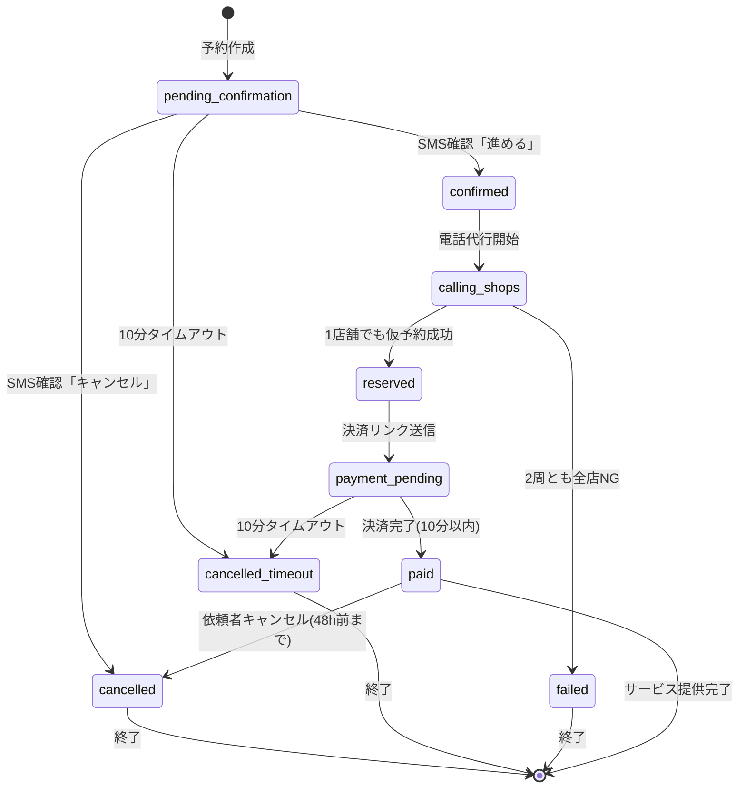

# 用語定義マスター

**文書バージョン:** 1.1
**作成日:** 2025-01-27
**最終更新日:** 2025-01-28
**目的:** QRVシステム全体で使用する用語の統一定義
**関連文書:** 全基本設計書

---

## 目次

1. [概要](#1-概要)
2. [識別子・ID系](#2-識別子id系)
3. [ステータス値](#3-ステータス値)
4. [データ型・フォーマット](#4-データ型フォーマット)
5. [タイムアウト・期限](#5-タイムアウト期限)
6. [エラーコード](#6-エラーコード)
7. [通知テンプレート名](#7-通知テンプレート名)
8. [その他の用語](#8-その他の用語)

---

## 1. 概要

### 1.1 用語統一の重要性

本マスターファイルは、QRVシステムの全設計書・実装で使用する用語を統一定義します。
以下の原則に従います：

**命名規則:**
- データベースカラム名: `snake_case`（例: `reservation_id`）
- JSON APIパラメータ: `snake_case`（例: `customer_phone`）
- Python変数・関数: `snake_case`（例: `create_reservation`）
- クラス名: `PascalCase`（例: `ReservationService`）
- 定数: `UPPER_SNAKE_CASE`（例: `SMS_TIMEOUT_SECONDS`）

---

## 2. 識別子・ID系

### 2.1 予約ID

**用語:** `reservation_id`

**形式:** `QRV-{6桁の英数字}`

**例:** `QRV-A3F9D2`, `QRV-B7H1K9`

**説明:** システムが発行する予約の一意識別子

**生成方法:** ランダムな6桁（英大文字 + 数字）

**使用箇所:**
- データベース: `reservations.reservation_id`（主キー）
- API: 予約作成時のレスポンス、予約状況取得のパラメータ
- SMS/Email: 全通知メッセージに含める
- URL: 決済URL、キャンセルURL

---

### 2.2 店舗ID

**用語:** `shop_id`

**形式:** 数値（整数）

**例:** `1`, `2`, `3`

**説明:** 提携店の一意識別子

**使用箇所:**
- データベース: `shops.shop_id`（主キー）
- CSV: `data/shops_{service_type}.csv`

---

### 2.3 通話ID

**用語:** `call_id`

**形式:** `CALL-{timestamp}-{shop_id}`

**例:** `CALL-20250127150000-1`

**説明:** 通話ログの一意識別子

**使用箇所:**
- データベース: `call_logs.call_id`（主キー）

---

### 2.4 通知ID

**用語:** `notification_id`

**形式:** `NOTIF-{timestamp}-{type}`

**例:** `NOTIF-20250127150000-SMS`

**説明:** 通知履歴の一意識別子

**使用箇所:**
- データベース: `notifications.notification_id`（主キー）

---

### 2.5 確認ID

**用語:** `confirmation_id`

**形式:** UUID v4

**例:** `550e8400-e29b-41d4-a716-446655440000`

**説明:** SMS確認リンクの一意識別子

**使用箇所:**
- データベース: `confirmation_links.confirmation_id`（主キー）
- URL: `https://qualfia.com/phone/confirm/{confirmation_id}`

---

### 2.6 決済ID

**用語:** `payment_id`

**形式:** UUID v4

**例:** `660e8400-e29b-41d4-a716-446655440001`

**説明:** 決済リンクの一意識別子

**使用箇所:**
- データベース: `payment_links.payment_id`（主キー）
- URL: `https://qualfia.com/phone/book/{payment_id}`

---

### 2.7 キャンセルID

**用語:** `cancellation_id`

**形式:** UUID v4

**例:** `770e8400-e29b-41d4-a716-446655440002`

**説明:** キャンセルリンクの一意識別子

**使用箇所:**
- データベース: `cancellation_links.cancellation_id`（主キー）
- URL: `https://qualfia.com/phone/cancel/{cancellation_id}`

---

## 3. ステータス値

### 3.1 予約ステータス（reservation.status）

**テーブル:** `reservations.status`

**データ型:** VARCHAR(30)

| ステータス値 | 説明 | 次の遷移先 |
|------------|------|-----------|
| `pending_confirmation` | SMS確認待ち | `confirmed`, `cancelled`, `cancelled_timeout` |
| `confirmed` | SMS確認完了 | `calling_shops` |
| `calling_shops` | 提携店に電話中 | `reserved`, `failed` |
| `reserved` | 仮予約成功 | `payment_pending` |
| `payment_pending` | 決済待ち | `paid`, `cancelled_timeout` |
| `paid` | 決済完了（予約確定） | `cancelled` |
| `cancelled` | キャンセル | （終了） |
| `cancelled_timeout` | キャンセル（タイムアウト） | （終了） |
| `failed` | 予約失敗 | （終了） |

**ステータス遷移の重要な原則:**
1. **1店舗でも仮予約成功したら終了**: `calling_shops`状態で1店舗でも仮予約が成功したら、即座に`reserved`に遷移し、他の店舗には電話をかけません
2. **レコードは削除しない**: キャンセルや失敗時もレコードは削除せず、ステータスを更新します
3. **タイムアウトは自動遷移**: SMS確認（10分）、決済（10分）のタイムアウトは自動で`cancelled_timeout`に遷移します

**ステータス遷移図:**

---

### 3.2 通話ステータス（call_logs.call_status）

**テーブル:** `call_logs.call_status`

**データ型:** VARCHAR(20)

| ステータス値 | 説明 |
|------------|------|
| `success` | 予約成功 |
| `no_answer` | 応答なし（30秒タイムアウト） |
| `busy` | 話中 |
| `time_unavailable` | 時間帯が埋まっている |
| `area_unavailable` | エリア対応不可 |
| `additional_info_required` | 追加情報要求 |
| `out_of_reception_hours` | 電話受付時間外 |
| `failed` | その他失敗 |

---

### 3.3 通知ステータス（notifications.status）

**テーブル:** `notifications.status`

**データ型:** VARCHAR(20)

| ステータス値 | 説明 |
|------------|------|
| `pending` | 送信待ち |
| `sent` | 送信成功 |
| `failed` | 送信失敗 |
| `retrying` | リトライ中 |

---

### 3.4 返金ステータス（cancellation_links.refund_status）

**テーブル:** `cancellation_links.refund_status`

**データ型:** VARCHAR(20)

| ステータス値 | 説明 |
|------------|------|
| `pending` | 返金処理待ち |
| `processing` | 返金処理中 |
| `completed` | 返金完了 |
| `failed` | 返金失敗 |

---

## 4. データ型・フォーマット

### 4.1 電話番号

**用語:** `phone_number` / `customer_phone`

**形式:** 11桁の数値文字列（ハイフンなし）

**例:** `08012345678`

**バリデーション:**
- 先頭: `070`, `080`, `090` のいずれか
- 長さ: 11桁
- 数値のみ

**使用箇所:**
- データベース: `reservations.customer_phone`, `shops.phone_number`
- API: 予約作成パラメータ

---

### 4.2 住所

**用語:** `address` / `delivery_address`

**形式:** 日本語文字列

**例:** `東京都渋谷区道玄坂1-2-3`

**バリデーション:**
- 必須: 都道府県名から開始
- 最大長: 200文字

**暗号化:** フィールド単位で暗号化（Fernet方式）

**使用箇所:**
- データベース: `reservations.request_details` JSONフィールド内
- 暗号化後に保存、予約完了後も永続保持（削除しない）

---

### 4.3 日付

**用語:** `date`

**形式:** ISO 8601形式 `YYYY-MM-DD`

**例:** `2025-01-28`

**使用箇所:**
- データベース: DATE型
- API: 文字列形式

---

### 4.4 日時

**用語:** `datetime` / `timestamp`

**形式:** ISO 8601形式 `YYYY-MM-DDTHH:MM:SS+09:00`

**例:** `2025-01-28T15:00:00+09:00`

**タイムゾーン:** JST（日本標準時、UTC+9）

**使用箇所:**
- データベース: TIMESTAMP型
- API: ISO 8601文字列

---

### 4.5 時刻

**用語:** `time`

**形式:** `HH:MM` (24時間形式)

**例:** `15:00`, `09:30`

**使用箇所:**
- CSV: `phone_reception_start`, `phone_reception_end`
- データベース: TIME型

---

### 4.6 時間範囲

**用語:** `time_range`

**形式:** `HH:MM-HH:MM`

**例:** `14:00-17:00`

**使用箇所:**
- 予約リクエスト: 希望時間帯

---

### 4.7 料金

**用語:** `price` / `amount`

**形式:** 整数（円単位）

**例:** `2200`, `15000`

**使用箇所:**
- データベース: INTEGER型
- API: 数値型
- 表示: `{price}円` の形式

---

### 4.8 サービスタイプ

**用語:** `service_type`

**形式:** 5桁の数値文字列

**例:** `00001` (アロママッサージ), `00002` (胡蝶蘭配送)

**使用箇所:**
- データベース: `reservations.service_type`, `shops.service_type`
- CSV: ファイル名 `data/shops_{service_type}.csv`
- 設定: `config/service_{service_type}.json`

---

## 5. タイムアウト・期限

### 5.1 SMS確認タイムアウト

**用語:** `SMS_CONFIRMATION_TIMEOUT`

**値:** 10分（600秒）

**説明:** SMS確認リンクの有効期限

**使用箇所:**
- `confirmation_links.expires_at` の計算
- バックグラウンドタスク: タイムアウト監視

---

### 5.2 決済タイムアウト

**用語:** `PAYMENT_TIMEOUT`

**値:** 10分（600秒）

**説明:** 決済リンクの有効期限

**使用箇所:**
- `payment_links.expires_at` の計算
- バックグラウンドタスク: タイムアウト監視

---

### 5.3 電話応答なし判定時間

**用語:** `CALL_TIMEOUT`

**値:** 30秒

**説明:** 電話の応答なし判定時間

**使用箇所:**
- Bland.ai API呼び出し時のタイムアウト設定

---

### 5.4 第1回リマインダー送信時刻

**用語:** `FIRST_REMINDER_HOURS`

**値:** 48時間前

**説明:** 予約日時の何時間前に第1回リマインダーを送信するか

**使用箇所:**
- Celery Beat定期タスク

---

### 5.5 第2回リマインダー送信時刻

**用語:** `SECOND_REMINDER_HOURS`

**値:** 2時間前

**説明:** 予約日時の何時間前に第2回リマインダーを送信するか

**使用箇所:**
- Celery Beat定期タスク

---

### 5.6 キャンセル可能期限

**用語:** `CANCELLATION_DEADLINE_HOURS`

**値:** 48時間前

**説明:** 予約日時の何時間前までキャンセル可能か

**使用箇所:**
- `cancellation_links.expires_at` の計算
- キャンセル画面: 期限チェック

---

### 5.7 SMSリトライ回数

**用語:** `SMS_MAX_RETRIES`

**値:** 3回

**説明:** SMS送信失敗時の最大リトライ回数

**使用箇所:**
- SMS送信処理

---

### 5.8 電話リトライ周回数

**用語:** `CALL_MAX_ROUNDS`

**値:** 2周

**説明:** 電話代行の最大周回数（1周目 + 2周目）

**使用箇所:**
- 電話代行処理

---

## 6. エラーコード

### 6.1 エラーコード体系

**形式:** `ERR-{カテゴリ}-{番号}`

**例:** `ERR-SMS-001`, `ERR-DB-003`

### 6.2 エラーコード一覧

| コード | カテゴリ | 説明 |
|--------|---------|------|
| `ERR-SMS-001` | SMS | SMS送信失敗 |
| `ERR-SMS-002` | SMS | 電話番号形式エラー |
| `ERR-CALL-001` | 電話 | 電話発信失敗 |
| `ERR-CALL-002` | 電話 | 全店NG |
| `ERR-PAY-001` | 決済 | Stripe API エラー |
| `ERR-PAY-002` | 決済 | 決済タイムアウト |
| `ERR-DB-001` | DB | DB接続エラー |
| `ERR-DB-002` | DB | データ不整合 |
| `ERR-VAL-001` | バリデーション | 必須項目不足 |
| `ERR-VAL-002` | バリデーション | 形式エラー |
| `ERR-AUTH-001` | 認証 | 認証トークンエラー |
| `ERR-SYS-001` | システム | 予期しないエラー |

---

## 7. 通知テンプレート名

### 7.1 テンプレート名一覧

**テーブル:** `notifications.template_name`

| テンプレート名 | 説明 | 送信タイミング |
|--------------|------|-------------|
| `confirmation_request` | SMS確認リンク | 予約リクエスト作成直後 |
| `payment_link` | 決済リンク | 仮予約成功直後 |
| `payment_confirmed` | 決済完了通知 | 決済完了直後 |
| `booking_released` | 予約解放通知 | タイムアウト発生時 |
| `booking_cancelled` | キャンセル完了通知 | キャンセル実行時 |
| `reminder_48h` | 第1回リマインダー | 予約日時48時間前 |
| `reminder_2h` | 第2回リマインダー | 予約日時2時間前 |
| `booking_failed` | 予約失敗通知 | 全店NG時 |
| `shop_temp_booking` | 提携店仮予約通知 | 仮予約成功直後 |
| `shop_confirmed` | 提携店確定通知 | 決済完了直後 |
| `shop_cancelled` | 提携店キャンセル通知 | キャンセル実行時 |

---

## 8. その他の用語

### 8.1 依頼者

**用語:** `customer` / `requester`

**説明:** サービスを利用する一般消費者

**関連フィールド:** `customer_phone`

---

### 8.2 提携店

**用語:** `shop` / `partner`

**説明:** サービス提供事業者

**関連テーブル:** `shops`

---

### 8.3 仮予約

**用語:** `temporary_booking` / `reserved`

**説明:** 電話で予約成功したが、決済未完了の状態

**ステータス:** `reserved`, `payment_pending`

---

### 8.4 予約確定

**用語:** `confirmed_booking`

**説明:** 決済完了済みの状態

**ステータス:** `paid`

---

### 8.5 スコア

**用語:** `score`

**説明:** 提携店の優先順位を示す数値（0.00-100.00）

**使用箇所:** `shops.score`（降順でソート）

---

### 8.6 対応エリア

**用語:** `supported_areas`

**形式:** カンマ区切りの文字列または JSON配列

**例:** `"渋谷区,新宿区,港区"` または `["渋谷区", "新宿区", "港区"]`

**使用箇所:** `shops.supported_areas`

---

## 6. 暗号化仕様

### 6.1 暗号化の基本方針

**対象範囲:** 予約処理に関わる全データ

**定義:**

予約処理に関わる全データとは、以下を含む全ての情報を指す：

1. **依頼者関連データ**
   - 連絡先情報（電話番号）
   - 依頼内容（住所、日時、サービス詳細等）
   - 確定内容（提携店との合意内容）
   - 料金情報

2. **通話関連データ**
   - 通話ログ（文字起こし）
   - AI応答内容
   - 店舗応答内容

3. **通知関連データ**
   - 送信先（電話番号、メールアドレス）
   - 通知本文（SMS/Email）

4. **提携店関連データ**
   - 連絡先情報（電話番号、メールアドレス）

**暗号化対象外:**
- 予約ID、ステータス、タイムスタンプ等のメタデータ
- サービスタイプコード
- リンクID（URL構成要素のため暗号化不可）

**方針:**

従来「個人情報」という限定的な表現を使用していたが、予約処理に関わる全データを暗号化することで、包括的なデータ保護を実現する。データは暗号化した状態で永続保存し、監査・分析用途に活用する。

---

### 6.2 暗号化方式

**方式名:** Fernet（対称暗号化）

**技術仕様:**
- アルゴリズム: AES 128bit CBC モード
- 認証: HMAC（改ざん検知機能）
- タイムスタンプ付きトークン
- Base64エンコード

**特徴:**
- 暗号化と復号化に同じキーを使用（対称暗号）
- 暗号文にHMACが含まれ、改ざんを自動検知
- タイムスタンプにより有効期限の設定が可能（オプション）

---

### 6.3 暗号化対象フィールド一覧

| テーブル | フィールド | データ型 | 暗号化理由 |
|---------|-----------|---------|-----------|
| reservations | customer_phone | VARCHAR(20) | 依頼者連絡先 |
| reservations | request_details | JSON | 依頼内容（住所、日時等） |
| reservations | confirmed_details | JSON | 確定内容（店舗との合意） |
| reservations | price | INTEGER | 取引情報 |
| call_logs | transcript | TEXT | 通話内容 |
| call_logs | ai_response | TEXT | AI応答内容 |
| call_logs | shop_response | TEXT | 店舗応答内容 |
| notifications | recipient | VARCHAR(100) | 送信先連絡先 |
| notifications | content | TEXT | 通知本文 |
| shops | phone_number | VARCHAR(20) | 提携店連絡先 |
| shops | email | VARCHAR(100) | 提携店連絡先 |

**合計:** 11フィールド（4テーブル）

---

### 6.4 暗号化キー管理

**キー形式:** 32バイトのバイナリデータ（Base64エンコード）

**キー保存場所:**

| 環境 | 保存場所 | 管理方法 |
|------|---------|---------|
| 開発環境 | 環境変数 | ローカル環境変数またはDocker Compose secrets |
| テスト環境 | 環境変数 | CI/CDサービスのSecrets機能 |
| 本番環境 | キー管理サービス | Railway Secrets、AWS Secrets Manager等 |

**セキュリティ要件:**
- キーは環境変数で管理（コードに埋め込み禁止）
- キーファイルはバージョン管理から除外
- キーへのアクセスは最小権限の原則
- キーの定期的なローテーション（将来対応）

**キーローテーション:**
- 初期MVPではキーローテーション未実装
- 将来的に多層暗号化での対応を検討
- 旧キーと新キーの並行運用期間を設ける

---

### 6.5 暗号化・復号化タイミング

**暗号化タイミング:**
- データベース保存時

**復号化タイミング:**
- データベース読み出し時
- 画面表示時
- 外部API送信時（必要な場合）

**実装方式:** 保存時暗号化（Encryption at Rest）
- アプリケーション層では平文で処理
- データベース保存時のみ暗号化
- 外部送信時は復号化して送信（暗号化されたまま送信しない）

**注意事項:**
- ログ記録時は復号化しない（暗号化されたまま記録）
- エラーメッセージに復号化後のデータを含めない

---

### 6.6 セキュリティ方針

**禁止事項:**
- 暗号化キーをソースコードに埋め込む
- 暗号化キーをバージョン管理システムにコミット
- 復号化後のデータをログに出力
- 復号化後のデータをエラーメッセージに含める
- 暗号化をスキップする処理パスを作る

**推奨事項:**
- 暗号化・復号化処理を共通関数化
- 単体テストで暗号化・復号化を検証
- 暗号化キーの存在チェックを起動時に実施
- 暗号化失敗時は処理を中断（データ保護優先）
- 定期的なセキュリティ監査

---

## 変更履歴

| バージョン | 日付 | 変更内容 |
|-----------|------|---------|
| 1.0 | 2025-01-27 | 初版作成 |
| 1.1 | 2025-01-28 | 暗号化仕様を全面拡張： ・新セクション6「暗号化仕様」を追加 ・暗号化対象を11フィールド（4テーブル）に拡張 ・暗号化方式（Fernet）の詳細仕様を記載 ・暗号化キー管理方針を明確化 ・「個人情報」表現を「予約処理に関わる全データ」に統一 ・データ削除ポリシーを変更（永続保存） |

---

**文書終了**
