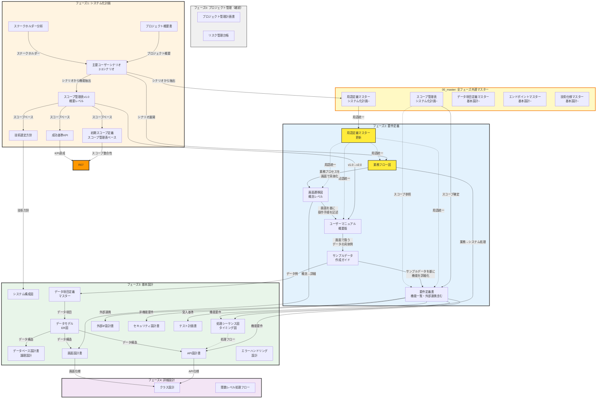
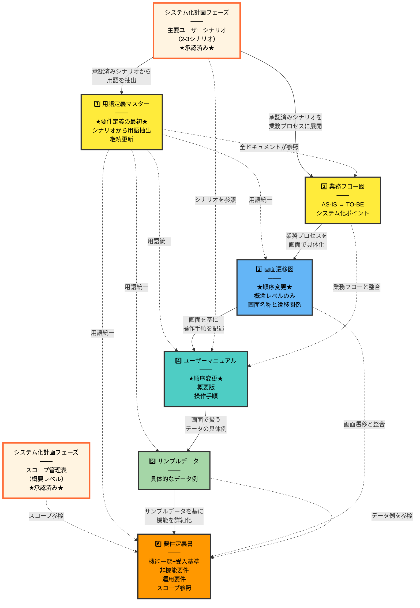
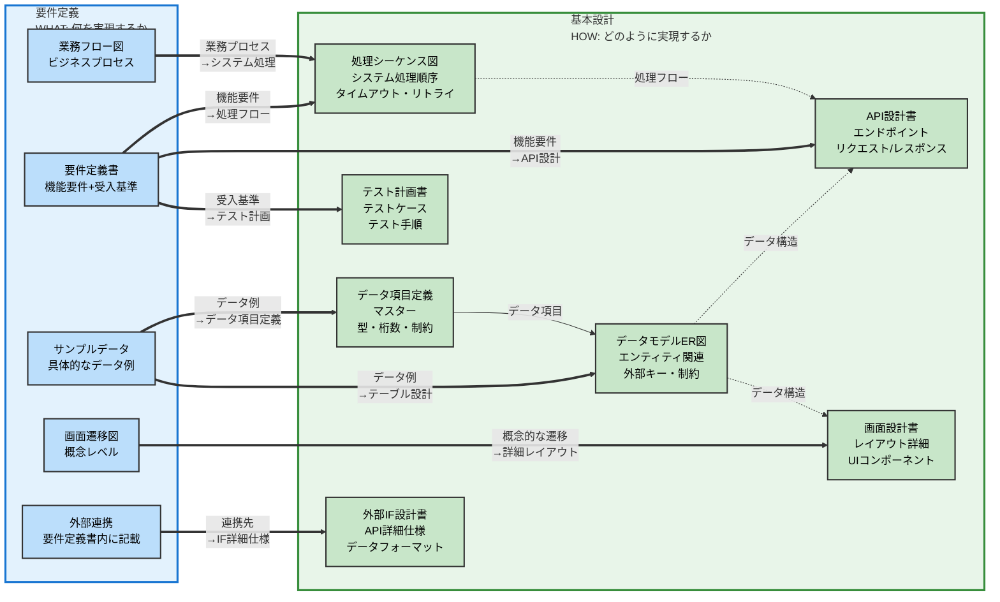
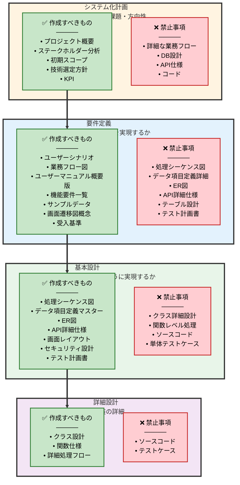

# ドキュメント関係図（中間作成物）

**作成日**: 2025-01-29
**更新日**: 2025-01-30
**目的**: 各フェーズで作成されるドキュメントの関係性を視覚化

---

## 0. プロジェクトのディレクトリ構成

```
project_root/
├── 1_guideline/                         ← プロジェクト全体のガイドライン
│   ├── 1_general/                       ← 汎用的なガイドライン
│   │   ├── 01_システム化計画フェーズ.md
│   │   ├── 02_要件定義フェーズ.md
│   │   └── 03_基本設計フェーズ.md
│   │
│   └── 2_specific/                      ← プロジェクト固有のガイドライン（必要に応じて）
│
└── 2_docs/                              ← プロジェクトの成果物
    ├── 00_master/                       ← プロジェクト全体のマスターファイル
    │   ├── 01_スコープ管理表.md          ← システム化計画で作成、以降更新しない
    │   ├── 02_用語定義マスター.md        ← システム化計画~運用まで継続更新
    │   ├── 03_データ項目定義マスター.md  ← 基本設計~運用まで継続更新
    │   ├── 04_エンドポイントマスター.md  ← 基本設計~運用まで継続更新
    │   └── 05_技術仕様マスター.md        ← 基本設計~運用まで継続更新
    │
    ├── 01_planning/                     ← システム化計画フェーズ
    │   ├── プロジェクト概要書.md
    │   ├── ステークホルダー分析.md
    │   ├── 主要ユーザーシナリオ.md
    │   ├── 初期スコープ定義.md
    │   ├── 技術選定方針.md
    │   └── 成功基準KPI.md
    │
    ├── 02_requirement/                  ← 要件定義フェーズ
    │   └── 1_definition/                ← 要件定義ドキュメント
    │       ├── 01_業務フロー図.md
    │       ├── 02_画面遷移図.md
    │       ├── 03_ユーザーマニュアル.md
    │       ├── 04_サンプルデータ.md
    │       └── 05_要件定義書.md
    │
    └── 03_design/                       ← 基本設計フェーズ
        └── 1_basic/
            ├── 処理シーケンス図.md
            ├── データモデルER図.md
            ├── API設計書.md
            └── ...
```

### ディレクトリ構成の設計思想

#### 2_docs/00_master（プロジェクト全体のマスターファイル）
- **全フェーズで参照・更新されるマスターファイル**
- プロジェクト全体で一貫性を保つための基盤
- 番号順が作成順序と一致

#### 2_docs（フェーズごとの成果物）
- **各フェーズで作成される成果物**
- フェーズごとにディレクトリを分離
- 00_master、01_planning、02_requirement、03_designという番号順

---

## 1. 全フェーズのドキュメント関係図（概要）

各フェーズで作成されるドキュメントと、フェーズ間の主要な依存関係を示します。



### 凡例

- **実線（→）**: 強い依存関係（前提条件）
- **点線（-.->）**: 参照関係（整合性確認が必要）
- **黄色**: 最優先で作成すべき基盤ドキュメント
- **オレンジ**: 中核となるドキュメント

---

## 2. 要件定義フェーズ内のドキュメント依存関係（詳細）

要件定義フェーズ内での作成順序とドキュメント間の依存関係を示します。

**前提**：
- システム化計画フェーズで主要ユーザーシナリオ（2-3シナリオ）が既に作成・承認済み
- システム化計画フェーズでスコープ管理表（概要レベル）が作成・承認済み



### 推奨作成順序（最終版）

#### システム化計画フェーズ（Phase 1）で作成

0. **プロジェクト概要書** ← プロジェクトの背景・目的
1. **ステークホルダー分析** ← 関係者の特定・役割定義
2. **主要ユーザーシナリオ（2-3シナリオ）** ← ★プロジェクトの方向性を決定
   - プロジェクトのゴール明確化
   - ペルソナ定義（誰が、なぜ使うか）
   - 主要な利用シーンを具体的に記述
   - ステークホルダー全員で承認を取得
3. **スコープ管理表（概要レベル）** ← ★シナリオから機能を抽出・優先順位付け
   - シナリオから必要な機能を抽出
   - MoSCoW法で優先順位付け（Must/Should/Could/Won't）
   - 「今回のスコープ範囲」と「今後の拡張が検討されるスコープ」の2つに分類
   - 機能分類レベルの粒度（詳細は要件定義で）
   - ステークホルダー全員で承認を取得
   - **以降、このスコープ管理表は更新しない**（要件定義書に機能一覧として詳細化）
4. **初期スコープ定義** ← スコープ管理表に基づく正式な定義書
5. **技術選定方針** ← シナリオ・スコープから技術要件を導出
6. **成功基準KPI** ← シナリオ・スコープベースでKPI設定

#### 要件定義フェーズ（Phase 2）で作成

**前提**：
- システム化計画の主要ユーザーシナリオが承認済み
- システム化計画のスコープ管理表（概要レベル）が承認済み

1. **用語定義マスター** ← 承認済みシナリオから用語を抽出・定義（継続更新）
2. **業務フロー図** ← 承認済みシナリオを業務プロセスに展開
3. **画面遷移図（概念レベル）** ← ★順序変更：業務プロセスを画面で具体化
   - 画面名称と遷移関係のみ
   - 詳細なレイアウトは基本設計で作成
4. **ユーザーマニュアル（概要版）** ← ★順序変更：画面遷移図を基に操作手順を記述
   - 画面の全体像を踏まえた操作手順
   - 各画面での操作内容を具体的に記述
5. **サンプルデータ作成ガイド** ← 画面で扱うデータの具体例
6. **要件定義書** ← サンプルデータを基に機能を詳細化
   - **スコープ管理表（概要レベル）を参照**
   - **機能一覧（機能ID付与）**← スコープ管理表の詳細版
   - 外部システム連携要件
   - 必要なデータ項目の概要
   - 受入基準

#### 基本設計フェーズに移動したドキュメント

- **データ項目定義マスター** ← 基本設計フェーズで作成（テーブル設計・ER図と一体で）
  - 要件定義書には「必要なデータの種類」を概要レベルで記載
  - 詳細な型・桁数・制約条件は基本設計で定義

- **テスト計画書** ← 基本設計フェーズで作成（システム構成確定後）
  - 要件定義書の各機能要件に「受入基準」を記載することで代替
  - 詳細なテストケース・テスト手順は基本設計で定義

#### 削除したドキュメント・変更した位置

- **ユーザーシナリオ（要件定義フェーズ）** ← システム化計画フェーズに移動
  - 理由1：プロジェクトの方向性を早期に確定できる
  - 理由2：要件定義フェーズでの手戻りを削減できる
  - 理由3：業務フロー図とユーザーマニュアルで内容が重複するため、要件定義での詳細化は不要

- **ユースケース図** ← 削除（ユーザーシナリオと業務フロー図でカバー済み）
  - ユーザーシナリオで「誰が何をするか」を具体的に記述
  - 業務フロー図で「業務の流れ」を可視化
  - ユースケース図を追加しても、新しい情報がほとんどない（冗長）

- ~~サービス仕様比較表~~ ← 今回のプロジェクトでは不要（複数プランがある場合のみ作成）
- ~~外部システム連携要件~~ ← **要件定義書の一章として記載**（別ドキュメント不要）

#### 外部システム連携要件の記載方法

外部システムとの連携がある場合は、**要件定義書に以下のような章を追加**します：

```markdown
## 7. 外部システム連携要件

### 7.1 LINE Messaging API

#### 連携目的
- 依頼者からのファイル受信
- 依頼者へのステータス通知

#### 連携方式
- REST API（Webhook）
- メッセージ送信API

#### データ項目
- ユーザーID、メッセージ内容、添付ファイル

#### エラーハンドリング
- API障害時は管理画面で通知
```

このように、要件定義書の中に統合することで、**ドキュメント数を削減**し、**一元管理**できます。

#### 作成順序の理由

**画面遷移図を要件定義書より先に作成する理由**：
- スコープ管理表で「今回実装する機能」を確定した後、画面遷移図で「どの画面でそれを実現するか」を具体化
- 画面遷移図（概念レベル）を見ながら要件定義書を書くことで、機能要件が具体的になる
- 「この画面にはこの機能が必要」という形で要件を記述できる
- 画面の流れを考えることで、エラーハンドリングや画面遷移の要件も明確になる

**画面遷移図の粒度（要件定義フェーズ）**：
- ✅ 画面名称とその役割
- ✅ 画面間の遷移関係（矢印）
- ✅ 主要なボタン・リンク名
- ❌ 詳細なレイアウト（配置、サイズ、色）← 基本設計で作成
- ❌ 詳細なUIコンポーネント（ドロップダウン、モーダル等）← 基本設計で作成

**サンプルデータ作成ガイドを画面遷移図の後に作成する理由**：
- 画面遷移図で「どの画面があるか」を明確化した後、その画面で「どんなデータを扱うか」を具体例で示す
- サンプルデータがあることで、要件定義書を書く際に「このデータ項目が必要」と具体的に記述できる
- 抽象的な要件より、具体的なデータ例がある方がステークホルダーと議論しやすい
- サンプルデータ作成時に「このデータ項目が足りない」と気づくことができる

**データ項目定義マスターを基本設計フェーズに移動する理由**：
- データ項目の詳細（型、桁数、制約条件）は「HOW（どのように実装するか）」なので基本設計で決定
- 要件定義書には「必要なデータの種類」を概要レベルで記載するだけで十分
- データ項目定義マスターは、テーブル設計・ER図と一体で作成する方が効率的
- `2_docs/00_master/02_データ項目定義マスター.md` は基本設計フェーズで作成開始

**テスト計画書を基本設計フェーズに移動する理由**：
- 詳細なテストケースは、システム構成（画面、API、DB）が確定してから作成すべき
- 要件定義書の各機能要件に「受入基準」を記載することで、テストの方針は担保できる
- 基本設計フェーズで、具体的なテスト項目・テストケース・テスト手順を定義
- 小規模プロジェクトでは、テスト戦略とテスト計画を1つのドキュメントにまとめても良い

---

## 3. 要件定義 → 基本設計への変換関係

WHAT（何を実現するか）からHOW（どのように実現するか）への変換を示します。



### 重要なポイント

| 視点 | 要件定義 | 基本設計 |
|-----|---------|---------|
| **焦点** | **WHAT**（何を実現するか） | **HOW**（どのように実現するか） |
| **業務フロー図** | ✅ ビジネスプロセス | ❌ システム処理順序 |
| **データ定義** | ✅ サンプルデータ例 | ❌ データ項目定義・テーブル設計・ER図 |
| **画面定義** | ✅ 画面遷移図（概念） | ❌ 画面レイアウト（詳細） |
| **通信仕様** | ✅ 外部連携先の特定（要件定義書内） | ❌ API詳細仕様 |
| **テスト** | ✅ 受入基準（要件定義書内） | ❌ テスト計画書・テストケース |

---

## 4. ドキュメント間のトレーサビリティ（整合性確認）

各ドキュメント間で整合性を確認すべきポイントを示します。

```mermaid
graph TD
    subgraph TRACE["トレーサビリティマトリクス"]
        direction TB

        TERM[用語定義マスター<br/>全ドキュメントの基盤]

        subgraph CHECK1["整合性チェック1: スコープ"]
            SC01[システム化計画書]
            SC02[要件定義書]
            SC01 -.->|スコープ整合性| SC02
        end

        subgraph CHECK2["整合性チェック2: 用語"]
            TERM -.->|用語統一| R_ALL[全要件定義<br/>ドキュメント]
        end

        subgraph CHECK3["整合性チェック3: データ"]
            DATA01[データ項目定義]
            DATA02[要件定義書]
            DATA03[画面遷移図]
            DATA04[ER図基本設計]

            DATA01 -.->|データ整合性| DATA02
            DATA01 -.->|項目網羅性| DATA03
            DATA01 ==>|データ項目→テーブル| DATA04
        end

        subgraph CHECK4["整合性チェック4: 機能"]
            FUNC01[業務フロー図]
            FUNC02[ユーザーマニュアル概要版]
            FUNC03[要件定義書]
            FUNC04[画面遷移図]
            FUNC05[処理シーケンス図]

            FUNC01 -.->|業務→操作手順| FUNC02
            FUNC02 -.->|操作手順→機能| FUNC03
            FUNC03 -.->|機能→画面| FUNC04
            FUNC03 ==>|機能→処理| FUNC05
        end

        subgraph CHECK5["整合性チェック5: 非機能"]
            NF01[要件定義書<br/>非機能要件]
            NF02[セキュリティ設計書]
            NF03[性能設計]

            NF01 ==>|非機能要件<br/>→設計| NF02
            NF01 ==>|性能要件<br/>→設計| NF03
        end
    end

    style TRACE fill:#fff9c4,stroke:#f57f17,stroke-width:3px
    style TERM fill:#ffeb3b,stroke:#333,stroke-width:3px,color:#000
    style CHECK1 fill:#e1f5fe,stroke:#01579b,stroke-width:2px
    style CHECK2 fill:#f3e5f5,stroke:#4a148c,stroke-width:2px
    style CHECK3 fill:#e8f5e9,stroke:#1b5e20,stroke-width:2px
    style CHECK4 fill:#fff3e0,stroke:#e65100,stroke-width:2px
    style CHECK5 fill:#fce4ec,stroke:#880e4f,stroke-width:2px
```



### 整合性確認の5つの観点

1. **スコープ整合性**: システム化計画書と要件定義書のスコープが一致しているか
2. **用語統一**: 用語定義マスターの用語が全ドキュメントで統一されているか
3. **データ整合性**: サンプルデータ→データ項目定義→テーブル設計の流れが一貫しているか
4. **機能整合性**: 業務フロー→ユーザーマニュアル→要件→画面→処理の流れが一貫しているか
5. **非機能整合性**: 非機能要件が基本設計に正しく反映されているか

---

## 5. 手戻り防止の境界線（禁止事項の明確化）

各フェーズで作成すべきもの（✅緑）と作成してはいけないもの（❌赤）を明確化します。



### 手戻りを防ぐための鉄則

1. **ユーザーシナリオから始める**（プロジェクトのゴールとユーザー価値を最初に明確化）
2. **用語定義マスターはシナリオから自然に抽出する**
3. **各ドキュメント作成前に十分な情報収集**（段階的確定方式の徹底）
4. **確定前に必ずステークホルダー全員の承認を取る**
5. **"要件定義"と"基本設計"の境界を厳守する**（これが最大の手戻り原因）
6. **各要件に「受入基準」を明記する**（解釈の揺れを防ぐ）
7. **詳細なデータ定義・テスト計画は基本設計フェーズで作成**（要件定義ではサンプルと受入基準のみ）

---

## ユーザーシナリオをシステム化計画で作成する理由

### なぜシステム化計画フェーズでユーザーシナリオを作成するのか？

#### ✅ システム化計画で作成する圧倒的なメリット

1. **プロジェクトの方向性を早期に確定できる**
   - 要件定義に入る前に「誰のために、何を作るのか」が明確になる
   - ステークホルダー全員が同じゴールを共有できる
   - プロジェクトの投資判断材料として使える（ROI試算の根拠）
   - 技術的な詳細に入る前に、ビジネス価値を確認できる

2. **要件定義フェーズの手戻りが劇的に減る**
   - 要件定義に入る前に、プロジェクトの全体像がステークホルダー間で合意されている
   - 要件定義フェーズでは「合意済みのシナリオをどう実現するか」に集中できる
   - 「そもそも何を作るべきか」という根本的な議論の手戻りを防げる
   - 早期のフィードバックで大きな手戻りを防ぐ

3. **スコープの初期設定がより正確になる**
   - システム化計画の「初期スコープ定義」を、具体的なシナリオベースで作成できる
   - 抽象的なスコープではなく、「このシナリオを実現する/しない」という明確な判断基準ができる
   - 要件定義フェーズでのスコープ変更リスクが大幅に減少

4. **技術選定の精度が上がる**
   - システム化計画の「技術選定方針」を、具体的なユースケースに基づいて決定できる
   - 例：「高齢者が電話で操作する」というシナリオがあれば、音声認識や電話API連携が技術要件に入る
   - 「なんとなく」ではなく、シナリオに基づいた根拠のある技術選定ができる

5. **成功基準（KPI）の設定が具体的になる**
   - 「山田さん（65歳）が迷わず依頼完了できる」→ 操作完了率90%以上
   - シナリオごとに測定可能なKPIを設定できる
   - ビジネス目標とシステム要件を直接結びつけられる

6. **用語の発見と抽出が自然にできる**
   - シナリオを書く過程で「この用語、定義が必要だな」と気づける
   - 実際の文脈の中で用語を発見できるため、抜け漏れが少ない
   - 机上で「用語を考える」より、実践的な用語が集まる
   - 要件定義フェーズで用語定義マスターを作成する際の基礎資料になる

7. **ステークホルダーとのコミュニケーションが容易**
   - プロジェクト初期から具体的なイメージを共有できる
   - 「用語定義から始める」より、ストーリーから入る方が理解しやすい
   - 非技術者でも理解しやすい形式で、プロジェクトのゴールを説明できる

### ユーザーシナリオの作成ポイント（システム化計画フェーズ）

#### システム化計画フェーズで作成すべき内容

**重要**: システム化計画では**主要シナリオ（2-3個）のみ**を作成します。詳細は要件定義で業務フロー図とユーザーマニュアルに展開します。

```markdown
## ユーザーシナリオ例：QRVプロジェクト（システム化計画フェーズ）

### ペルソナ定義
- **山田さん**（65歳、年金生活者、スマートフォン操作が苦手）
  - 動機：孫から送られてきた写真を印刷したい
  - 期待：複雑な操作なしに依頼したい
  - 不安：アプリのインストールや会員登録は避けたい

- **佐藤さん**（40歳、会社員、ITリテラシー高い）
  - 動機：明日の会議資料を急いで印刷したい
  - 期待：スピーディーに完了したい
  - 不安：店舗に行く時間がない

### 主要シナリオ1: 通常プラン（山田さん）

1. **きっかけ**: 孫から送られてきた写真を印刷したい
2. **アクション**: 店頭のQRコードをスマホで読み取る
3. **システム応答**: 自動的に電話がかかる
4. **ユーザー操作**: 音声ガイダンスに従って「1」をプッシュ
5. **システム応答**: 「LINEで写真を送ってください」とメッセージ表示
6. **ユーザー操作**: LINEで写真を送信
7. **店舗側**: スタッフのスマホに通知
8. **完了**: スタッフから電話で「完了しました」と連絡
9. **受取**: 店舗で印刷物を受け取り、支払い

### 主要シナリオ2: セルフプラン（佐藤さん）

1. **きっかけ**: 明日の会議資料を急いで印刷したい
2. **アクション**: 店頭のQRコードをスマホで読み取る
3. **システム応答**: 自動的に電話がかかる
4. **ユーザー操作**: 音声ガイダンスに従って「2」をプッシュ
5. **システム応答**: 印刷機の番号が表示される
6. **ユーザー操作**: LINEでファイルを送信
7. **完了**: 印刷機で印刷コードを入力して出力
8. **支払い**: その場で電子決済

### 期待される効果（ビジネス価値）
- 複雑な操作なしに依頼完了（高齢者でも利用可能）
- 店舗スタッフの対応工数削減
- 24時間対応可能（セルフプラン）
- 電話とLINEという馴染みのあるツールのみ使用
```

#### システム化計画フェーズでの注意事項

- ✅ **主要シナリオ（2-3個）のみ**を作成（網羅性は不要）
- ✅ ペルソナ定義（誰が、なぜ使うか、何を期待するか）を明確に
- ✅ 利用シーンの流れを具体的に記述
- ✅ 期待される効果（ビジネス価値）を明記
- ✅ 正常系のみでOK（異常系は要件定義で詳細化）
- ❌ 画面の詳細（ボタンの配置など）は書かない
- ❌ 技術的な実装方法は含めない
- ❌ 細かい分岐やエッジケースは記載不要（要件定義で詳細化）

#### 要件定義フェーズでの扱い

システム化計画で承認されたユーザーシナリオは、要件定義フェーズで以下のように展開されます：
- **業務フロー図**: シナリオを業務プロセスのフローチャートに変換
- **ユーザーマニュアル（概要版）**: シナリオをユーザー操作手順に具体化
- **要件定義書**: シナリオから機能要件を抽出

**重要**: 要件定義フェーズでユーザーシナリオを詳細化・追加する必要は**ありません**。業務フロー図とユーザーマニュアルで十分にカバーできます。

---

## スコープ管理表の作成方法（システム化計画フェーズのみ）

### スコープ管理表（概要レベル）の作成

**目的**: プロジェクトの実現可能性を早期判断するため、機能分類レベルでスコープを確定

**重要**: スコープ管理表は**システム化計画フェーズでのみ作成**し、以降は更新しません。詳細は**要件定義書の機能一覧**として展開します。

```markdown
# スコープ管理表（システム化計画フェーズ）

**作成日**: 2025-01-20
**承認日**: 2025-01-25

## スコープの分類

### 今回のスコープ範囲（今回実装する機能）

| 機能分類 | 機能名 | 概要 | 優先度 | 判断理由 | シナリオ参照 |
|---------|--------|------|--------|---------|------------|
| 依頼受付 | QRコード読取 | QRコードからシステムにアクセス | Must have | ユーザーシナリオ1,2の必須要件 | シナリオ1,2 |
| 依頼受付 | 電話自動発信 | QR読取後に自動で電話接続 | Must have | ユーザーシナリオ1,2の必須要件 | シナリオ1,2 |
| 依頼受付 | 音声ガイダンス | プラン選択の案内 | Must have | ユーザーシナリオ1,2の必須要件 | シナリオ1,2 |
| ファイル受信 | LINE連携 | LINEでファイル受信 | Must have | ユーザーシナリオ1,2の必須要件 | シナリオ1,2 |
| 通知 | 提携店への通知 | 依頼をスタッフスマホに通知 | Must have | ユーザーシナリオ1の必須要件 | シナリオ1 |
| 決済 | 電子決済 | セルフプランの決済 | Should have | ユーザーシナリオ2で必要 | シナリオ2 |
| 管理 | 依頼状況管理 | 管理画面で依頼一覧表示 | Should have | 運用に必要 | - |

### 今後の拡張が検討されるスコープ（将来実装を検討）

| 機能分類 | 機能名 | 概要 | 優先度 | 検討時期 | 判断理由 |
|---------|--------|------|--------|---------|---------|
| 分析 | 利用統計 | 依頼数・売上のグラフ表示 | Could have | 2025年Q3 | 今回は手動集計で対応 |
| 拡張 | Webアプリ版 | ブラウザからもアクセス可能 | Could have | 2025年Q4 | まずスマホ版で検証 |
| 拡張 | 多言語対応 | 英語・中国語対応 | Won't have | 未定 | 国内のみ展開のため現時点で不要 |

## 変更履歴

| 日付 | フェーズ | 変更者 | 変更内容 | 承認状況 |
|------|---------|--------|---------|---------|
| 2025-01-25 | システム化計画 | 全員 | 初版承認 | ✅ 承認済み |
| 2025-01-20 | システム化計画 | 鈴木 | 初版作成 | ドラフト |
```

### 要件定義書での展開方法

スコープ管理表（概要レベル）は、要件定義書の中で**機能一覧**として詳細化します。

**要件定義書の構成例**：

```markdown
# 要件定義書

## 1. はじめに
## 2. プロジェクト概要

## 3. スコープ（システム化計画で承認済み）

### 3.1 今回のスコープ範囲
システム化計画で承認されたスコープ管理表に基づき、以下の機能を実装します：
- 依頼受付機能（QRコード読取、電話自動発信、音声ガイダンス）
- ファイル受信機能（LINE連携）
- 通知機能（提携店への通知）
- 決済機能（電子決済）
- 管理機能（依頼状況管理）

### 3.2 今後の拡張が検討されるスコープ
以下の機能は将来の実装を検討します：
- 分析機能（利用統計）
- Webアプリ版
- 多言語対応

## 4. 機能一覧（スコープ管理表の詳細版）

| 機能ID | 機能分類 | 機能名 | 詳細機能 | 優先度 | 備考 |
|--------|---------|--------|---------|--------|------|
| REQ-001 | 依頼受付 | QRコード読取 | QRコードスキャン | Must have | 標準カメラアプリで読取可能 |
| REQ-002 | 依頼受付 | QRコード読取 | 店舗情報自動取得 | Must have | QRコードに店舗IDを埋め込み |
| REQ-003 | 依頼受付 | 電話自動発信 | 自動発信機能 | Must have | tel:スキームを使用 |
| ... | ... | ... | ... | ... | ... |

## 5. 機能要件（詳細）

### 5.1 依頼受付機能

#### 5.1.1 REQ-001: QRコードスキャン
- **概要**: ユーザーがQRコードをスキャンしてシステムにアクセスする
- **受入基準**:
  - 標準カメラアプリでQRコードを読み取れること
  - QRコード読み取り後、自動的に電話発信画面に遷移すること
- **優先度**: Must have
- **スコープ参照**: システム化計画のスコープ管理表「QRコード読取」

...

## 6. 非機能要件
## 7. 外部システム連携要件
## 8. 運用要件
```

このように、**スコープ管理表は概要レベルのみ**作成し、**詳細は要件定義書に統合**することで、ドキュメントの重複を避けられます

---

## 継続的に更新すべきマスターファイル

プロジェクト全体で一貫性を保つために、以下のマスターファイルを継続的に更新します。

### 1. **用語定義マスター** ← ★★★（必須）
- **開始フェーズ**: システム化計画（ユーザーシナリオから抽出）
- **継続更新**: 要件定義、基本設計、詳細設計、実装、運用
- **格納場所**: `2_docs/00_master/02_用語定義マスター.md`
- **更新タイミング**: 新しい概念や技術用語が各フェーズで追加されたとき
- **重要性**: Single Source of Truth。全ドキュメントで用語を統一するための基盤

### 2. **スコープ管理表** ← ★★★（必須、ただし更新不要）
- **開始フェーズ**: システム化計画（ユーザーシナリオから機能抽出）
- **継続更新**: **更新しない**（要件定義書の機能一覧として詳細化）
- **格納場所**: `2_docs/00_master/01_スコープ管理表.md`
- **内容**: 機能分類レベル（概要）のみ
  - 「今回のスコープ範囲」と「今後の拡張が検討されるスコープ」の2つに分類
  - MoSCoW法で優先順位付け
- **重要性**:
  - プロジェクトの実現可能性を早期判断
  - スコープクリープを防止
  - 要件定義書の機能一覧の土台となる

### 3. **データ項目定義マスター** ← ★★★（推奨）
- **開始フェーズ**: 基本設計（ER図・テーブル設計と同時）
- **継続更新**: 詳細設計、実装、運用
- **格納場所**: `2_docs/00_master/03_データ項目定義マスター.md`
- **更新タイミング**:
  - 基本設計: ER図に基づいてDB項目を定義
  - 詳細設計: API仕様に基づいてリクエスト/レスポンス項目を追加
  - 実装: フロントエンドで必要な追加項目を定義
  - 運用: 機能追加時に新しいデータ項目を追加
- **重要性**: データの一貫性を全体で保つための基盤

### 4. **エンドポイントマスター（API一覧）** ← ★★★（推奨）
- **開始フェーズ**: 基本設計（API設計書作成時）
- **継続更新**: 詳細設計、実装、運用
- **格納場所**: `2_docs/00_master/04_エンドポイントマスター.md`
- **内容**: URL、HTTPメソッド、概要、リクエスト/レスポンス、認証方式
- **更新タイミング**: API追加・変更・廃止時
- **重要性**: フロントエンド・バックエンドの連携、APIバージョン管理

### 5. **技術仕様マスター** ← ★★（検討推奨）
- **開始フェーズ**: 基本設計
- **継続更新**: 詳細設計、実装、運用
- **格納場所**: `2_docs/00_master/05_技術仕様マスター.md`
- **内容**: 技術スタック、バージョン情報、採用理由、設定ファイル
- **更新タイミング**: 技術選定時、バージョンアップ時、ライブラリ追加時
- **重要性**: 技術的負債の管理、セキュリティパッチ適用の判断

### マスターファイル管理のベストプラクティス

#### 1. **変更履歴の記録**
各マスターファイルに変更履歴セクションを設ける

```markdown
## 変更履歴

| 日付 | フェーズ | 変更者 | 変更内容 | 関連チケット |
|------|---------|--------|---------|-------------|
| 2025-01-30 | 実装 | 山田 | 機能追加: REQ-050 通知機能 | TICKET-123 |
| 2025-01-29 | 要件定義 | 佐藤 | スコープ詳細化: Phase 1機能 | - |
| 2025-01-20 | システム化計画 | 鈴木 | 初版作成 | - |
```

#### 2. **作成フェーズの明記**
各項目がどのフェーズで追加されたかを記録

```markdown
| 機能ID | 機能名 | 優先度 | Phase | 作成フェーズ | 更新日 |
|--------|--------|--------|-------|-------------|--------|
| REQ-001 | QRコード読取 | Must have | Phase 1 | システム化計画 | 2025-01-20 |
| REQ-050 | 通知機能 | Should have | Phase 1 | 要件定義 | 2025-01-29 |
```

#### 3. **定期的なレビュー**
- 各フェーズの終了時にマスターファイルをレビュー
- 不要になった項目を「廃止」としてマーク（削除しない）
- 廃止理由と廃止日を記録

#### 4. **マスターファイルの格納構成**
```
project_root/
├── 1_guideline/                      ← プロジェクトのガイドライン
│   ├── 1_general/                    ← 汎用ガイドライン
│   └── 2_specific/                   ← プロジェクト固有ガイドライン
│
└── 2_docs/
    ├── 00_master/                    ← プロジェクト全体のマスターファイル
    │   ├── 01_スコープ管理表.md       ← システム化計画で作成、以降更新しない
    │   ├── 02_用語定義マスター.md     ← システム化計画~運用まで継続更新
    │   ├── 03_データ項目定義マスター.md ← 基本設計~運用まで継続更新
    │   ├── 04_エンドポイントマスター.md ← 基本設計~運用まで継続更新
    │   └── 05_技術仕様マスター.md     ← 基本設計~運用まで継続更新
    │
    ├── 01_planning/                  ← システム化計画フェーズの成果物
    │   └── 主要ユーザーシナリオ.md
    │
    ├── 02_requirement/1_definition/  ← 要件定義フェーズの成果物
    │   ├── 01_業務フロー図.md
    │   ├── 02_画面遷移図.md
    │   ├── 03_ユーザーマニュアル.md
    │   ├── 04_サンプルデータ.md
    │   └── 05_要件定義書.md
    │
    └── 03_design/                    ← 基本設計フェーズの成果物
        ├── 01_処理シーケンス図.md
        ├── 02_データモデルER図.md
        └── ...
```

---

## まとめ

### ドキュメント作成の基本原則（最終版）

1. **ユーザーシナリオはシステム化計画で作成**: プロジェクトのゴールとユーザー価値を最初に明確化・承認
2. **スコープ管理表もシステム化計画で作成**: シナリオから機能を抽出し、優先順位付け・「今回のスコープ範囲」と「今後の拡張が検討されるスコープ」の2つに分類
3. **スコープ管理表は更新しない**: 詳細は要件定義書の機能一覧として展開（ドキュメントの重複を排除）
4. **画面遷移図を先に作成**: 業務フロー図 → 画面遷移図 → ユーザーマニュアルの順序で、論理的に展開
5. **要件定義では承認済みシナリオ・スコープを展開**: 業務フロー図、画面遷移図、ユーザーマニュアルで具体化
6. **マスターファイルは継続的に更新**: 用語定義マスターのみ全フェーズで更新（スコープ管理表は更新不要）
7. **段階的確定方式**: 情報収集 → ドラフト → レビュー → 確定（用語定義マスターは例外的に継続更新）
8. **トレーサビリティ確保**: 各ドキュメントの関連を明記（システム化計画 → 要件定義 → 基本設計）
9. **境界の厳守**: 各フェーズで作成すべきものと禁止事項を明確に区別
10. **整合性確認**: 5つの観点（スコープ、用語、データ、機能、非機能）で確認

### 要件定義フェーズのドキュメント数（最終）

- **6個**（スコープ管理表v2.0を削除、要件定義書に統合）
  1. 用語定義マスター（継続更新）
  2. 業務フロー図
  3. 画面遷移図（概念レベル）
  4. ユーザーマニュアル（概要版）
  5. サンプルデータ作成ガイド
  6. 要件定義書（機能一覧・外部連携・受入基準含む）

### 参照ドキュメント

- [01_システム化計画フェーズ.md](1_guideline/1_general/01_システム化計画フェーズ.md)
- [02_要件定義フェーズ.md](1_guideline/1_general/02_要件定義フェーズ.md)
- [03_基本設計フェーズ.md](1_guideline/1_general/03_基本設計フェーズ.md)
- [GUIDE_要件定義フェーズガイドライン更新案.md](GUIDE_要件定義フェーズガイドライン更新案.md)

---

**次のステップ**: このドキュメントを参考に、要件定義フェーズのドキュメント作成を開始してください。
