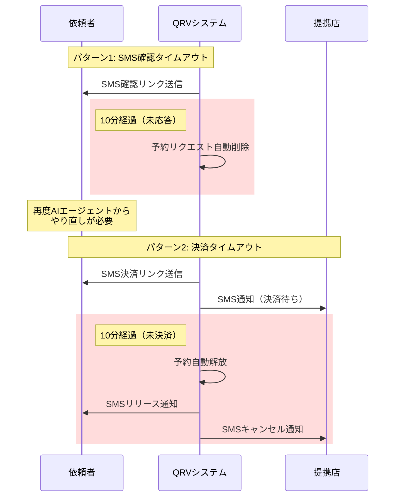
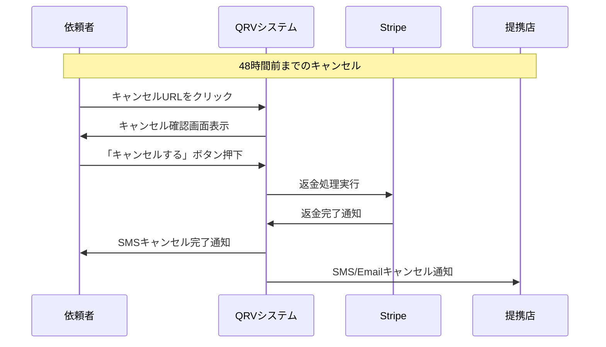
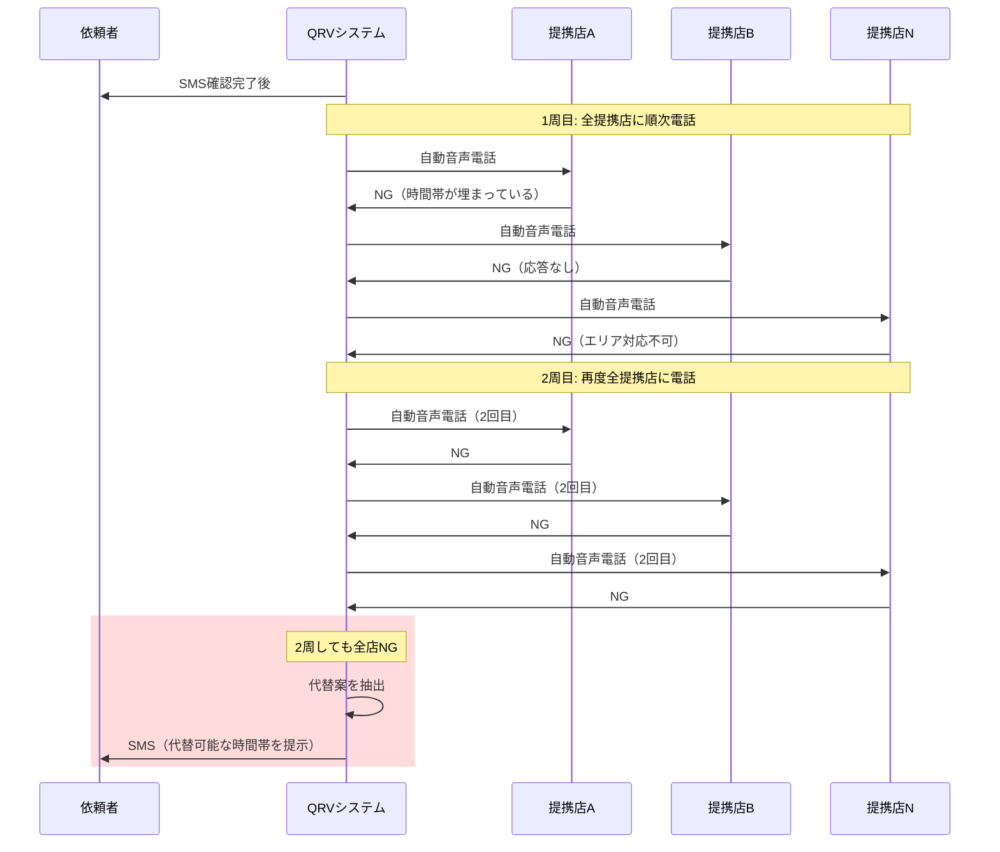
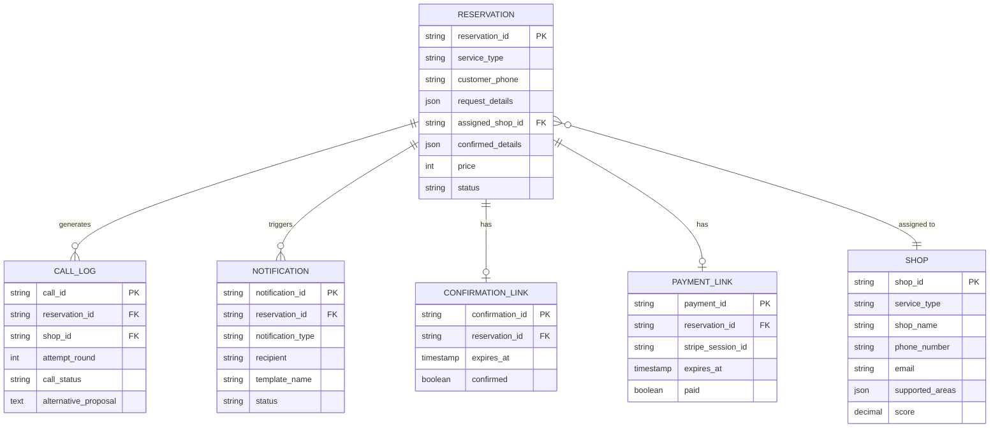

# QRV 要件定義 - 図表集

**文書バージョン:** 1.0
**作成日:** 2025-01-26
**関連文書:** [QRV_要件定義書.md](QRV_要件定義書.md)

---

## 目次

1. [タイミング図](#1-タイミング図)
2. [サービスタイプ比較表](#2-サービスタイプ比較表)
3. [概念データモデル](#3-概念データモデル)

---

## 1. タイミング図

### 1.1 正常系フロー（時間制約の可視化）

```mermaid
sequenceDiagram
    participant 依頼者
    participant AIエージェント
    participant QRVシステム
    participant 提携店
    participant 決済システム

    Note over 依頼者,AIエージェント: 予約情報の収集
    依頼者->>AIエージェント: 予約依頼（チャット）
    AIエージェント->>依頼者: 必要情報を質問
    依頼者->>AIエージェント: 情報提供
    AIエージェント->>QRVシステム: 予約リクエスト作成

    Note over 依頼者,QRVシステム: SMS確認（10分以内）
    QRVシステ�>>依頼者: SMS確認リンク送信

    rect rgb(255, 240, 240)
        Note right of 依頼者: タイムリミット: 10分
        依頼者->>QRVシステム: 「進める」ボタン押下
    end

    Note over QRVシステム,提携店: 電話代行（自動）
    QRVシステム->>提携店: 自動音声電話（1周目）
    提携店->>QRVシステム: 予約可能を回答

    Note over 依頼者,決済システム: 決済（10分以内）
    QRVシステム->>依頼者: SMS決済リンク送信
    QRVシステム->>提携店: SMS/Email通知（決済待ち）

    rect rgb(255, 245, 220)
        Note right of QRVシステム: 5分経過時
        QRVシステム->>依頼者: SMS決済リマインダー
    end

    rect rgb(255, 240, 240)
        Note right of 依頼者: タイムリミット: 10分
        依頼者->>決済システム: 決済実行
    end

    決済システム->>QRVシステム: Webhook通知（決済完了）
    QRVシステム->>依頼者: SMS確定通知（キャンセルURL含む）
    QRVシステム->>提携店: SMS/Email確定通知

    Note over 依頼者,提携店: リマインダー（48時間前・2時間前）

    rect rgb(240, 255, 240)
        Note over QRVシステム: 予約日の48時間前
        QRVシステム->>依頼者: SMSリマインダー（第1回、キャンセルURL含む）
        QRVシステム->>提携店: SMSリマインダー（第1回）
    end

    rect rgb(240, 255, 240)
        Note over QRVシステム: 予約日の2時間前
        QRVシステム->>依頼者: SMSリマインダー（第2回）
        QRVシステム->>提携店: SMSリマインダー（第2回）
    end
```

### 1.2 タイムアウト時の処理



### 1.3 キャンセル処理



### 1.4 全店NG時の処理



---

## 2. サービスタイプ比較表

### 2.1 基本情報の比較

| 項目 | 00001: Aroma Massage | 00002: Thai Massage | 00003: Orchid Delivery |
|------|---------------------|--------------------|-----------------------|
| **表示名** | アロママッサージ | タイマッサージ | 胡蝶蘭配送 |
| **対応エリア** | 東京23区 | 東京23区 | 東京23区 |
| **受付期限** | 最短24時間前、最長30日先 | 最短24時間前、最長30日先 | 最短24時間前、最長30日先 |
| **料金体系** | 時間制（変動） | 時間制（変動） | サイズ制（固定） |

### 2.2 確認項目の比較

#### 共通項目（全サービス）
- `customer_phone`（連絡先電話番号）- 必須

#### サービス固有項目

| 項目 | 00001: Aroma | 00002: Thai | 00003: Orchid |
|------|-------------|------------|--------------|
| **配送先/派遣先住所** | delivery_address（必須） | delivery_address（必須） | delivery_address（必須） |
| **日時** | preferred_date（必須）<br>time_range（必須） | preferred_date（必須）<br>time_range（必須） | delivery_date（必須） |
| **サービス時間** | preferred_duration（必須）<br>40分〜120分、10分刻み<br>fallback_duration（任意） | preferred_duration（必須）<br>60分〜120分、10分刻み<br>fallback_duration（任意） | - |
| **商品** | - | - | orchid_size（必須）<br>3本立て/6本立て/10本立て<br>stand_message（必須） |

### 2.3 料金体系の比較

#### 00001: Aroma Massage（時間制・時間帯変動）
- ベース料金: 1,000円
- 通常時間帯（6:00-22:00）: 1,200円/10分
- 深夜時間帯（22:00-6:00）: 1,500円/10分
- **計算例:** 21:30開始60分
  - 21:30-22:00（30分）: 1,200円 × 3 = 3,600円
  - 22:00-22:30（30分）: 1,500円 × 3 = 4,500円
  - 合計: 1,000円 + 3,600円 + 4,500円 = **9,100円**

#### 00002: Thai Massage（時間制・時間帯変動）
- ベース料金: 1,000円
- 通常時間帯（6:00-22:00）: 1,300円/10分
- 深夜時間帯（22:00-6:00）: 1,600円/10分
- **計算例:** 14:00開始60分
  - 14:00-15:00（60分）: 1,300円 × 6 = 7,800円
  - 合計: 1,000円 + 7,800円 = **8,800円**

#### 00003: Orchid Delivery（サイズ制・固定料金）
- 3本立て: **15,000円**（配送料込み）
- 6本立て: **25,000円**（配送料込み）
- 10本立て: **30,000円**（配送料込み）

### 2.4 電話スクリプト（Requirements部分）の比較

#### 00001: Aroma Massage
```
{date}の{time_range}で、{preferred_duration}分のアロママッサージをお願いしたいのですが、
難しい場合は{fallback_duration}分でも構いません。
場所は{address}です。ご対応可能でしょうか？
```

#### 00002: Thai Massage
```
{date}の{time_range}で、{preferred_duration}分のタイマッサージをお願いしたいのですが、
難しい場合は{fallback_duration}分でも構いません。
場所は{address}です。ご対応可能でしょうか？
```

#### 00003: Orchid Delivery
```
{delivery_date}に{address}へ、{orchid_size}の胡蝶蘭の配送をお願いしたいのですが、
立て札は「{stand_message}」でお願いします。ご対応可能でしょうか？
```

### 2.5 サービスタイプ追加時の考慮事項

将来的に新サービスを追加する際、以下を定義する必要があります：

1. **基本情報**
   - サービスコード（5桁）
   - サービス名（英語/日本語）
   - 対応エリア
   - 受付期限

2. **確認項目**
   - サービス固有の必須項目
   - サービス固有の任意項目
   - AIエージェントが質問するプロンプト

3. **料金体系**
   - 固定料金 or 変動料金
   - 計算ロジック（時間制/サイズ制/個数制等）

4. **電話スクリプト**
   - Requirements部分のテンプレート
   - Confirmation部分のテンプレート

5. **提携店CSV**
   - `data/shops_{service_type}.csv` の作成
   - 対応エリア、電話受付時間、スコアの設定

---

## 3. 概念データモデル

### 3.1 エンティティ関連図（概念レベル）



### 3.2 エンティティの説明

#### RESERVATION（予約）
- **役割:** 依頼者の予約リクエストと確定内容を管理
- **主要関連:**
  - 1つの予約は1つの提携店に割り当てられる（assigned_shop_id）
  - 1つの予約は複数の通話ログを持つ（電話代行の履歴）
  - 1つの予約は複数の通知を持つ（SMS/Email）
  - 1つの予約は1つの確認リンクを持つ（SMS確認用）
  - 1つの予約は1つの決済リンクを持つ（Stripe決済用）

#### SHOP（提携店）
- **役割:** サービス提供事業者の情報を管理
- **主要関連:**
  - 1つの提携店は複数の予約に割り当てられる可能性がある
  - サービスタイプごとに別CSVで管理（shops_00001.csv等）

#### CALL_LOG（通話ログ）
- **役割:** 電話代行の履歴を記録
- **主要関連:**
  - 1つの予約に対して複数の通話ログ（複数店舗に電話）
  - 各通話ログは1つの提携店と関連

#### NOTIFICATION（通知履歴）
- **役割:** SMS/Email送信の履歴を記録
- **主要関連:**
  - 1つの予約に対して複数の通知（確認SMS、決済SMS、リマインダー等）

#### CONFIRMATION_LINK（確認リンク）
- **役割:** 依頼者がSMSで「進める」を押すための確認リンク管理
- **主要関連:**
  - 1つの予約に対して1つの確認リンク
  - 有効期限: 5分

#### PAYMENT_LINK（決済リンク）
- **役割:** 依頼者が決済を行うためのリンク管理
- **主要関連:**
  - 1つの予約に対して1つの決済リンク
  - 有効期限: 10分
  - Stripe Checkout Sessionと連携

### 3.3 主要な業務ルール

1. **予約のライフサイクル**
   - 予約は作成後、複数のステータスを遷移する
   - 最終的に `paid`（確定）、`cancelled`（キャンセル）、`failed`（失敗）のいずれかになる

2. **提携店の選定**
   - サービスタイプと対応エリアでフィルタリング
   - 電話受付時間内の店舗のみを抽出
   - スコア降順でソート

3. **電話代行のリトライ**
   - 1周目で全店NGの場合、2周目を実施
   - 2周目も全店NGの場合、代替案を依頼者に提示

4. **タイムアウト管理**
   - SMS確認: 5分以内に未応答 → 予約リクエスト削除
   - 決済: 10分以内に未決済 → 予約解放、提携店に通知

5. **通知の種類**
   - 依頼者向け: SMS（確認、決済、確定、リマインダー）
   - 提携店向け: SMS + Email（決済待ち、確定、リマインダー）

---

## 付録

### A. 図表の目的と利用方法

#### タイミング図
- **目的:** 時間制約のある業務フローを可視化
- **利用シーン:**
  - タスクキュー（Celery）のタスク設計
  - タイムアウト監視処理の設計
  - 依頼者・提携店への通知タイミングの確認

#### サービスタイプ比較表
- **目的:** サービスごとの差分を整理
- **利用シーン:**
  - 新規サービス追加時の設計指針
  - サービス設定ファイル（JSON/YAML）の構造設計
  - AIエージェントのプロンプト設計

#### 概念データモデル
- **目的:** エンティティ間の関係性を理解
- **利用シーン:**
  - データベーススキーマ設計（外部設計フェーズ）
  - API設計時のデータ構造確認
  - 業務フローとデータの対応関係の理解

### B. 変更履歴

| バージョン | 日付 | 変更内容 | 作成者 |
|-----------|------|---------|--------|
| 1.0 | 2025-01-26 | 初版作成（タイミング図、サービスタイプ比較表、概念データモデル） | - |
| 1.1 | 2025-01-26 | タイミング図を更新：<br>・SMS確認期限を5分→10分に変更<br>・決済リマインダー（5分経過時）を追加<br>・リマインダーを48時間前・2時間前の2回送信に変更<br>・キャンセル処理フローを追加（1.3節） | - |

---

**文書終了**
